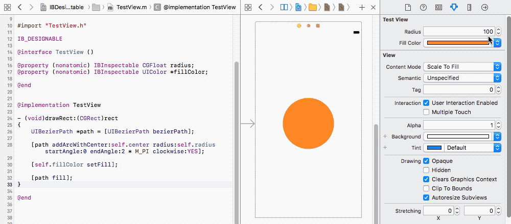
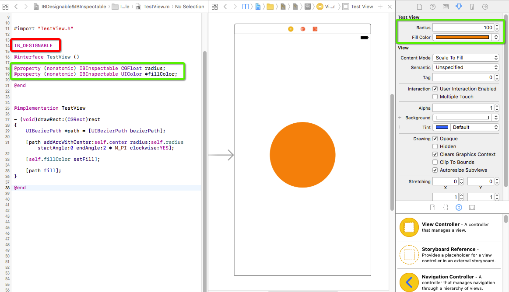
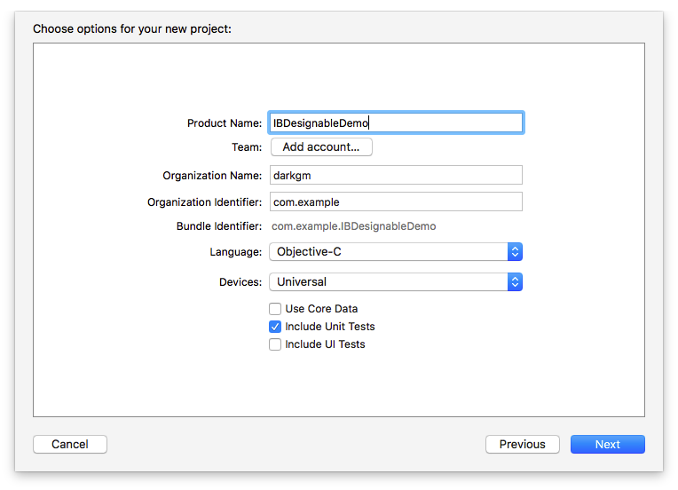
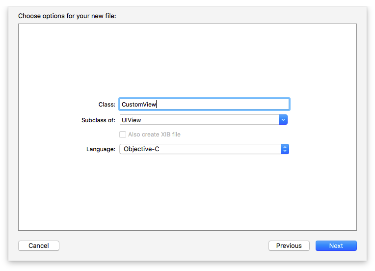
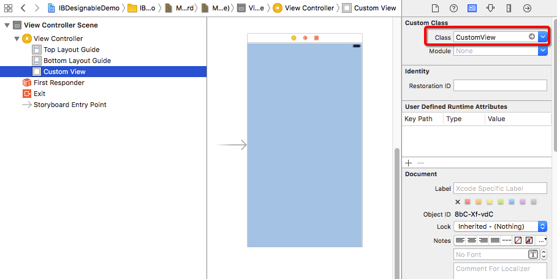
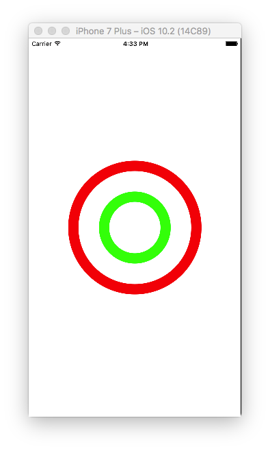
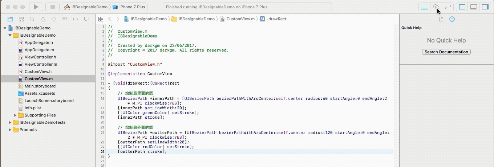
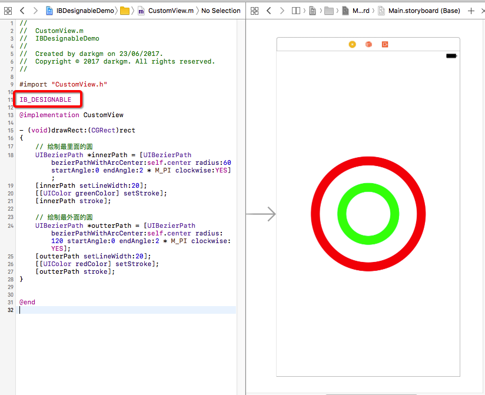
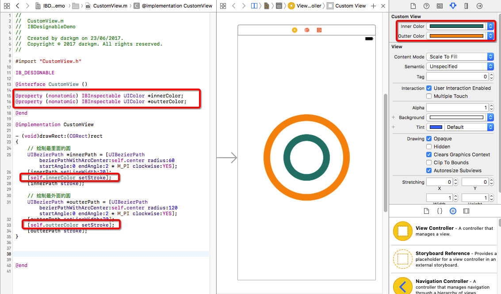
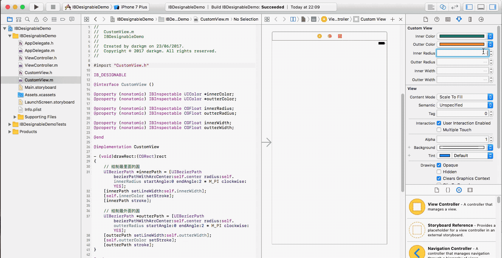

从**Xcode 6**开始，我们可以通过`IB_DESIGNABLE`和`IBInspectable`属性实现自定义视图的实时渲染，即在代码中添加该功能后，可以在**Interface Builder**中直接查看和修改自定义视图，而非运行程序才能查看视图效果。



> 这里我们讲述的是在**Objective-C**语言中，使用`IB_DESIGNABLE`和`IBInspectable`，如果是在**Swift**中，应该使用`@IBDesignable`和`@IBInspectable `替换。

## 1 IB_DESIGNABLE

`IB_DESIGNABLE`用于标记自定义视图的可设计性，在类定义时使用，可以轻松地调整自定义控件的呈现以得到想要的确切的结果。当应用到**UIView**的子类中时，`IB_DESIGNABLE`可以让**Interface Builder**知道它能在画布上直接渲染视图，任何改变，无论是从代码或属性检查器中，都将立即呈现在画布上。比如在CoreGraphics绘图过程中，在类名前使用`IB_DESIGNABLE`标记后，当我们更新`drawRect:`中的视图时，不必编译并运行应用程序，它会将更新结果立即显示在**storyborad**上。




> 注意，上图中的`IB_DESIGNABLE`添加在类的实现文件（.m文件）里，除此之外，还可以添加到类的头文件（.h文件）中，如下：

```
#import <UIKit/UIKit.h>

IB_DESIGNABLE

@interface testView : UIView

@end
```


## 2 IBInspectable

`IBInspectable`用于标记属性的可观察性。使用`IBInspectable`标记的属性会显示在**storyboard**中属性检查器的顶部，允许我们更改其内容，如果配合使用了`IBDesignable`，则会将更改结果实时显示在画布上。然而，`IBInspectable`并非对所有属性都适用，只有能够在 Runtime Attributes 中指定的类型才能够被标记后显示在IB中，目前`IBInspectable`只支持以下几种类型：

- `BOOL`
- `NSNumber`
- `NSString`
- `NSRange`
- `CGFloat`
- `CGPoint`
- `CGSize`
- `CGRect`
- `UIColor`
- `UIImage`


## 3 示例
下面我们通过一个简单的例子具体学习`IB_DESIGNABLE` 和 `IBInspectable`的用法。

#### 3.1 创建项目
首先打开**Xcode**，创建一个新的项目（**File\New\Project...**），选择**iOS**一栏下**Application**中的**Single View Application**模版，然后点击**Next**，填写项目选项。在**Product Name**中填写**IBDesignableDemo**，选择语言为**Objective-C**，点击**Next**，选择文件位置，并单击**Create**创建工程。



#### 3.2 绘制自定义视图
绘制自定义视图一般需要创建一个**UIView**的子类，通过重写`drawRect:`方法并添加一些Core Graphics图形代码来实现。

在这里，我们首先创建一个新的文件（**File\New\File...**），选择**iOS\Source\Cocoa Touch Class**并命名新的**CustomView**类,使它成为**UIView**的子类，并确保语言为**Objective-C**，单击**Next**，然后单击**Create**创建。



打开**Main.storyboard**，选中控制器中的**View**，在最右边的**Identity Inspector**中找到**Custom Class**一栏，将该类更改为刚才创建的**CustomView**类，这样我们就将控制器中的主视图改成了我们自定义的视图。



打开**CustomView.m**文件，取消注释，在`drawRect:`方法中使用`UIBezierPath`绘制两个同心圆，代码如下：

```
- (void)drawRect:(CGRect)rect
{
    // 绘制最里面的圆
    UIBezierPath *innerPath = [UIBezierPath bezierPathWithArcCenter:self.center radius:60 startAngle:0 endAngle:2 * M_PI clockwise:YES];
    [innerPath setLineWidth:20];
    [[UIColor greenColor] setStroke];
    [innerPath stroke];
    
    // 绘制最外面的圆
    UIBezierPath *outterPath = [UIBezierPath bezierPathWithArcCenter:self.center radius:120 startAngle:0 endAngle:2 * M_PI clockwise:YES];
    [outterPath setLineWidth:20];
    [[UIColor redColor] setStroke];
    [outterPath stroke];
}
```

运行程序，我们会看到下图中的绘制结果：



> 关于使用`UIBezierPath`绘图的内容，可以参考[文档](https://developer.apple.com/documentation/uikit/uibezierpath?language=objc)或[相关文章](https://github.com/darkjoin/Learning/wiki/UIBezierPath%E7%BB%98%E5%9B%BE)。


#### 3.3 使用IB_DESIGNABLE查看绘制结果
如果不想运行模拟器，我们可以通过添加`IB_DESIGNABLE`，在**storyboard**中可以看到同样的绘制结果，更好的是，当我们修改代码，**storyboard**中的内容也会同步更新。

让我们先点击右上角的辅助编辑器，让**storyboard**显示在代码右侧，具体操作如下图：



> 也可以在顶部选择**View\Assistant Editor\Show Assistant Editor**打开辅助编辑器。

现在我们看到的**storyboard**还是空白的，接下来我们在实现部分前面添加`IB_DESIGNABLE`关键词，再看**storyboard**，是的，代码中绘制的同心圆已经显示出来了：



尝试将代码中的绘制颜色设置为其它颜色看看！

#### 3.4 使用IBInspectable自定义storyboard中的属性
为了便于设置颜色，我们声明两个`UIColor`的属性，并用`IBInspectable`标记，在`@implementation CustomView`前添加如下代码：

```
#import "CustomView.h"

IB_DESIGNABLE

// 新添加的代码
@interface CustomView ()

@property (nonatomic) IBInspectable UIColor *innerColor;
@property (nonatomic) IBInspectable UIColor *outterColor;

@end

@implementation CustomView
```

然后将两个圆的绘制颜色分别设置为该属性，修改`drawRect:`方法中代码如下：

```
- (void)drawRect:(CGRect)rect
{
    // 绘制最里面的圆
    ...
    [self.innerColor setStroke];
    [innerPath stroke];
    
    // 绘制最外面的圆
    ...
    [self.outterColor setStroke];
    [outterPath stroke];
}
```

然后打开属性检查器，我们会看到刚才声明的属性，将属性的内容修改为其他颜色，看看**storyboard**的变化：



接下来，我们继续添加一些属性来设置圆的半径和宽度：

```
@interface CustomView ()

@property (nonatomic) IBInspectable UIColor *innerColor;
@property (nonatomic) IBInspectable UIColor *outterColor;

// 新添加的属性
@property (nonatomic) IBInspectable CGFloat innerRadius;
@property (nonatomic) IBInspectable CGFloat outterRadius;

@property (nonatomic) IBInspectable CGFloat innerWidth;
@property (nonatomic) IBInspectable CGFloat outterWidth;

@end

```

然后修改`drawRect:`方法，将圆的半径和绘制的线宽设置为上面的属性：

```
- (void)drawRect:(CGRect)rect
{
    // 绘制最里面的圆
    UIBezierPath *innerPath = [UIBezierPath bezierPathWithArcCenter:self.center radius:self.innerRadius startAngle:0 endAngle:2 * M_PI clockwise:YES];
    [innerPath setLineWidth:self.innerWidth];
    [self.innerColor setStroke];
    [innerPath stroke];
    
    // 绘制最外面的圆
    UIBezierPath *outterPath = [UIBezierPath bezierPathWithArcCenter:self.center radius:self.outterRadius startAngle:0 endAngle:2 * M_PI clockwise:YES];
    [outterPath setLineWidth:self.outterWidth];
    [self.outterColor setStroke];
    [outterPath stroke];
}
```

打开属性检查器，修改属性内容，就可以自由地定义圆的颜色、大小和宽度：



至此，我们已经学会了**IB_DESIGNABLE** 和 **IBInspectable**的用法，在绘图中使用该功能替代运行模拟器，可以节省了大量的时间。然而它也有局限性，一般我们用它来绘制简单的代码，对于创建复杂的设计，**storyboard**常常会超时，这种情况下**Playground**可能是更好的选择。

最后，如果在创建demo中遇到问题，可以下载[IBDesignableDemo](https://github.com/darkjoin/CodeExamples)查看完整代码。
