# Mac项目嵌入Flutter

## 1 创建Flutter project

Mac项目嵌入Flutter，需要创建Flutter project，而非Flutter module。
使用`flutter create --platforms macos xxx`在当前Mac项目目录下创建Flutter project：

```
~ flutter create --platforms macos my_flutter_app
Creating project my_flutter_app...
Running "flutter pub get" in my_flutter_app...                   2,143ms
Wrote 38 files.

All done!
In order to run your application, type:

  $ cd my_flutter_app
  $ flutter run

Your application code is in my_flutter_app/lib/main.dart
```

完成后会在当前项目目录下看到`my_flutter_app`文件夹，其目录结构如下：
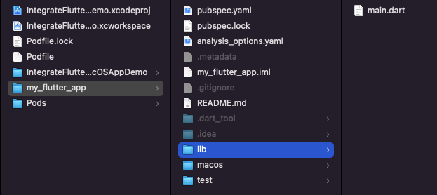

> 如果运行macos目录下的Runner项目有下面的报错：
>
> 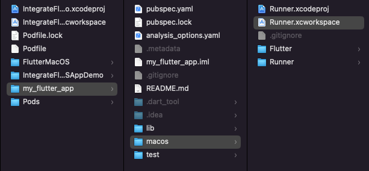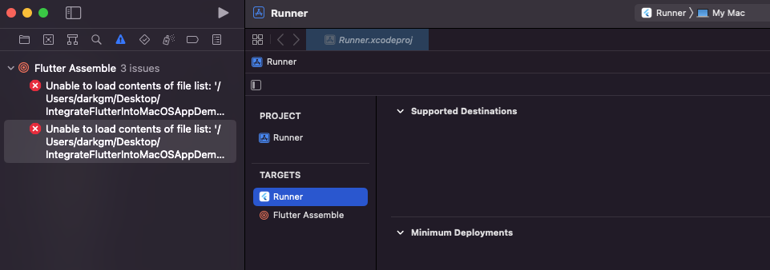
>
> ```
> Unable to load contents of file list: '/xxx/IntegrateFlutterIntoMacOSAppDemo/my_flutter_app/macos/Flutter/ephemeral/FlutterInputs.xcfilelist'
> Unable to load contents of file list: '/xxx/IntegrateFlutterIntoMacOSAppDemo/my_flutter_app/macos/Flutter/ephemeral/FlutterOutputs.xcfilelist'
> ```
>
> 可以在运行前先执行`flutter build macos`，然后再重新运行即可。

## 2 生成MacOS Framework并导入到项目中

定位到Flutter project目录下，执行`flutter build macos-framework`：

```
~ cd my_flutter_app/
~ flutter build macos-framework --output=../FlutterMacOS/

💪 Building with sound null safety 💪

Building macOS frameworks in debug mode...
 ├─Building App.xcframework and FlutterMacOS.xcframework...        16.2s
 └─Moving to ../FlutterMacOS/Debug
Building macOS frameworks in profile mode...
Building App.framework for x86_64...
Building App.framework for arm64...
 ├─Building App.xcframework and FlutterMacOS.xcframework...        32.4s
 └─Moving to ../FlutterMacOS/Profile
Building macOS frameworks in release mode...
Building App.framework for x86_64...
Building App.framework for arm64...
 ├─Building App.xcframework and FlutterMacOS.xcframework...        27.3s
 └─Moving to ../FlutterMacOS/Release
Frameworks written to
/xxx/IntegrateFlutterIntoMacOSAppDemo/my_flutter_app/../FlutterMacOS.
```

完成后会在当前项目目录下看到`FlutterMacOS`文件夹，里面包含生成的`App.xcframework`和`FlutterMacOS.xcframework`：

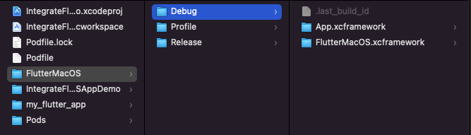

将生成的frameworks链接和嵌入到当前的Mac项目：

在项目Target的`Build Phases > Link Binary With Libraries`部分添加刚才生成的Framework：
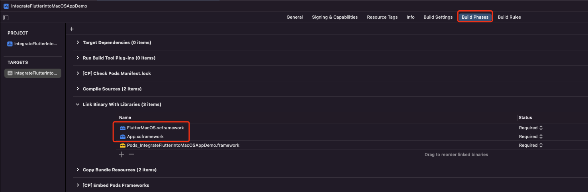

上面添加Debug模式或者Release模式下的Framework都可以，根据自己的需要来添加就好。

如果想在对应环境下嵌入相应的Framework，就需要手动修改下Framework的路径，按环境来配置。
打开`project.pbxproj`文件，将刚才添加的frameworks的路径手动修改为`$CONFIGURATION`。比如之前如果是导入的Debug下的Framework，就将`path = FlutterMacOS/Debug/xxx.xcframework;`改为`path = FlutterMacOS/$CONFIGURATION/xxx.xcframework;`

```
3A5D5D7629DC231100A076E3 /* FlutterMacOS.xcframework */ = {isa = PBXFileReference; lastKnownFileType = wrapper.xcframework; name = FlutterMacOS.xcframework; path = FlutterMacOS/$CONFIGURATION/FlutterMacOS.xcframework; sourceTree = "<group>"; };
3A5D5D7729DC231100A076E3 /* App.xcframework */ = {isa = PBXFileReference; lastKnownFileType = wrapper.xcframework; name = App.xcframework; path = FlutterMacOS/$CONFIGURATION/App.xcframework; sourceTree = "<group>"; };
```

在Target的`Build Settings > Search Paths > Framework Search Paths`部分添加framework路径，同样这里按环境来配置。

```
$(PROJECT_DIR)/FlutterMacOS/$CONFIGURATION
```

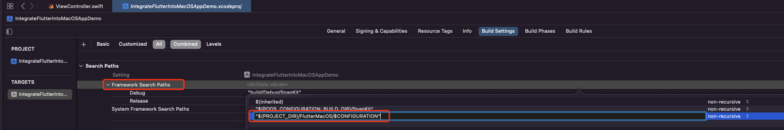

链接Framewrok之后，就可以在Target的`General > Frameworks, Libraries, and Embedded Content`部分，看到刚才嵌入的frameworks，然后手动将Embed改为`Embed & Sign`：

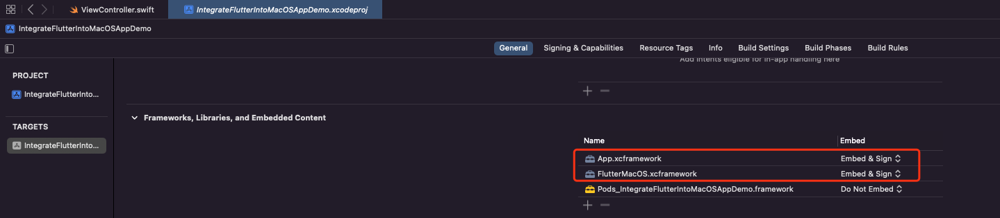

完成后会在`Build Phases > Embed Frameworks`部分看到刚才嵌入的frameworks：

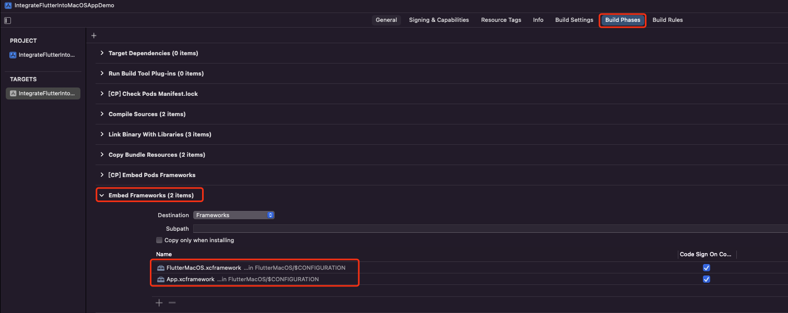

接下来就可以正常导入Flutter模块进行编译了。

需要注意的是，使用这种方式，后续如果修改了`my_flutter_app/lib/main.dart`文件中的内容，需要重新执行`flutter build macos-framework`才会在现有项目生效。

## 3 在当前项目展示Flutter页面

在Mac项目中展示Flutter页面，可以直接调用FlutterViewController来展示：

```
import Cocoa
import SnapKit
import FlutterMacOS

class ViewController: NSViewController {
    
    override func viewDidLoad() {
        super.viewDidLoad()
        setupUI()
    }
    
    private func setupUI() {
        view.wantsLayer = true
        view.layer?.backgroundColor = NSColor.white.cgColor
        view.addSubview(flutterButton)
        flutterButton.snp.makeConstraints { make in
            make.center.equalToSuperview()
        }
    }

    lazy var flutterButton: NSButton = {
        let view = NSButton()
        view.target = self
        view.action = #selector(showFlutterPage)
        view.title = "ShowFlutter"
        view.contentTintColor = NSColor.black
        view.font = NSFont.systemFont(ofSize: 14)
        view.isBordered = false
        return view
    }()
    
    @objc private func showFlutterPage() {
        let flutterController = FlutterViewController()
        flutterController.view.setFrameSize(NSSize(width: 500, height: 500))
        presentAsModalWindow(flutterController)
    }
}
```

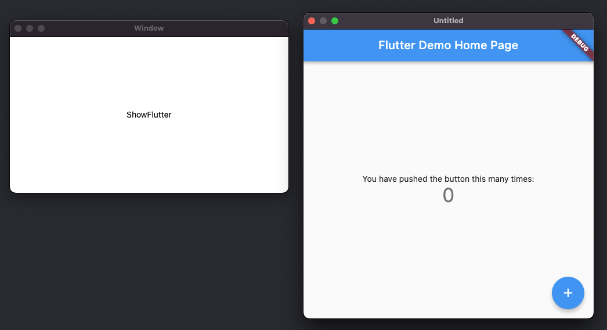

## 4 可能遇到的问题

#### 4.1 Could not start Dart VM service HTTP server

如果在展示Flutter页面时控制台有下面错误：

```
flutter: Could not start Dart VM service HTTP server:
SocketException: Failed to create server socket (OS Error: Operation not permitted, errno = 1), address = 127.0.0.1, port = 0
```

可以在`entitlements`文件添加下面内容来解决：

```
<key>com.apple.security.network.server</key>
<true/>
```

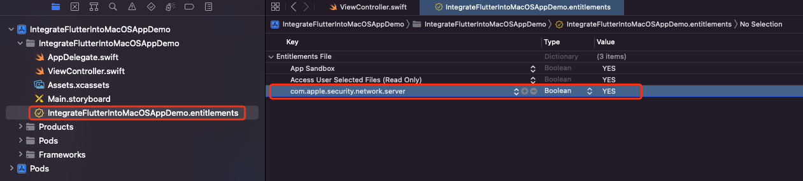

#### 4.2 Exhausted heap space, trying to allocate 32 bytes

如果在展示Flutter页面时出现崩溃，控制台有下面报错：

```
Exhausted heap space, trying to allocate 32 bytes.
../../third_party/dart/runtime/vm/object.cc: 2727: error: Out of memory.
```

可以在`entitlements`文件添加下面内容来解决：

```
<key>com.apple.security.cs.allow-jit</key>
<true/>
```

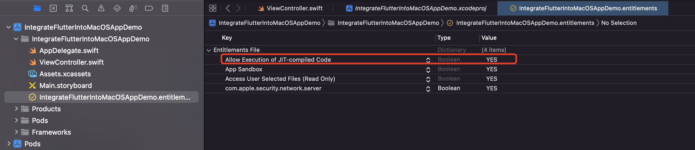

## 参考资料

https://docs.flutter.dev/development/add-to-app/ios/project-setup

https://github.com/flutter/samples/issues/1300

https://github.com/dart-lang/sdk/issues/50719