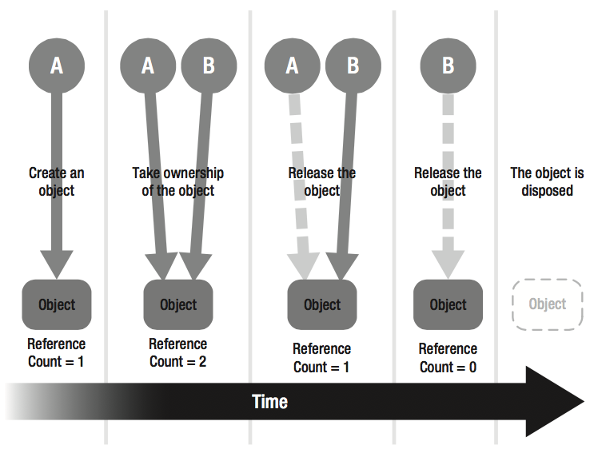

内存管理是程序在运行时分配内存、使用内存，并在程序完成时释放内存的过程。在Objective-C中，也被看作是在众多数据和代码之间分配有限内存资源的所有权(Ownership)的一种方式。

内存管理关心的是清理或回收不用的内存，以便内存能够再次利用。如果一个对象不再使用，就需要释放对象占用的内存。Objective-C提供了两种内存管理的方法：手动管理内存计数(MRR)和自动引用计数(ARC)。这两种方法都采用了一种称为“引用计数”的模型来实现，该模型由Foundation框架的NSObject类和运行时环境（Runtime Environment）共同提供。下面，我们就先来介绍下什么是引用计数。

## 1 引用计数
引用计数（Reference Count）是一个简单而有效的管理对象生命周期的方式，一般概念是：当创建一个新的对象时，初始的引用计数为1。为保证对象的存在，每当创建一个引用到该对象时，通过给对象发送`retain`消息，为引用计数加1；当不再需要对象时，通过给对象发送`release`消息，为引用计数减1；当对象的引用计数为0时，系统就知道这个对象不再使用了，通过给对象发送`dealloc`消息，销毁对象并回收内存。一般在`retain`方法之后，引用计数通常也被称为保留计数(retain count)。



为了更好地阐述引用计数的机制，这里[引用](http://yuxiaopeng.com/2014/07/memory-management-2/)开关房间灯的例子来说明：

假设办公室的照明设备只有一个，进入办公室的人需要照明，离开办公室的人不需要照明。因此，为保证办公室仅有的照明设备得到很好的管理，只要办公室还有人，就会需要照明，灯就得开着，而当办公室没人的时候，就需要关灯。为了判断办公室是否还有人，我们导入计数功能来计算“需要照明的人数”：

- 第一个进入办公室的人，需要照明，此时，“需要照明的人数”为1，计数值从0变为1，需要开灯。
- 第二个进入办公室的人，也需要照明，此时，“需要照明的人数”为2，计数值从1变为2。
- 之后，每一个进入办公室的人都需要照明，此时“需要照明的人数”依次增加，计数值也依次加1。
- 当第一个人离开办公室时，不再需要照明，此时“需要照明的人数”减1，计数值也减1。
- 之后，只要有人离开办公室，就不再需要照明，此时“需要照明的人数”依次减少，计数值依次减1。
- 当最后一个人离开办公室时，不再有人需要照明，“需要照明的人数”为0，计数值减至0，需要关灯。

在Objective-C中，对象就相当于办公室的照明设备，而对象的使用环境就相当于进入办公室上班的人。其对应关系可以用以下表格来表示：

|进入办公室上班的人对照明设备所做的动作|对象的使用环境对Objective-C对象所做的动作|
|---|---|
|开灯|生成对象|
|需要照明|持有对象|
|不再需要照明|释放对象|
|关灯|销毁对象|

## 2 手动管理内存 MRR
手动管理内存，即MRR(manual retain-release)，是基于引用计数来实现的，通过自己跟踪对象来明确管理内存。它与ARC之间的唯一区别是：在MRR中，对象的保留和释放都是由我们手动处理，而在ARC中是自动处理的。

#### 2.1 MRR内存管理的基本原则
为了方便理解，我们先通过一个例子看下MRR中的内存管理是如何工作的，之后会有总结。

首先打开**Xcode**，创建一个新的项目（**File\New\Project...**）,在这里我们将项目名称写为**MemoryManagementDemo**。为了确保我们的代码是在MRR环境下，在进行任何操作之前，我们需要先检查当前项目是否启用了ARC，如果是，将它关闭，如下图所示：


然后打开**storyboard**，删除当前视图控制器，从右下角的对象库中找到**Navigation Controller**，并拖动到画布上。选中左边的导航控制器，切换到属性检查器，勾选**View Controller**一栏下面的**is Initial View Controller**选项，将该控制器作为初始控制器，完成后，该控制器左侧有个白色的箭头，如下：


这时候如果你点击运行，会在模拟器中看到一个空的表视图：


接下来我们删除**ViewController.h**文件和**ViewController.m**文件，并创建一个新的文件（**File\New\File...**），使它成为的**UITableViewController**的子类：


打开刚才创建的**TableViewController.h**文件，声明一个数组类型的实例变量（这里我们使用下划线`_`作为实例变量名称的起始字符，你可以把它看成是实例变量的一部分）：

```
#import <UIKit/UIKit.h>

@interface TableViewController : UITableViewController
{
    NSArray *_titles;
}

@end
```

然后切换到**TableViewController.m**文件，为了在表视图中显示内容，我们在`viewDidLoad`方法中简单地设置数组：

```
- (void)viewDidLoad
{
    [super viewDidLoad];
    
    _titles = [[NSArray alloc] initWithObjects:@"1", @"2", @"3", @"4", @"5", @"6", @"7", @"8", @"9", @"10", nil];
}
```

在Objective-C中创建对象时，一般先向某个类发送`alloc`消息来为新的对象分配内存存储空间，然后调用`init`方法初始化对象。如果`init`方法没有使用任何参数，可以用`new`替代。即：

```
Class *object = [[Class alloc] init];
```

也可以写成：

```
Class *object = [Class new];
```

在这里我们使用`NSArray`类的`initWithObjects:`方法创建数组对象，该方法返回一个新的对象，其中引用计数被设置为1，所以当我们不再使用对象时，需要减少引用计数，在OC中可以通过调用`release`方法来实现。

但是应该在哪里调用`release`呢？前面说过，当我们不再需要使用对象时，就可以调用该方法来释放对象，因此我们将它写在`dealloc`方法中。

在`viewDidLoad`下面创建一个`dealloc`方法，并添加如下代码：

```
- (void)dealloc
{
    [_titles release];
    _titles = nil;
    
    [super dealloc];
}
```

我们不仅释放了对象，还将对象设置为`nil`，这样做可以避免很多问题。比如当你尝试在一个空的对象上调用一个方法，它什么都不做，但是如果你尝试在一个被释放掉的对象上调用方法，会引起程序的崩溃。还有，在`dealloc`方法的末尾记得调用`super`，这样做是为了使任何继承来的对象都能够被释放掉，同时，这也是使用手工内存管理的另一麻烦之处，在释放完自身的一些对象之后，都需要调用`[super dealloc]`。最后，需要注意的是，永远不要直接对对象调用`dealloc`方法。

接下来我们来完成tableView的dataSource部分：

```
#pragma mark - Table view data source

- (NSInteger)numberOfSectionsInTableView:(UITableView *)tableView
{
    return 1;
}

- (NSInteger)tableView:(UITableView *)tableView numberOfRowsInSection:(NSInteger)section
{
    return _titles.count;
}

- (UITableViewCell *)tableView:(UITableView *)tableView cellForRowAtIndexPath:(NSIndexPath *)indexPath
{
    UITableViewCell *cell = [tableView dequeueReusableCellWithIdentifier:@"cell" forIndexPath:indexPath];
    
    NSString *string = [_titles objectAtIndex:indexPath.row];
    NSString *title = [[NSString alloc] initWithFormat:@"Title: %@", string];
    cell.textLabel.text = title;
    [title release];
    
    return cell;
}
```

前两个方法分别返回tableView的section数量和row数量，第三个方法用来设置每一行显示的内容，在这里我们显示一个字符串。值的注意的是，使用`initWithFormat:`方法创建的字符串引用计数将为1，结束时需要释放，否则会造成内存泄漏。另外，在`tableView:cellForRowAtIndexPath:`方法中，我们使用`dequeueReusableCellWithIdentifier:forIndexPath:`方法创建一个可重用的表视图单元对象，这里指定的重用标识符“cell”应该与storyboard中的**TableViewCell**的标识符一致。如果storyboard中的**TableViewCell**的标识符为空，需要添加：


最后，打开storyboard，将视图控制器设置为**TableViewController**：


点击运行，可以看到表视图中的内容：


现在我们已经知道，在手动管理内存的情况下，调用`alloc/init`创建对象时，引用计数为1，当结束使用对象时，需要调用`release`方法使引用计数减为0。但在有些情况下，比如在一个方法中不再需要用到这个对象，但需要将其返回，这时候就引入了自动释放的概念，通过给对象发送`autorelease`消息用以标记该对象延迟释放。

我们修改`tableView:cellForRowAtIndexPath:`方法中的代码：

```
- (UITableViewCell *)tableView:(UITableView *)tableView cellForRowAtIndexPath:(NSIndexPath *)indexPath
{
    UITableViewCell *cell = [tableView dequeueReusableCellWithIdentifier:@"cell" forIndexPath:indexPath];
    
    NSString *string = [_titles objectAtIndex:indexPath.row];
    // 修改：
    NSString *title = [[[NSString alloc] initWithFormat:@"Title: %@", string] autorelease];
    cell.textLabel.text = title;
    
    return cell;
}
```

上面的代码删除掉了`[title release]`，并添加了`autorelease`的调用，这样在创建`title`对象后，会将对象添加到由自动释放池维护的对象列表中，我们可以继续使用该对象来执行此方法的其余部分，直到自动释放池被清理时释放对象。

接下来我们继续修改上面的代码：

```
- (UITableViewCell *)tableView:(UITableView *)tableView cellForRowAtIndexPath:(NSIndexPath *)indexPath
{
    UITableViewCell *cell = [tableView dequeueReusableCellWithIdentifier:@"cell" forIndexPath:indexPath];
    
    NSString *string = [_titles objectAtIndex:indexPath.row];
    // 修改：
    NSString *title = [NSString stringWithFormat:@"Title: %@", string];
    cell.textLabel.text = title;
    
    return cell;
}
```

这次我们使用`stringWithFormat:`方法替换了`alloc/init/autorelease`，该方法也会返回一个新的`NSString`对象，引用计数为1，同时该对象也会被自动添加到自动释放池中。你可能对此会感到困惑，同样都是创建对象，为什么有些会自动释放有些需要调用`autorelease`？这里有一个简单的约定可供参考：

- 如果使用以`init`或`copy`开头的方法创建对象，返回的对象引用计数将为1，并且不会自动释放。也就是说我们拥有该对象，使用完成后需要调用`release`释放，或者调用`autorelease`延迟释放。
- 如果使用任何其它方式开头的方法创建对象，返回的对象引用计数也将为1，但会自动释放，使用完成后不需要再调用`release`或`autorelease`。需要注意的是，以这种方式创建的对象，即使我们现在可以使用它，但是并不拥有该对象。

现在我们又有一个新的问题：如果一个对象具有自动释放，那以后想要再次使用该对象要怎么办？如果我们尝试将该对象存储在某个地方稍后使用的话，可能会因为尝试访问已经释放的内存而引起程序崩溃，因此我们调用`retain`保留该对象，使对象的引用计数变为2，之后当`autorelease`触发时，引用计数减为1，并且对象不会被释放。

下面打开**TableViewController.h**，我们继续在文件中添加一个实例变量`_lastTitleSelected`，当选中某一行时，该变量用于跟踪上一次所选中行的对应文本内容：

```
@interface TableViewController : UITableViewController
{
    NSArray *_titles;
    NSString *_lastTitleSelected;
}

@end
```

然后在**TableViewController.m**文件底部添加`tableView:didSelectRowAtIndexPath`方法及代码：

```
#pragma mark - Table view delegate

- (void)tableView:(UITableView *)tableView didSelectRowAtIndexPath:(NSIndexPath *)indexPath
{
    // 创建消息
    NSString *string = [_titles objectAtIndex:indexPath.row];
    NSString *title = [NSString stringWithFormat:@"Title: %@", string];
    NSString *message = [NSString stringWithFormat:@"Last title: %@. Current title: %@", _lastTitleSelected, title];
    
    // 创建警报视图以显示弹出的消息
    UIAlertController *alert = [UIAlertController alertControllerWithTitle:@"Hint" message:message preferredStyle:UIAlertControllerStyleAlert];
    UIAlertAction *action = [UIAlertAction actionWithTitle:@"OK" style:UIAlertActionStyleDefault handler:nil];
    [alert addAction:action];
    [self presentViewController:alert animated:YES completion:nil];
    
    // 释放当前实例变量
    [_lastTitleSelected release];
    
    // 重新设置该实例变量
    _lastTitleSelected = [title retain];
}
```

该方法首先创建了一个`message`对象，用作警报视图弹出的消息内容。然后创建一个警报控制器，当选中tableView某一行时会弹出一个警报框。最后的两句代码是我们强调的重点，由于警报框中的消息内容包含上次选中行的文本信息和这次选中行的文本信息，而每次选中的行可能会都不一样，因此为了只保留最近一次选中行的信息，我们需要先释放当前的实例变量`_lastTitleSelected`，然后再重新设置该实例变量。最后一行代码中，调用了`retain`来保留`title`对象，这是因为该对象在创建时具有自动释放，为防止在后面的使用中对象被释放掉，我们使用`retain`来增加对象的引用计数以确保程序不会崩溃。如果想测试，我们可以在方法中添加`NSLog`语句输出`title`对象的保留计数：

```
- (void)tableView:(UITableView *)tableView didSelectRowAtIndexPath:(NSIndexPath *)indexPath
{
    // 创建消息
    ...
    
    NSString *title = [NSString stringWithFormat:@"Title: %@", string];
    NSLog(@"retain count = %lu", (unsigned long)[title retainCount]);
    
    ...
    
    // 重新设置该实例变量
    _lastTitleSelected = [title retain];
    NSLog(@"retain count = %lu", (unsigned long)[title retainCount]);
}
```

你将会看到下面的输出结果：

```
retain count = 1
retain count = 2
```

最后，不要忘记在`dealloc`方法中释放实例变量`_lastTitleSelected`：

```
- (void)dealloc
{
    [_titles release];
    _titles = nil;
    
    [_lastTitleSelected release];
    _lastTitleSelected = nil;
    
    [super dealloc];
}
```

如果一切顺利，点击运行，你会看到下面的运行结果：


到这里，你对内存管理应该了解一些了，下面我们就来总结一下手动管理内存的规则：

- 以`alloc`、`new`、`copy`或`mutableCopy`开头的方法创建的对象，我们拥有该对象，使用完成后需要调用`release`或`autorelease`释放。

- 在`init`方法中为了获取对象的所有权，或者在某些情况下避免对象被移除，可以使用`retain`保留对象。在使用完对象后，需要使用`release`进行释放。

- 对使用了`retain`、`copy`、`mutableCopy`、`alloc`或`new`方法的任何对象，以及具有`retain`和`copy`特性的属性进行释放，需要重写`dealloc`方法，使得在对象被释放的时候能够释放这些实例变量。

- 给对象发送`release`消息并不一定立即销毁这个对象，只有当对象的引用计数减至0时，对象才会被销毁，然后系统会发送`dealloc`消息给这个对象用于释放它的内存。

- 如果在方法中不再需要用到某个对象，但需要将其返回，可以给该对象发送`autorelease`消息用以标记延迟释放，对象的引用计数会在当前自动释放池的末尾减1。

- 当应用程序终止时，内存中的所有对象都会被释放，不论它们是否在自动释放池中。

- 当不再需要一个对象时，必须放弃所拥有的该对象的所有权。

- 不能放弃一个你所不拥有的对象的所有权。

#### 2.2 自动释放池（autorelease pool）

上面有说到自动释放，在这里我们简单介绍下自动释放池。

自动释放池创建的目的就是希望可以帮助追踪需要延迟一些时间释放的对象。
通过给对象发送`autorelease`消息，就可以将一个对象添加到由自动释放池维护的对象列表中：

```
[object autorelease];
```

程序中使用来自Foundation、UIKit、AppKit框架的类时，首先需要创建一个自动释放池，这样来自这些框架的类才会创建并返回自动释放的对象，需要在程序中使用`@autoreleasepool`指令（一般在项目中的**main.m**文件中就会看到该语句）：

```
@autoreleasepool {
	statements
}
```

当执行到autorelease块的末尾时，系统就会对池中的每个对象发送`release`消息，这将影响到所有发送过`autorelease`消息并被添加到自动释放池中的对象，当这些对象的引用计数减至0时，会发送出`dealloc`消息，并且它们的内存将会被释放。

需要注意的是，自动释放池并不包含实际的对象，只是包含对象的引用，对象将在自动释放池清理的时候被释放。在ARC中，自动释放池主要用于降低内存峰值，只是我们不再需要手动添加`autorelease`的代码了。

#### 2.3 使用访问器方法简化内存管理

手动管理内存时，在代码中使用`retain`或`release`来保留或释放对象难免会出错，为此，我们可以使用访问器方法来减少内存管理中的问题。

通常所说的访问器（accessor）方法指的是设值方法（setter）和取值方法(getter)，又统称为存取方法。设值方法即设置实例变量值的方法，主要目的是将方法参数设为对应的实例变量的值，一般不会返回任何值。取值方法即检索实例变量值的方法，主要目的是获取存储在对象中的实例变量的值，并通过程序返回发送出去，所以取值方法必须返回实例变量的值作为return的参数。

下面我们继续延用之前的例子，在**TableViewController.h**文件中为两个实例变量添加设值方法和取值方法：

```
@interface TableViewController : UITableViewController
{
    NSArray *_titles;
    NSString *_lastTitleSelected;
}

- (void)setTitles:(NSArray *)titles;
- (NSArray *)titles;
- (void)setLastTitleSelected:(NSString *)lastTitleSelected;
- (NSString *)lastTitleSelected;

@end
```

然后在**TableViewController.m**文件的底部添加实现方法：

```
#pragma mark - Accessor method

- (void)setTitles:(NSArray *)titles
{
    [titles retain];
    [_titles release];
    _titles = titles;
}

- (NSArray *)titles
{
    return _titles;
}

- (void)setLastTitleSelected:(NSString *)lastTitleSelected
{
    [lastTitleSelected retain];
    [_lastTitleSelected release];
    _lastTitleSelected = lastTitleSelected;
}

- (NSString *)lastTitleSelected
{
    return _lastTitleSelected;
}
```

上面的getter方法容易理解，它们只返回了实例变量。而在setter方法中，我们首先使用`retain`保留新传入的参数变量以增加引用计数，然后使用`release`释放掉旧的实例变量以减少引用计数，最后将实例变量的值设置为传入的参数变量。这样，只要设置对象，就能保证在实例变量中存储的对象有正确的引用计数。另外，使用这样的顺序设置实例变量，可以防止将实例变量设置为同一对象的情况。还有，如果你仔细观察上面的设值方法，你就会明白我们在最开始命名实例变量的时候要使用下划线的原因，最主要的是为了避免由实例变量名称和参数变量名称相同而引起的冲突。

接下来我们就使用这些存取方法来修改代码中的实例变量。

首先我们使用设值方法来修改`viewDidLoad`中的`_titles`：

```
- (void)viewDidLoad
{
    [super viewDidLoad];
    
    [self setTitles:[[[NSArray alloc] initWithObjects:@"1", @"2", @"3", @"4", @"5", @"6", @"7", @"8", @"9", @"10", nil] autorelease]];
}
```

观察仔细的话，你会发现除了使用设值方法外，在末尾我们还调用了`autorelease`。还记得在setter方法中我们使用`retain`将传入的参数变量引用计数加1吗？这里我们使用了`initWithObjects:`创建数组对象，会导致变量最终的引用计数为2，因此必须使用自动释放来减少引用计数。当然，我们也可以使用`arrayWithObjects:`方法创建数组对象，这样就不需要再调用`autorelease`了。

另外，为了方便，Objective-C语言允许我们使用点运算符`.`代替方括号`[]`来设置或获取实例变量的值，即：

```
self.titles = xxx;
```

相当于：

```
[self setTitles:xxx];
```

> 点运算符`.`通常用于属性，但不限于属性。

下面我们使用点运算符`.`再次修改上面的方法：

```
- (void)viewDidLoad
{
    [super viewDidLoad];
    
    self.titles = [[[NSArray alloc] initWithObjects:@"1", @"2", @"3", @"4", @"5", @"6", @"7", @"8", @"9", @"10", nil] autorelease];
}
```

接下来在`tableView:didSelectRowAtIndexPath`方法中修改`_lastTitleSelected`：

```
- (void)tableView:(UITableView *)tableView didSelectRowAtIndexPath:(NSIndexPath *)indexPath
{
    ...
    
    // 创建警报视图以显示弹出的消息
    ...
    [self presentViewController:alert animated:YES completion:nil];
    
    // 设置实例变量(删除最后两行代码，用下面的代码替代)
    self.lastTitleSelected = title;
}
```

我们将实例变量的内存管理的代码都写在了`setter`方法中，所以在上面的代码中设置实例变量就简单了很多。

另外需要说明的一点是，[文档](https://developer.apple.com/library/content/documentation/Cocoa/Conceptual/MemoryMgmt/Articles/mmPractical.html#//apple_ref/doc/uid/TP40004447-SW6)中有提到：不要在初始化方法和dealloc方法中使用访问器方法：

> The only places you shouldn’t use accessor methods to set an instance variable are in initializer methods and `dealloc`. 

如果要在`init`方法中初始化一个对象，一般使用下面的形式：

```
- (instancetype)init
{
    self = [super init];
    if (self) {
        instance = ...
    }
    
    return self;
}
```

在`dealloc`方法中也要使用实例变量：

```
- (void)dealloc
{
    [instance release];
    [super dealloc];
}
```

之所以说不要在`init`和`dealloc`方法中使用访问器方法，主要是由于面向对象的继承、多态特性与访问器方法可能造成的副作用联合导致的。继承和多态导致在父类的实现中调用访问器方法时可能会调用到子类重写的存取方法，而此时子类部分并未完全初始化或已经销毁，导致混乱，从而出现一系列的逻辑问题甚至崩溃。但这种说法也不是绝对的，尽管存在风险但并不代表百分之百的崩溃或错误，如果你在程序中有这样写，并且明确地知道它不会产生任何问题，那么就可以使用它来简化你的代码。比如，在这里我们修改`dealloc`中的代码：

```
- (void)dealloc
{
    self.titles = nil;
    self.lastTitleSelected = nil;
    
    [super dealloc];
}
```

上面删除了之前手动调用release及将其设置为nil的两行代码，然后使用setter方法替代。现在我们将nil作为设值方法里的参数变量传递，即：

```
[nil retain];
[_titles release];
_titles = nil;
```

由于代码中`[nil retain]`不会执行任何操作，因此我们在`dealloc`方法中使用`self.titles = nil`不会产生任何问题。不过为了安全起见，在不清楚是否会产生问题的情况下，我们还是建议遵守文档中的说明。

#### 2.4 使用属性
除了手动编写存取方法，Objective-C还提供了属性（property）方便我们快速地为实例变量创建访问器方法，并可选地实现它们。

属性的声明一般在接口部分，以`@property`关键字开头，后面可以选择性的定义属性的特性，然后以属性的类型和名称（一般情况下我们使用与实例变量相同的名称，但并不是必须的）结尾。下面是几种有效的属性声明：

```
@property int age;
@property (copy) NSString *name;
@property (nonatomic, strong) NSArray *array;
```

> 需要注意的是，在声明属性时，属性的名称前面不要以`new`、`alloc`、`copy`或者`init`这些词语开头。

声明属性的操作就相当于声明setter和getter方法，以上面的`age`为例：

```
@property int age;
```

就相当于：

```
- (void)setAge:(int)age;
- (int)age;
```

一般系统默认的设值方法名称是以`set`开头（setPropertyName），默认的取值方法是以属性名称命名（propertyName）。如果想要更改成自定义的名称可以使用下面的方法：

- 用setter = setterName来指定setter方法的名称，如：

 ```
 @property (setter = setterName) int age;
 ```
- 用getter = getterName来指定getter方法的名称，如：

 ```
 @property (getter = getterName) int age;
 ```

一般常用于`BOOL`类型，getter方法通常以`is`开头，比如标识一个视图是否隐藏的`hidden`属性，其getter方法应该称为`isHidden`。可以这样声明：

```
@property (nonatomic,getter = isHidden ) BOOL hidden;
```

接下来我们在类的实现部分使用`@synthesize`告诉编译器自动为属性实现一个设值方法和取值方法，即：

```
@implementation Class

@synthesize age;

@end
```

其中`@synthesize age`默认指定的实例变量名称与属性相同，即：

```
@synthesize age = age;
```

Xcode 4.4以后，编译器引入了属性自动合成（property autosynthesis），也就是说编译器会为每一个`@property`添加`@synthesize`，我们不需要再显式地使用`@synthesize`指令了。但需要注意的是，自动合成默认生成的实例变量名称以`_`为前缀，加上属性名，即：

```
@synthesize age = _age;
```

如果不喜欢默认的实例变量名称，或者我们希望使用更有语义的名称，就需要通过`@synthesize`来指定等号后面的名称作为我们希望的实例变量名：

```
@synthesize age = currentAge;
```

还需要说明的是，通常编译器会自动合成一个实例变量和至少一个访问器方法，如果我们为带有`readwrite`关键字的属性同时手动实现了setter和getter方法，或为带有`readonly`关键字的属性实现了getter方法，那么编译器会假定我们正在对属性的实现进行控制，并且不会自动合成实例变量。在这种情况下，我们就需要手动指定一个实例变量：

```
@synthesize property = _property;
```

另外需要注意的是，一般情况下使用`@property`会在编译期间自动合成存取方法，但有些存取方法是在运行时动态创建的，这时声明和使用属性时会由于缺少方法而在编译期间发出警告，这时候我们可以使用`@dynamic`语句来抑制警告：

```
@implementation Class
@dynamic age;
@end
```

下面我们就使用属性替换我们代码中的存取方法：

首先我们在**TableViewController.h**文件中删除实例变量和存取方法的声明，使用属性来代替：

```
@interface TableViewController : UITableViewController

@property (nonatomic, retain) NSArray *titles;
@property (nonatomic, retain) NSString *lastTitleSelected;

@end
```

然后切换到**TableViewController.m**文件，删除之前写的setter和getter方法，并在实现部分的最顶部添加`@synthesize`：

```
@implementation TableViewController

@synthesize titles = _titles;
@synthesize lastTitleSelected = _lastTitleSelected;
```

当然这里声明的实例变量与默认的一致，因此上面的`@synthesize`也可以省略不写。

现在可以运行代码试下，你会发现模拟器跟以前一样正常显示。但是显然这种让编译器自动生成存取方法的做法比我们手动编写存取方法要简单很多，同时也更高效，并且在多核设备上可以使用多线程运行。

#### 2.5 属性的特性
属性的特性是使用一些特殊的关键字来告诉编译器如何合成相关的访问器方法。在我们的代码中，声明属性时使用了`nonatomic`和`retain`。在此之前我们讲到属性的声明时，在示例中也使用到了`copy`，但属性的关键字远不止这几个， 一般分为线程相关、访问器相关以及内存相关这三类。下面是详细介绍。

##### 2.5.1 线程相关：atomic、nonatomic
**atomic（默认）**

- 默认特性，如果没有使用任何关键字指定属性的特性，默认情况下Objective-C属性的特性是`atomic`。
- `atomic`表示原子属性，使用该属性是为了告诉系统使用互斥（mutex）锁定保护属性的存取方法，如果当前进程进行到一半，其他线程来访问当前线程，可以保证先执行完当前线程。也就是说，即使从不同的线程同时调用访问器方法，也能够保证有一个值总能被getter方法完全检索到或者被setter方法完全设置。比如，在多线程的程序中，如果有多个线程指向相同的实例变量，一个线程可以读取，另一个线程可以写入。当它们在同一时间点击时，读取的线程将被保证能够获取到一个有效的值，可能是更改前的值，也可能是更改后的值。
- 原子属性与对象的线程安全性是不同的，并且使用原子属性并不能保证线程安全。如果有多个线程同时访问同一个实例变量，其中一个线程调用`release`，就会造成程序崩溃。
- 使用`atomic`让编译器生成的互斥锁定代码会很耗费资源，使程序变慢影响效率，所以一般很少使用。 
- `atomic`属性合成的访问器方法是私有的，因此不能与自己实现的访问器方法相结合。如果我们尝试为`atomic`属性提供自定义的setter或getter方法，会收到编译器的警告：

 
 
 或者
	
 

**nonatomic** 

- `nonatomic`与`atomic`相反，表示非原子属性。使用该属性是为了告诉系统不要使用互斥锁定保护属性的存取方法。当有多个线程同时访问同一个属性时将会导致无法预计的结果。在这里不能保证调用访问器方法时会返回一个有效的值。如果尝试在写入的中间读取时，我们可能会得到一个无效的值。
- 跟`atomic`比起来，`nonatomic`效率要更高一些，如果要多次访问一个属性时，使用`nonatomic`会更高效。
- 一般在单线程和明确知道只有一个线程访问的情况下广泛使用。
- 使用`nonatomic`可以将自动合成的setter或getter方法与自己手动实现的getter或setter方法相结合。因此，对于使用`atomic`实现setter或getter时出现的警告，可以通过设置属性的特性为`nonatomic`来解除：
 
 

##### 2.5.2 访问器相关：readonly、readwrite
**readonly**

- `readonly`表示只读属性，对包括自身在内的所有类都是只读的。
- 合成的访问器只有getter方法没有setter方法。

**readwrite（默认）**

- 默认特性，一般不需要显式声明。
- `readwrite`表示读写属性，即属性允许被自身或其他类读写，与`readonly`相反。
- 合成的访问器同时拥有setter方法和getter方法。

> 如果希望一个属性只允许自身读写，而对其他类都是只读的，可以在`.h`文件的接口部分中将属性的特性声明为`readonly`，然后在`.m`文件的私有接口部分再重新将属性特性声明为`readwrite`即可。

##### 2.5.3 内存相关：retain、assign、strong、weak、copy、unsafe_unretained
**retain**

- `retain`表示属性的保留操作，用于获取对象的所有权，会增加传入对象的引用计数。
- 在属性中使用`retain`关键字可以指示编译器在设置实例变量之前保留传入的变量，在默认的设值方法中会是：

 ```
    if (_property != newValue) {
        [_property release];
        _property = [newValue retain];
    }
 ```

- 主要在手动内存管理中使用，在ARC下，一般使用`strong`替代。

**assign（默认）**

- 默认特性。一般像`int`、`float`、`double`和`NSInteger`、`CGFloat`、`BOOL`等值类型的属性默认使用`assign`。
- `assign`用于属性的赋值操作，不存在所有权关系。在默认的设值方法中会是：

 ```
	_property = newValue;
 ```

**copy**

- `copy`用于创建对象的副本，并且对该副本对象拥有所有权，而非原对象本身。
- 在属性中使用`copy`关键字可以指示编译器在设置实例变量之前创建传入变量的副本，在默认的设值方法中会是：

 ```
    if (_property != newValue) {
        [_property release];
        _property = [newValue copy];
    }
 ```

- `copy`属性对其创建的副本对象隐式强引用。同时也意味着该属性将使用`strong`，因为它必须保持其创建的副本对象。
- 为`copy`属性设置的任何对象必须遵守`NSCopying`协议。
- 如果需要直接设置`copy`属性的实例变量，例如在初始化方法中，要记得设置原始对象的副本。

**strong（默认）**

- 默认特性。一般Objective-C对象的属性默认是`strong`。
- `strong`是在引入ARC的时候引入的关键字，相当于MRR下的`retain`。
- 使用`strong`声明强引用，表示实例变量对传入的对象拥有所有权，只要持有该属性中对象的引用，该对象就不会被释放。如果有两个强引用的对象相互指向对方，就会造成强引用循环。
- 需要区分的是，在Objective-C中，对象属性默认是`strong`，而对象变量默认是`__strong`。

**weak**

- `weak`也是ARC下的属性关键字，但它是从iOS 5引入，因此在iOS 5之前不可用。
- 使用`weak`声明弱引用，与`strong`相反，它表示实例变量对传入的对象没有所有权，并且在setter方法中也不会对传入对象增加引用计数。当对象被释放后，实例变量会自动设置为nil。
- 对于变量来说，我们可以使用`__weak`将变量声明为弱指针变量，并且在实际应用中，我们也通过使用`__weak`将强引用替换为弱引用，以此来解决强引用循环的问题：

 ```
  NSObject * __weak weakVariable;
 ```

- 一般情况下，delegate和outlet用`weak`来声明。

**unsafe_unretained**

- `unsafe_unretained`表示不安全的引用，是iOS 5之前替代`weak`的关键字。
- 与`weak`不同的是，使用`unsafe_unretained`声明的属性，当对象被释放后，实例变量不会自动设置为nil。这意味着我们将留下一个悬挂指针，指向原先被释放的对象所占用的内存，会导致程序崩溃，因此它被称为是“不安全的”。

#### 2.6 内存管理要避免的问题

内存管理不正确导致的主要问题有两种：

- 释放或重写仍在使用的内存导致内存损坏：通常会导致应用程序崩溃，甚至导致用户数据遭到改写或损坏。

- 没有释放不再使用的内存导致内存泄漏：会导致应用程序对内存的使用不断增加，从而导致系统性能下降或应用程序被终止。

对于上面第一种问题，我们可以使用NSZombieEnabled调试工具来查找过度释放的对象。对于第二种问题，可以使用Instruments跟踪引用计数事件并查找内存泄漏。

如果想在编译时识别出代码中的问题，可以使用Xcode中内置的静态分析功能。这将使XCode运行我们的代码，并查找可以自动检测到的任何错误，以警告我们有任何潜在的问题。下面我们就对之前的项目使用该功能来检测下是否存在问题：

打开项目，在顶部的菜单栏选择**Product\Analyze**：


分析完成后，你会看到一个蓝色的小方块标记，点击之后会在左侧看到详细信息：


上面的消息告诉我们检测到内存泄漏，实例变量`_window`需要被释放，缺少`dealloc`方法，所以我们在`AppDelegate.m`的实现部分添加`dealloc`方法，并对实例变量`_window`调用`release`方法：

```
- (void)dealloc
{
    [_window release];
    _window = nil;
    
    [super dealloc];
}
```

再次点击菜单栏中的**Product\Analyze**，你会看到之前的标记消失了，同时也没有检测到其他新问题。

## 3 自动引用计数 ARC
自动引用计数，即ARC(Automatic Reference Counting)，是Xcode 4.2版本的一个新特性，使用了与手动管理相同的引用计数系统，不同的是，系统在编译时会帮我们插入合适的内存管理方法，保留和释放都是自动处理的，从而避免了手动引用计数的一些潜在陷阱。一般在新项目中被推荐使用。

#### 3.1 ARC下内存管理的规则
ARC的规则很简单，我们不需要再手动保留和释放对象，需要做的只是管理指向对象的指针。只要有指针指向该对象，该对象将保留在内存中；当指针指向其他对象，或不存在时，该对象将被自动释放。

下面我们列出在ARC下内存管理的规则：

- 不能显式调用`dealloc`，或`retain`、`release`、`retainCount`、`autorelease`等，甚至也不能使用`@selector(retain)`、`@selector(release)`等。
- 如果需要管理除释放实例变量之外的资源，则可以实现`dealloc`方法，并且自定义的`dealloc`方法不需要调用`[super dealloc]`。
- 访问器方法的名称不能以`new`开头，这反过来也意味着不能声明一个以`new`开头的属性，除非我们指定了一个不同的getter：

 ```
 //错误：
 @property NSString * newTitle;
 
 //正确：
 @property（getter = theNewTitle）NSString * newTitle;
 ```

#### 3.2 MRR转化为ARC
在上面的demo中我们都是用MRR来进行内存管理的，现在我们需要把它转化成ARC，最容易想到的方法是手动转换，需要把所有调用到`retain`、`release`等方法的代码都去掉，但这样做会很麻烦。幸运的是，Xcode提供了一个ARC自动转换工具，可以帮助我们方便地将源码转为ARC，更灵活的是，它不但可以将项目中的所有文件转换为ARC，还可以选择性地对指定的文件进行转换，对于一些不想转换的文件可以禁用ARC。

下面我们就使用这种自动转换工具转换我们的代码：

首先，ARC是LLVM3.0编译器的特性，因此我们先来确认下当前的编译器是否符合。选中文件中的项目，在**Build Settings**搜索框中输入“compiler”，然后在**Build Options**中查看第一项**Compiler for C/C++/Objective-C**对应的编译器版本：


在转换前我们先点击**Xcode**菜单栏中的**Product\Build**以确保当前代码没有问题。

接下来从**Xcode**的菜单栏中选择**Edit\Convert\To Objective-C ARC...**：


然后在弹出的窗口中点击第一个图标下的小三角可以展开所有文件，在这里，为了对比手动转换，我们取消选中**AppDelegate.m**文件，只选中其他两个默认勾选的文件进行转换，然后点击**check**：


继续在弹出的窗口点击**Next**：


你会看到正在生成转化：


转换完成后将会显示所有文件的预览。左侧窗格显示已更改的文件，右侧窗格显示原文件。这里显示的是**TableViewController.h**文件，你会看到在属性声明中使用`strong`替代了`retain`。


接下来我们切换到**TableViewController.m**文件：


这里一共有两处更改。首先是在**viewDidLoad**方法中，初始化`titles`时删除了`autorelease`的调用。然后删除了`dealloc`方法及内容。

确认后，继续点击**Save**保存更改，就可以在我们的项目中看到之前预览文件的更改，转换完成。

再次编译程序，点击**Product\Build**，显示编译成功。

还有一点需要知道的是，在同一个项目中将ARC代码与非ARC代码相结合是可行的。下面我们打开**AppDelegate.m**文件，会看到该文件依然存在`dealloc`方法，并且可以正常运行，这是因为我们取消勾选该文件时，转换工具已经禁用这两个源文件的ARC，我们可以在**TARGETS**的**Build Phases**中看到：


**AppDelegate.m**文件后面被加上了`-fno-objc-arc`的编译标记，表示该文件将不使用ARC规则进行编译。相反地，如果想对特定的文件启用ARC，可以为其添加`-fobjc-arc`标记。在这里，我们双击**AppDelegate.m**文件后面的的标记，将其更改为`-fobjc-arc`以对该文件启用ARC：


再次点击**Product\Build**编译程序，会看到错误提示，下面我们就手动更改代码来修复这些错误：

首先打开**AppDelegate.m**文件，看到错误主要发生在`dealloc`方法中：


从错误信息中我们不难看出，主要是由于在ARC下调用`release`和`dealloc`导致的。我们删除整个`dealloc`方法，错误消失，再次点击**Product\Build**编译程序，编译成功。此时，运行程序，会发现一切正常显示。

至此，我们的转换工作已经全部完成，项目中的所有文件都使用了ARC。如果对其中的代码还有问题，可以下载[MemoryManagementDemo](https://github.com/darkjoin/CodeExamples)查看。

## 4 Core Foundation 对象的内存管理

#### 4.1 Core Foundation

Core Foundation是基于Objective-C的Foundation框架，但是以C语言实现。对于大多数应用程序，我们并不需要使用Core Foundation，一般从Objective-C中就可以完成任何我们想要的操作。然而，对于一些底层的API，比如Core Graphics和Core Text等，就需要我们对Core Foundation有所了解。

一般底层的Core Foundation对象大多以`CreateWith`开头的函数来创建，其内存管理只需要延续手工引用计数的办法即可。对于引用计数的修改，需要使用`CFRetain`和`CFRelease`函数，其功能与Objective-C对象的`retain`和`release`方法类似。

```
    // 创建一个CFStringRef对象
    CFStringRef cfString = CFStringCreateWithCString(kCFAllocatorDefault, "string", kCFStringEncodingUTF8);
    
    // 保留该对象，引用计数加1
    CFRetain(cfString);
    
    // 释放该对象，引用计数减1
    CFRelease(cfString);
```

#### 4.2 免费桥接（toll-free bridged）
Core Foundation框架和Foundation框架中有许多数据类型可以互换使用，比如我们可以使用`NSString`对象将其用作`CFStringRef`，也可以使用`CFStringRef`对象将其用作`NSString`。这种可以互换使用的数据类型也被称为免费桥接数据类型。这意味着我们可以使用相同的数据结构作为Core Foundation函数调用的参数或者Objective-C消息调用的接收者。然而，并不是所有的数据类型都是免费桥接的，详细列表可以参考[Toll-Free Bridged Types](https://developer.apple.com/library/content/documentation/CoreFoundation/Conceptual/CFDesignConcepts/Articles/tollFreeBridgedTypes.html#//apple_ref/doc/uid/20002401-767858)。

在免费桥接中，与内存管理相关的一个重要问题就是转换过程中对象的所有权问题。比如在ARC下，我们需要将一个Core Foundation对象转换成一个Objective-C对象，这时候就需要告诉编译器如何管理对象的所有权。于是我们引入bridge相关的关键字来说明对象的所有权语义：

##### 4.2.1 `__bridge`
使用`__bridge`可以在Objective-C对象和Core Foundation对象之间相互转换，此转换只做类型转换，不转移对象的所有权。

- 使用 `__bridge`将Objective-C对象转换为Core Foundation对象，使用完成后由ARC负责释放对象：

 ```
     // 创建一个NSString对象
    NSString *nsString = @"string";
    
    // 将NSString对象转换为CFStringRef对象
    CFStringRef cfString = (__bridge CFStringRef)nsString;
 ```
 
 

- 使用 `__bridge`将Core Foundation对象转换为Objective-C对象，完成后需要调用`CFRelease`释放对象：

 ```
     // 创建一个CFStringRef对象
    CFStringRef cfString = CFStringCreateWithCString(kCFAllocatorDefault, "string", kCFStringEncodingUTF8);
    
    // 将CFStringRef对象转换为NSString对象
    NSString *nsString = (__bridge NSString*)cfString;
    
    // 释放CFStringRef对象
    CFRelease(cfString);
 ```

##### 4.2.2 `__bridge_retained`
使用`__bridge_retained`或`CFBridgingRetain`将Objective-C对象转换为Core Foundation对象，此转换会将Objective-C对象的所有权转移给Core Foundation对象，使用完成后需要调用`CFRelease`释放对象所有权。

```
    // 创建一个NSString对象
    NSString *nsString = @"string";
    
    // 将NSString对象转换为CFStringRef对象
    CFStringRef cfString = (__bridge_retained CFStringRef)nsString;
    
    // 释放CFStringRef对象
    CFRelease(cfString);
```

##### 4.2.3 `__bridge_transfer`
使用`__bridge_transfer`或`CFBridgingRelease`将Core Foundation对象转换为Objective-C对象，此转换会将Core Foundation对象的所有权转移给ARC，使用完成后由ARC负责释放对象所有权。

```
    // 创建一个CFStringRef对象
    CFStringRef cfString = CFStringCreateWithCString(kCFAllocatorDefault, "string", kCFStringEncodingUTF8);
    
    // 将CFStringRef对象转换为NSString对象
    NSString *nsString = (__bridge_transfer NSString*)cfString;
```

## 5 参考资料

[Advanced Memory Management Programming Guide](https://developer.apple.com/library/content/documentation/Cocoa/Conceptual/MemoryMgmt/Articles/MemoryMgmt.html#//apple_ref/doc/uid/10000011-SW1)

[Encapsulating Data](https://developer.apple.com/library/content/documentation/Cocoa/Conceptual/ProgrammingWithObjectiveC/EncapsulatingData/EncapsulatingData.html)

[Transitioning to ARC Release Notes](https://developer.apple.com/library/content/releasenotes/ObjectiveC/RN-TransitioningToARC/Introduction/Introduction.html)

[Obj-C Memory Management](https://www.tutorialspoint.com/objective_c/objective_c_memory_management.htm)

[Memory Management Tutorial for iOS](https://www.raywenderlich.com/2657/memory-management-tutorial-for-ios)

[Properties Tutorial for iOS](https://www.raywenderlich.com/2712/properties-tutorial-for-ios)

[Beginning ARC in iOS 5 Tutorial](https://www.raywenderlich.com/5677/beginning-arc-in-ios-5-part-1)

[iOS核心技术之：内存管理之二手动内存管理](http://yuxiaopeng.com/2014/07/memory-management-2/)

[理解 iOS 的内存管理](http://blog.devtang.com/2016/07/30/ios-memory-management/)


