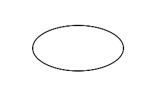
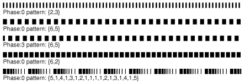

# UIBezierPath绘图

UIBezierPath继承自NSObject，位于UIKit框架中，是Core Graphics框架中与路径相关的功能的封装。在iOS3.2及更高版本中，可以使用UIBezierPath创建基于向量的路径、绘制路径的轮廓、填充路径包围的空间等。其中路径可以定义简单的形状，如矩形，椭圆或弧形，也可以定义复合多边形，包含直线和曲线段的混合。

## 1 Bezier path 与 UIBezierPath
Bezier path源于法国数学家皮埃尔·贝齐耶（PierreBézier）研制的“[贝塞尔曲线](https://zh.wikipedia.org/wiki/%E8%B2%9D%E8%8C%B2%E6%9B%B2%E7%B7%9A)”(Bezier curves)的概念。简单来说，它是几个点之间的曲线，如下图。


> 关于贝塞尔曲线的深入学习可以参考[Bezier path 资料](https://pomax.github.io/bezierinfo/zh-CN/)。

UIBezierPath对象是CGPathRef数据类型的封装，用于创建基于向量的路径，而路径是由线和曲线构建的。每组连接的线和曲线段形成所谓的子路径，共享相同的绘图属性，要绘制具有不同属性的子路径，必须将每个子路径放在其自己的UIBezierPath对象中。

## 2 创建UIBezierPath对象

<a id="2.1">

#### 2.1 使用`bezierPath`方法创建自定义路径对象
	UIBezierPath *bezierPath = [UIBezierPath bezierPath];

> 大多数情况下，对于多边形或自定义图形，我们一般从“空路径”开始，通过移动位置到初始点，然后向下一个点添加线和弧线的方法创建路径内容。

</a>

#### 2.2 使用`bezierPathWithRect:`方法创建矩形路径
	UIBezierPath *rectPath = [UIBezierPath bezierPathWithRect:CGRectMake(100, 100, 200, 100)];


#### 2.3	使用`bezierPathWithRoundedRect:cornerRadius:`方法创建圆角矩形路径
	UIBezierPath *roundedRectPath = [UIBezierPath bezierPathWithRoundedRect:CGRectMake(100, 100, 200, 100) cornerRadius:10];


#### 2.4 使用	`bezierPathWithRoundedRect:byRoundingCorners:cornerRadii:`方法创建自定义的圆角矩形路径

	UIBezierPath *roundedCornerPath = [UIBezierPath bezierPathWithRoundedRect:CGRectMake(100, 100, 200, 100) byRoundingCorners:UIRectCornerTopLeft | UIRectCornerBottomRight cornerRadii:CGSizeMake(20, 20)];


> 该方法可以指定将哪个角设置为圆角：
> `UIRectCornerTopLeft`（左上角） 
> `UIRectCornerTopRight`（右上角）
> `UIRectCornerBottomLeft`（左下角）
> `UIRectCornerBottomRight`（右下角）
> `UIRectCornerAllCorners`（所有角）


#### 2.5 使用`bezierPathWithOvalInRect:`方法创建椭圆或圆形路径
	UIBezierPath *ovalPath = [UIBezierPath bezierPathWithOvalInRect:CGRectMake(100, 100, 200, 100)];



<a id="2.6">

#### 2.6 使用	`bezierPathWithArcCenter:radius:startAngle:endAngle:clockwise:`方法创建弧形路径
	UIBezierPath *arcPath = [UIBezierPath bezierPathWithArcCenter:CGPointMake(200, 200) radius:100 startAngle:0 endAngle:M_PI clockwise:NO];


> 该方法中的参数：`cenrer`用于指定弧形的圆心；`radius`指定弧形的半径；`startAngle`指定弧形的起始角度；`endAngle`指定弧形的终止角度；`clockwise`指定了弧形的绘制方向，是否为顺时针。上面的代码中`closewise`设置为`NO`，表示逆时针绘制。另外，值得注意的是，这里指定的起始和终止角度都需要以弧度表示，在默认的坐标系中绘制时，起始和终止角度的定义基于下图所示的单位圆。


</a>

#### 2.7 使用`bezierPathByReversingPath`方法创建反向路径
    UIBezierPath *rectPath = [UIBezierPath bezierPathWithRect:CGRectMake(100, 100, 200, 100)];
    UIBezierPath *reversedPath = [rectPath bezierPathByReversingPath];
    


> 需要注意的是，这是一个实例方法，而上面其他几个都是类方法。使用该方法绘制时，它不一定会改变路径的形状，相反，它改变的是路径的绘制方向（交换起点和终点），从而可能影响到路径的填充效果。上面的代码中，`rectPath`默认是顺时针绘制的(如左图所示)，对它调用该方法后，虽然路径形状没有变化，但是是逆时针方向绘制的（如右图所示）。

## 3 构建自定义路径
构建自定义路径，首先需要使用[2.1](#2.1)介绍的方法创建一个新的空路径对象，通过选择一个初始点并调用`moveToPoint:`方法移动到该点，然后就可以开始向该点添加线或曲线。添加新的线或曲线总是假定从当前位置开始，并以指定的某个点结束。每次添加后，新一段的终点自动变成下一段的起点，也是当前点(`currentPoint`)。结束时，通过调用`closePath`方法从当前点向子路径中的第一个点添加一条直线段来关闭路径。
#### 3.1 使用`addLineToPoint:`方法构建直线路径
    // 1 创建路径对象
    UIBezierPath *bezierPath = [UIBezierPath bezierPath];
    
    // 2 移动到起点
    [bezierPath moveToPoint:CGPointMake(100, 100)];
    
    // 3 添加直线
    [bezierPath addLineToPoint:CGPointMake(300, 300)];


#### 3.2 使用`addArcWithCenter:radius:startAngle:endAngle:clockwise:`方法构建弧形路径
    // 1 创建路径对象
    UIBezierPath *bezierPath = [UIBezierPath bezierPath];
    
    // 2 移动到起点
    [bezierPath moveToPoint:CGPointMake(100, 100)];
    
    // 3 添加弧线
    [bezierPath addArcWithCenter:CGPointMake(200, 200) radius:100 startAngle:0 endAngle:M_PI clockwise:YES];


> 这里定义弧线的方法与创建弧形路径对象的方法类似，详细参数可以参考[2.6](#2.6)中的说明。

#### 3.3 使用`addQuadCurveToPoint:controlPoint:`方法和`addCurveToPoint:controlPoint1:controlPoint2:`方法构建曲线路径 
> 我们常见的曲线形状是使用起点和终点之间的切线以及一个或多个控制点进行定义的。UIBezierPath为我们提供了二次贝塞尔曲线（只有一个控制点）和三次贝塞尔曲线（有两个控制点）的绘制方法。下图展示了这两种曲线的区别。 


##### 3.3.1 二次曲线 (quadratic bezier curve)  

```
// 1 创建路径对象
UIBezierPath *bezierPath = [UIBezierPath bezierPath];

// 2 移动到起点
[bezierPath moveToPoint:CGPointMake(100, 200)];

// 3 添加二次曲线
[bezierPath addQuadCurveToPoint:CGPointMake(300, 200) controlPoint:CGPointMake(250, 100)];
```   


     
##### 3.3.2 三次曲线 (cubic bezier curve)

```
// 1 创建路径对象
UIBezierPath *bezierPath = [UIBezierPath bezierPath];

// 2 移动到起点
[bezierPath moveToPoint:CGPointMake(100, 200)];

// 3 添加三次曲线
[bezierPath addCurveToPoint:CGPointMake(300, 200) controlPoint1:CGPointMake(200, 100) controlPoint2:CGPointMake(200, 300)];
```


#### 3.4 使用`closePath`方法关闭路径
    // 1 创建路径对象
    UIBezierPath *bezierPath = [UIBezierPath bezierPath];
    
    // 2 移动到起点
    [bezierPath moveToPoint:CGPointMake(200, 200)];
    
    // 3 添加直线
    [bezierPath addLineToPoint:CGPointMake(300, 400)];
    [bezierPath addLineToPoint:CGPointMake(100, 400)];
    
    // 4 关闭路径
    [bezierPath closePath];


> 使用该方法闭合路径时，会添加一条从当前点到起点的直线，因此在上面的代码中，相当于我们使用`[bezierPath closePath]`替代了`[bezierPath addLineToPoint:CGPointMake(200, 200)]`。

#### 3.5 使用`appendPath:`方法追加路径
    // 1 创建路径
    UIBezierPath *bezierPath = [UIBezierPath bezierPath];
    [bezierPath addArcWithCenter:CGPointMake(200, 200) radius:110 startAngle:0 endAngle:2 * M_PI clockwise:YES];
    
    // 2 追加一个圆形路径
    UIBezierPath *circle = [UIBezierPath bezierPathWithOvalInRect:CGRectMake(125, 125, 150, 150)];
    [bezierPath appendPath:circle];
    
    // 3 追加一个正方形路径
    UIBezierPath *square = [UIBezierPath bezierPathWithRect:CGRectMake(180, 180, 40, 40)];
    [bezierPath appendPath:square];


#### 3.6 使用`removeAllPoints`方法删除路径
    // 1 创建路径
    UIBezierPath *bezierPath = [UIBezierPath bezierPath];
    [bezierPath addArcWithCenter:CGPointMake(200, 200) radius:110 startAngle:0 endAngle:2 * M_PI clockwise:YES];
    
    // 2 追加一个圆形路径
    UIBezierPath *circle = [UIBezierPath bezierPathWithOvalInRect:CGRectMake(125, 125, 150, 150)];
    [bezierPath appendPath:circle];
    
    // 3 创建一个正方形路径
    UIBezierPath *square = [UIBezierPath bezierPathWithRect:CGRectMake(180, 180, 40, 40)];
    
    // 4 删除该正方形路径
    [square removeAllPoints];
    
    // 5 追加该正方形路径
    [bezierPath appendPath:square];


## 4 渲染路径
#### 4.1 设置渲染路径的属性
##### 4.1.1 `lineWidth` 渲染路径的线条宽度


> 默认是1.0。

##### 4.1.2 `lineCapStyle` 渲染路径的线条端点的形状:`kCGLineCapButt`(默认)、`kCGLineCapRound`、`kCGLineCapSquare`。


##### 4.1.3 `lineJoinStyle` 渲染路径的线条接合点的形状：`kCGLineJoinMiter`(默认)、`kCGLineJoinRound`、`kCGLineJoinBevel`。


##### 4.1.4 `miterLimit` 渲染路径时用于避免线段连接处形成尖峰的斜角极限


> 默认是10。

##### 4.1.5 `flatness` 渲染曲线路径的平坦度


> 默认平坦度值为0.6。在大多数情况下，我们不需要更改平坦度。 

##### 4.1.6 `usesEvenOddFillRule`渲染路径时是否使用奇偶规则


> 如果为YES，则使用奇偶规则填充路径。如果为NO，则使用非零规则填充。默认是NO。
>
> 填充路径时，一般通过两种方式计算填充区域：非零绕组数规则（nonzero winding number rule）和奇偶规则（even-odd rule）。
> 要确定哪些区域被填充，一般从给定区域内的点开始，向路径边界以外的任何点绘制一条射线，交叉路径线的总数决定了填充区域。
>
> 对于非零规则，绘制路径段的方向影响结果。从左到右路径的交叉点计数为+1，从右到左路径的交叉点计数为-1。如果交叉点的总和不为0，则该点被认为在路径内，并且对应的区域被填充。如果交叉点的总和为0，则该点在路径外部，并且该区域不被填充。上图左边显示了使用非零绕组数规则填充的两组内圈和外圈。当每个圆圈以相同方向绘制时，两个圆圈都被填充。当圆圈以相反方向绘制时，内圈未被填充。
>
> 对于奇偶规则，计算路径交叉的总数，如果结果为奇数，则该点被认为在路径内，并且对应的区域被填充。如果结果为偶数，则该点被认为是在路径之外，并且该区域不被填充。绘制路径段的方向不影响结果。如上图右边所示，绘制每个圆的方向并不重要，填充将始终如图所示。

<a id="4.1.7">

##### 4.1.7 `setLineDash:count:phase:` 设置渲染路径的线条形状



    // 1 创建路径对象
    UIBezierPath *rectPath = [UIBezierPath bezierPathWithRect:CGRectMake(100, 100, 100, 100)];
    
    // 2 定义一个浮点值的C风格数组以指定线段的长度及间隔
    CGFloat pattern[4] = {8.0, 3.0, 20.0, 5.0};
    
    // 3 设置线条形状
    [rectPath setLineDash:pattern count:4 phase:0];
    
    // 4 设置线条宽度
    [rectPath setLineWidth:4.0];
    
    // 5 绘制路径
    [rectPath stroke];


> 该方法中，第一个参数`pattern`是浮点值的C风格数组，指定了线段的长度及间隔，数组中的值交替定义，第一个是线段的长度，后跟第一个线段间隔长度，再是第二个线段长度，再跟第二个线段间隔长度，以此类推。
> 第二个参数`count`指定了pattern数组中的元素个数。
> 第三个参数`phase`指定画线模式的起始点，即开始绘制时的偏移位置，以画线模式的点计算，正值向右偏移，负值向左偏移。

</a>

##### 4.1.8 `getLineDash:count:phase:` 检索渲染路径的线条画线模式

> 参数[同上](#4.1.7)


#### 4.2 渲染路径
##### 4.2.1 使用`fill`方法填充由路径包围的区域

```
// 1 创建一个矩形路径对象
UIBezierPath *rectPath = [UIBezierPath bezierPathWithRect:CGRectMake(100, 100, 100, 100)];

// 2 设置路径填充颜色
[[UIColor redColor] setFill];

// 3 填充路径
[rectPath fill];   
```   


<a id = "4.2.2">

##### 4.2.2 使用`fillWithBlendMode:alpha:`方法指定混合模式和透明度值来填充路径

```
// 1 创建一个背景矩形对象
UIBezierPath *backRect = [UIBezierPath bezierPathWithRect:CGRectMake(50, 50, 200, 200)];

// 2 设置背景矩形的填充颜色
[[UIColor greenColor] setFill];

// 3 填充背景矩形
[backRect fill];
    
// 4 创建一个前景矩形对象
UIBezierPath *rectPath = [UIBezierPath bezierPathWithRect:CGRectMake(100, 100, 100, 100)];

// 5 设置前景矩形的填充颜色
[[UIColor redColor] setFill];

// 6 使用指定的混合模式和透明度值填充前景路径
[rectPath fillWithBlendMode:kCGBlendModeNormal alpha:0.5];
```


> 该方法中有两个参数。
> 第一个参数`blendMode`用于确定填充路径如何与现有的渲染内容合成，在上面的代码中我们的使用正常混合模式`kCGBlendModeNormal`，除此之外还有多重混合模式`kCGBlendModeMultiply`和叠加混合模式`kCGBlendModeOverlay`等，详细内容可以参考文档中关于[CGBlendMode](https://developer.apple.com/reference/coregraphics/cgblendmode?language=objc)的介绍。
> 第二个参数`alpha`用于确定填充路径的透明度，范围在0.0（透明）和1.0（不透明）之间。

</a>

##### 4.2.3 使用`stroke`方法跟踪并绘制路径的轮廓

```
// 1 创建一个矩形路径对象
UIBezierPath *rectPath = [UIBezierPath bezierPathWithRect:CGRectMake(100, 100, 100, 100)];
    
// 2 设置绘制路径的画笔颜色
[[UIColor redColor] setStroke];
    
// 3 设置绘制路径的线条宽度
[rectPath setLineWidth:3.0];
    
// 4 绘制路径
[rectPath stroke];
```


##### 4.2.4 使用`strokeWithBlendMode:alpha:`方法指定混合模式和透明度值来绘制路径

```
// 1 创建背景矩形
UIBezierPath *backRect = [UIBezierPath bezierPathWithRect:CGRectMake(50, 50, 200, 200)];
[[UIColor greenColor] setFill];
[backRect fill];
    
// 2 创建前景矩形
UIBezierPath *rectPath = [UIBezierPath bezierPathWithRect:CGRectMake(100, 100, 100, 100)];
// 2.1 设置绘制前景矩形的画笔颜色
[[UIColor redColor] setStroke];
// 2.2 设置绘制路径的线条宽度
[rectPath setLineWidth:10.0];
// 2.3 使用指定的混合模式和透明度值填充前景路径
[rectPath strokeWithBlendMode:kCGBlendModeNormal alpha:0.5];
```


> 该方法中的参数说明可以参考[`fillWithBlendMode:alpha:`](#4.2.2)方法中的注释。


## 5 剪切路径
#### 使用`addClip`方法剪切路径
    // 1 创建两个圆形路径
    UIBezierPath *path1 = [UIBezierPath bezierPathWithArcCenter:CGPointMake(150, 200) radius:100 startAngle:0 endAngle:2 * M_PI clockwise:YES];
    UIBezierPath *path2 = [UIBezierPath bezierPathWithArcCenter:CGPointMake(250, 200) radius:100 startAngle:0 endAngle:2 * M_PI clockwise:YES];
    
    // 2 绘制路径
    [path1 stroke];
    [path2 stroke];
    
    // 3 剪切路径
    [path1 addClip];
    
    // 4 填充路径
    [[UIColor redColor] setFill];
    [path2 fill];
    


> 该方法会修改绘图的可见区域，调用之后，随后的绘图操作只对指定路径内的区域有效。在上面的代码中，`path1`剪切路径后，`path2`只保留与`path1`相交的路径区域，因此在对`path2`进行填充操作时，只有相交区域被填充。

## 6 转换路径
#### 使用`applyTransform:`方法转换路径
    // 1 创建路径对象
    UIBezierPath *originPath = [UIBezierPath bezierPathWithRect:CGRectMake(0, 0, 100, 100)];
    
    // 2 转换路径
    [originPath applyTransform:CGAffineTransformMakeTranslation(100, 100)];
    
    // 3 填充路径
    [[UIColor redColor] setFill];
    [originPath fill];


> 该方法会使用指定的仿射变换矩阵来转换路径中的所有点，这里的参数`transform`就是用于确定将哪种转换矩阵应用于路径中，在上面的代码中使用了`CGAffineTransformMakeTranslation
`,除此之外还有`CGAffineTransformMakeScale
`和`CGAffineTransformMakeRotation
`等，详细内容可以参考文档中关于[CGAffineTransform](https://developer.apple.com/reference/coregraphics/cgaffinetransform-rb5?language=objc)的介绍。

## 7 路径的点击测试
#### 7.1 使用`currentPoint`属性表示路径的当前点

    // 1 创建路径
    UIBezierPath *path = [UIBezierPath bezierPath];
    [path moveToPoint:CGPointMake(100, 100)];
    [path addArcWithCenter:CGPointMake(200, 200) radius:50 startAngle:1.5 * M_PI endAngle:M_PI clockwise:NO];
    
    // 2 绘制路径
    [path setLineWidth:2.0];
    [path stroke];
    
    // 3 打印路径的当前点
    NSLog(@"The current point of the path is (%.2f, %.2f)", path.currentPoint.x, path.currentPoint.y);
    


> 该属性中的值也表示新路径段的起点。如果路径当前为空，则该属性包含`CGPointZero`。

#### 7.2 使用`bounds`属性表示完全包围路径中所有点的最小矩形

    // 1 创建一条直线路径
    UIBezierPath *path = [UIBezierPath bezierPath];
    [path moveToPoint:CGPointMake(100, 100)];
    [path addLineToPoint:CGPointMake(300, 300)];
    
    // 2 绘制直线路径
    [path setLineWidth:3.0];
    [[UIColor redColor] setStroke];
    [path stroke];
    
    // 3 以直线路径的边界创建一个矩形路径
    UIBezierPath *boundsPath = [UIBezierPath bezierPathWithRect:path.bounds];
    
    // 4 绘制矩形路径
    [boundsPath setLineWidth:5.0];
    [[UIColor blueColor] setStroke];
    [boundsPath stroke];
    


#### 7.3 使用`empty`属性判断路径中是否具有任何有效路径元素

    // 1 创建路径对象
    UIBezierPath *path = [UIBezierPath bezierPath];
    
    // 2 移动路径到指定点
    [path moveToPoint:CGPointMake(100, 100)];
    
    // 3 点击测试
    if (path.empty == YES) {
        NSLog(@"The path has no valid elements");
    }
    else if (path.empty == NO) {
        NSLog(@"The path has some valid elements");
    }


> 这里所说的有效路径元素包括移动到指定点的命令、绘制线或曲线的命令以及关闭路径的命令。 因此，即使上面的代码只调用了`moveToPoint：`方法，路径也不被视为空。

#### 7.4 使用`containsPoint:`方法判断路径包围的区域是否包含指定的点。
    // 1 创建路径
    UIBezierPath *path = [UIBezierPath bezierPathWithArcCenter:CGPointMake(200, 200) radius:100 startAngle:0 endAngle:2 * M_PI clockwise:YES];
    [path appendPath:[UIBezierPath bezierPathWithArcCenter:CGPointMake(200, 200) radius:75 startAngle:0 endAngle:2 * M_PI clockwise:NO]];
    [path appendPath:[UIBezierPath bezierPathWithArcCenter:CGPointMake(200, 200) radius:50 startAngle:0 endAngle:2 * M_PI clockwise:YES]];
    
    // 2 设置渲染路径的属性
    [[UIColor redColor] set];
    [path setLineWidth:3.0];
    
    // 3 点击测试
    if ([path containsPoint:CGPointMake(260, 210)] == YES) {
        [path fill];
    }
    else if ([path containsPoint:CGPointMake(260, 210)] == NO) {
        [path stroke];
    }


## 8 UIBezierPath的应用
UIBezierPath常见的用途之一就是将图像裁剪成自定义形状，如用户头像等。
这里我们所介绍的demo也将展示图片裁剪的过程，除此之外，还展示了刮开涂层（类似于刮刮乐）的效果。大致思路是，在视图中的同一位置添加两个大小相同的imageView使之重叠，然后分别将图片裁剪为相同的圆形，同样是重叠的效果，即上面一张圆形图片（前景）完全覆盖下面一张圆形图片（背景），当我们刮开上面的图片，下面的图片逐渐显示，最终效果图如下：


> 完整代码可以参考[UIBezierPathDemo](https://github.com/darkjoin/CodeExamples)。下面是详细介绍。

#### 8.1 创建项目

打开Xcode，创建一个新的项目(File\New\Project...)，选择iOS一栏下Application中的Single View Application模版，点击Next。 


在Product Name中填写UIBezierPathDemo，点击Next。选择文件位置，点击Create创建工程。


#### 8.2 构建界面
在这里我们使用纯代码构建。打开ViewController.m文件，定义两个UIImageView对象的属性。

```
@interface ViewController ()

@property (nonatomic, strong) UIImageView *bgImageView;      // 背景
@property (nonatomic, strong) UIImageView *fgImageView;      // 前景

@end

```

打开Assets.xcassets文件，添加两张图片([图片资源](https://github.com/darkjoin/CodeExamples/tree/master/UIBezierPathDemo/UIBezierPathDemo/Assets.xcassets))。


打开ViewController.m文件，在`viewDidLoad`方法中添加下面的代码。

```
- (void)viewDidLoad
{
    [super viewDidLoad];
    
    // 创建背景imageView并添加到视图中
    self.bgImageView = [[UIImageView alloc] initWithFrame:CGRectMake(50, 150, 300, 300)];
    [self.view addSubview:self.bgImageView];
    
    // 为背景imageView设置图片
    UIImage *bgImage = [UIImage imageNamed:@"bgImage"];
    self.bgImageView.image = bgImage;
    
    // 创建前景imageView并添加到视图中
    self.fgImageView = [[UIImageView alloc] initWithFrame:self.bgImageView.frame];
    [self.view addSubview:self.fgImageView];
    
    // 为前景imageView设置图片
    UIImage *fgImage = [UIImage imageNamed:@"fgImage"];
    self.fgImageView.image = fgImage;
}
```

运行一下，可以看到只显示了前景图片（背景图片被覆盖）。


#### 8.3 裁剪图片
在`viewDidLoad`方法的下面，我们定义一个`clipImage:`方法用于执行裁剪图片的操作，代码如下：

```
- (UIImage *)clipImage:(UIImage *)image
{
    // 开启一个与图像大小一致的图形上下文
    UIGraphicsBeginImageContextWithOptions(image.size, NO, 0);
    
    // 创建一个圆形的路径
    UIBezierPath *path = [UIBezierPath bezierPathWithOvalInRect:CGRectMake(0, 0, image.size.width, image.size.height)];
    
    // 剪切圆形路径
    [path addClip];
   
    // 将图片绘制到图形上下文中
    [image drawAtPoint:CGPointZero];
    
    // 从当前图形上下文中获取被裁剪的图片
    UIImage *clippedImage = UIGraphicsGetImageFromCurrentImageContext();
    
    // 关闭图形上下文
    UIGraphicsEndImageContext();
    
    // 返回被裁剪的图片
    return clippedImage;
}
```

> 在这里我们没有将绘制方法写在`drawRect:`方法中，而是单独写在了自定义的裁剪方法里，所以我们没有任何上下文可用，因此要生成一个新的图像就需要开启一个新的图形上下文，相关内容可以参考[Drawing and Creating Images](https://developer.apple.com/library/content/documentation/2DDrawing/Conceptual/DrawingPrintingiOS/HandlingImages/Images.html#//apple_ref/doc/uid/TP40010156-CH13-SW1)文档中的描述。
> 裁剪图片主要是通过对UIBezierPath对象调用`addClip`方法来实现的，上面的代码中最后返回一个从图形上下文中获取到UIImage对象（即被裁剪后的图像）。


之后，在`viewDidLoad`方法中通过调用`clipImage:`方法，将imageView的图片重新设置为被裁剪的图片，修改后的代码如下：

```
- (void)viewDidLoad
{ 	
	...
    // 为背景imageView设置图片
    UIImage *bgImage = [UIImage imageNamed:@"bgImage"];
    self.bgImageView.image = [self clipImage:bgImage];
    
    ...
    // 为前景imageView设置图片
    UIImage *fgImage = [UIImage imageNamed:@"fgImage"];
    self.fgImageView.image = [self clipImage:fgImage];
}
```

运行一下，可以看到图片被裁剪为圆形


#### 8.4 实现刮开涂层的效果
刮开涂层的效果主要是通过重写`touchesMoved:withEvent:`方法实现的，详细代码如下：

```
- (void)touchesMoved:(NSSet<UITouch *> *)touches withEvent:(UIEvent *)event
{
    [super touchesMoved:touches withEvent:event];
    
    // 创建一个UITouch对象
    UITouch *touch = touches.anyObject;
    
    // 设置触摸位置在前景图片上的坐标
    CGPoint touchPoint = [touch locationInView:self.fgImageView];
    
    // 设置触摸时清除点的大小
    CGRect touchRect = CGRectMake(touchPoint.x, touchPoint.y, 20, 20);
    
    // 开启一个与前景图像大小一致的图形上下文
    UIGraphicsBeginImageContextWithOptions(self.fgImageView.bounds.size, NO, 0);
    
    // 获取当前上下文
    CGContextRef context = UIGraphicsGetCurrentContext();
    
    // 将前景图像视图的图层渲染到当前上下文中
    [self.fgImageView.layer renderInContext:context];
    
    // 清除触摸过的区域
    CGContextClearRect(context, touchRect);
    
    // 从当前图形上下文中获取图片（即刮开的图片）
    UIImage *image = UIGraphicsGetImageFromCurrentImageContext();
    
    // 关闭图形上下文
    UIGraphicsEndImageContext();
    
    // 设置前景imageView的图片为刮开的图片
    self.fgImageView.image = image;
}
```

运行程序，用鼠标在图片上划动，可以看到如下效果：


> 关于[touchesMoved:withEvent:](https://developer.apple.com/reference/uikit/uiresponder/1621107-touchesmoved?language=objc)的详细介绍可以参考文档。

## 9 参考资料

1 [UIBezierPath - UIKit | Apple Developer Documentation](https://developer.apple.com/reference/uikit/uibezierpath?language=objc)

2 [Drawing Shapes Using Bézier Paths](https://developer.apple.com/library/content/documentation/2DDrawing/Conceptual/DrawingPrintingiOS/BezierPaths/BezierPaths.html)

3 [Bezier Paths in practice](https://digitalleaves.com/tutorial-bezier-paths-in-practice-i-from-basic-shapes-to-custom-designable-controls/)


