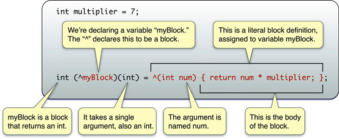

## 1 什么是Block
我们先来看一段代码：

```
[UIView animateWithDuration:0.2
                 animations:^{view.alpha = 0.0;}
                 completion:^(BOOL finished){ [view removeFromSuperview]; }];
```

上面的代码来自**UIView**的[animateWithDuration:animations:completion:](https://developer.apple.com/documentation/uikit/uiview/1622515-animatewithduration)方法，用于执行在视图的动画过程中淡化视图直到完全透明，然后从视图层次结构中删除视图的操作。该方法一共有三个参数，其中`animations`和`completion`都是以脱字符`^`开头的block对象，这是框架方法中使用block的典型示例之一。

块（Block）是苹果在iOS4开始引入的对C语言的一种扩展，它允许我们创建不同的代码段，与函数类似，不同的是，块定义在函数或方法内部，并能够访问在函数或方法范围内而块之外的任何变量。一般来说，这些变量能够访问但是它们的值并不能被改变。只有通过在变量前添加一个特殊的块修改器`__block`（在block前面添加两个下划线的字符组成）才能修改该变量的值，后面我们会有详细介绍。同时，块也是Objective-C对象，因此它们可以存储到NSArray或NSDictionary数据结构中，并且作为返回值从方法返回，甚至被分配给变量。

在这里我们主要介绍block的声明、创建、使用，以及在block内部访问变量等相关知识。

## 2 声明并创建Block



#### 2.1 Block的声明

```
返回值类型 (^block名称) (参数列表);
```

下面是几种有效的block声明：

```
void (^blockReturningVoidWithVoidArgument)(void);
void (^blockReturningVoidWithIntAndCharArguments)(int, char);
int (^blockReturningIntWithVoidArgument)(void);
NSString *(^blockReturningNSStringWithNSStringArgument)(NSString *);
NSString *(^blockReturningNSStringWithNSStringArgument)(NSString *string);
void (^arrayOfTenBlocksReturningVoidWithIntArgument[10])(int);
```

有几点值得注意的地方：

- block的声明和函数类似，如果不返回任何内容，则返回类型为`void`，且不可省略。
- block名称前面的脱字符`^`不能省略，块名称的命名规则与其它变量名或方法名的命名规则一致，并且脱字符和块名称都在圆括号内。
- 参数列表必须在括号内，如果有多个参数，参数间用逗号隔开。如果不传递参数，设置为`void`。如果有参数，必须标明参数类型，参数名称仅助于开发人员记住其功能，可以忽略。
- 最后，不要忘记写分号`;`。

#### 2.2 Block的创建与调用
##### 定义一个Block:
```
^(参数列表){
... 块主体 ...
};
```

与声明不同的是，在block定义中，如果有参数，参数名称不能省略；如果没有参数，则可以省略`(void)`参数列表。

##### 调用一个Block:
```
// 有参数：
block名称(参数); 

// 无参数：
block名称();
```

##### 代码示例：
- 无返回内容，无参数：

```
    // 1 声明一个block
    void (^block)(void);
    
    // 2 定义block(为block赋值）
    block = ^{
        NSLog(@"该block没有参数，不返回任何内容。");
    };
    
    // 3 调用block
    block();
```

也可以将block的声明和定义合并在一起，如下：

```
    // 1 创建block
    void (^block)(void) = ^{
        NSLog(@"该Block没有参数，不返回任何内容。");
    };
    
    // 2 调用block
    block();
```

- 无返回内容，有参数：

```
    void (^block)(int);
    
    block = ^(int value){
        NSLog(@"The value is %i", value);
    };
    
    block(3);
```

输出结果：

```
The value is 3
```

- 有返回内容，无参数：

```
    int (^block)(void);
    
    block = ^{
        int value = 3;
        return value;
    };
    
    NSLog(@"The value is %i", block());
```

输出结果：

```
The value is 3
```

- 有返回内容，有参数：

```
    int (^block)(int, int);
    
    block = ^(int a, int b){
        int value = a + b;
        return value;
    };
    
    NSLog(@"The value is %i", block(3, 5));
```

输出结果：

```
The value is 8
```

#### 2.3 使用typedef定义Block
如果需要重复声明多个相同类型（即返回值类型相同，参数列表相同）的block，我们可以使用`typedef`来定义block类型，以此来避免编写重复的代码，示例如下：

```
    // 1 声明一种返回值为int，并且有两个参数均为int的block类型
    typedef int (^Block)(int, int);
    
    // 2 使用该block类型声明并定义两个变量block1和block2
    Block block1 = ^(int a, int b){
        return a + b;
    };
    
    Block block2 = ^(int a, int b){
        return a * b;
    };
    
    // 3 调用
    NSLog(@"The value of block1 is %i", block1(3, 5));
    NSLog(@"The value of block2 is %i", block2(3, 5));
```

输出结果：

```
The value of block1 is 8
The value of block2 is 15
```

#### 2.4 将Block声明为全局变量
Block与其它变量一样，也可以被声明为全局变量，示例如下：

```
#import "ViewController.h"

// 声明并定义一个block为全局变量
NSString *(^globalBlock)(void) = ^{
    return @"This is a global block";
};

@implementation ViewController

- (void)viewDidLoad {
    [super viewDidLoad];
    
    // 调用
    NSLog(@"%@", globalBlock());
}
```

## 3 Block与变量
Block与函数类似，能够访问在函数或方法范围内而在块之外定义的任何变量。
#### 3.1 Block内访问全局变量，包括静态变量
```
#import "ViewController.h"

// 声明一个全局变量
int gGlobalVar = 5;

@implementation ViewController

- (void)viewDidLoad {
    [super viewDidLoad];
    
    void (^block)(void) = ^{
        // 1 访问全局变量
        NSLog(@"gGlobalVar = %i", gGlobalVar);
        
        // 2 直接修改全局变量的值
        gGlobalVar = 8;
        NSLog(@"gGlobalVar = %i", gGlobalVar);
    };
    
    // 调用
    block();
    
    // 3 调用前修改全局变量的值
    gGlobalVar = 6;
    block();
}
```

输出结果：

```
gGlobalVar = 5
gGlobalVar = 8
gGlobalVar = 6
gGlobalVar = 8
```

从上面代码及输出结果，我们不难发现：

1. 在block内可以访问全局变量的值。
2. 在block中可以直接修改全局变量的值。
3. 在block定义后、调用前修改全局变量的值，会影响输出结果。当调用block时，访问的全局变量的值是修改后的新值。这是因为全局变量（或静态变量）在内存中的地址是固定的，block在读取该变量值的时候是直接从其所在的内存中读取，因此得到的是最新值，而不是在定义时copy的常量。  

> block也可以访问静态变量、修改静态变量的值等，与全局变量类似，这里不再赘述。

<a id = "3.2">

#### 3.2 Block访问局部变量

```
- (void)viewDidLoad {
    [super viewDidLoad];
    
    // 定义一个局部变量
    int var = 5;
    
    void (^block)(void) = ^{
        // 1 访问局部变量
        NSLog(@"var = %i", var);
        
        // 2 修改局部变量的值
        var = 8;     //编译时会报错
        NSLog(@"var = %i", var);
    };
    
    // 调用
    block();
    
    // 3 调用前修改局部变量的值
    var = 6;
    block();
}
```

上面`var = 8;`所在的代码行会出现错误提示：*Variable is not assignable(missing __block type specifier)*，这是因为在block内部不能直接修改局部变量的值，如果要修改，必须使用`__block`修饰符重新声明局部变量。这里我们先注释掉`2`中的代码，看一下运行结果：

```
var = 5
var = 5
```

由此可见：

1. 在block内可以访问局部变量的值。
2. 在block内不能直接修改局部变量的值，如果要修改必须使用`__block`修饰符声明局部变量。
3. 在block定义后、调用前修改局部变量的值，不影响输出结果，当调用block时，访问的局部变量的值是修改前的旧值。这是因为block在定义时会copy变量的值作为常量使用，因此局部变量在block中是只读的，即使变量的值在block外改变，也不影响其在block中的值。

</a>

#### 3.3 Block访问`__block`修饰的局部变量
在这里我们使用`__block`存储类型修饰符（由下划线下划线block组成）重新定义局部变量，以解决[3.2](#3.2)中遇到的错误提示：

```
- (void)viewDidLoad {
    [super viewDidLoad];
    
    // 使用__block重新定义局部变量
    __block int var = 5;
    
    void (^block)(void) = ^{
        // 1 访问局部变量
        NSLog(@"var = %i", var);
        
        // 2 修改局部变量的值
        var = 8;
        NSLog(@"var = %i", var);
    };
    
    // 调用
    block();
    
    // 3 调用前修改局部变量的值
    var = 6;
    block();
}
```

这次没有任何错误提示，并且输出结果如下：

```
var = 5
var = 8
var = 6
var = 8
```

由此我们发现：

1. 被`__block`修饰的局部变量，在block内可以正常访问该变量的值。
2. 被`__block`修饰的局部变量，在block内可以修改该变量的值。
3. 被`__block`修饰的局部变量，在block定义后、调用前修改该变量的值会影响输出结果，调用block时，访问的该变量的值是修改后的新值。  

## 4 Block的使用
我们已经知道block被广泛地用在很多框架方法中，除此之外，它还常用于GCD、动画、排序及各类回调中，在这里我们主要介绍Block作为参数和属性的用法。

#### 4.1 Block作为方法或函数的参数
我们将block作为参数传递给方法或函数的过程与其它参数类似，需要注意的是，一般情况下，我们只对方法使用一个block参数，如果该方法还需要其它非block的参数，则该block参数应该是方法的最后一个参数。

```
// 定义一个含有block参数的方法：
- (void)addNumber:(int)number1 withNumber:(int)number2 withBlockArgument:(void (^)(int))block
{
    int result = number1 + number2;
    block(result);
}

// 在viewDidLoad中调用该方法：
- (void)viewDidLoad {
    [super viewDidLoad];
   
    [self addNumber:3 withNumber:5 withBlockArgument:^(int result) {
        NSLog(@"The result is %i", result);
    }];
}
```

输出结果：

```
The result is 8
```

#### 4.2 Block被用作属性
Block作为属性时用法与其它属性类似，不同的是，使用block作为属性时，在MRC环境下只能用`copy`修饰。这是因为在使用block访问外部变量时，block类型是堆block，当堆中的block引用计数为0被销毁时，如果想继续在外部访问和调用block，就需要将block从栈中复制一份移动到堆中，因此需要用`copy`修饰。如果是在ARC环境下这些会自动发生，我们不需要担心，可以用`strong`修饰。

下面是一段简单的代码示例：

```
#import "ViewController.h"

@interface ViewController ()

// 声明一个block属性
@property (nonatomic, copy) void (^blockAsProperty)(void);

@end

@implementation ViewController

- (void)viewDidLoad {
    [super viewDidLoad];
    
    // 设置该block属性
    self.blockAsProperty = ^{
        NSLog(@"Using block as a property.");
    };
    
    // 调用
    self.blockAsProperty();
}
```

也可以使用`typedef`来声明block属性：

```
typedef void (^blockAsProperty)(void);

@interface ViewController ()

@property (nonatomic, copy) blockAsProperty blockProperty;
@property (nonatomic, copy) blockAsProperty anotherBlockProperty;

@end
```

另外，block作为属性多被用于逆向传值，如下图所示，我们将第二个视图控制器中设置的颜色通过block属性传递给第一个视图控制器做背景颜色。在这里我们不详细介绍实现过程，如果需要可以下载[BlockDemo](https://github.com/darkjoin/CodeExamples)查看。


#### 4.3 Block在框架方法中的使用
文章的开头我们就展示了在框架方法中使用block的示例，在这里只列举一下block在系统框架中的几种用法，详细内容可以参阅文档中关于[Blocks in the System Framework APIs](https://developer.apple.com/library/content/featuredarticles/Short_Practical_Guide_Blocks/index.html#//apple_ref/doc/uid/TP40009758-CH1-SW29)的讲解。

Block在系统框架方法中主要被用作以下几种形式：

- 完成处理程序 (Completion handlers)
- 通知处理程序 (Notification handlers)
- 错误处理程序 (Error handlers)
- 枚举 (Enumeration)
- 视图动画和转场 (View animation and transitions)
- 排序 (Sorting)


## 5 Block的内存管理
Block在ARC和MRC下的内存管理是不同的，在这里我们只介绍block在ARC下的内存管理，在MRC下的内存管理可以参考[这里](http://tanqisen.github.io/blog/2013/04/19/gcd-block-cycle-retain/)。

在ARC默认情况下，block是存储在堆中，ARC会自动进行内存管理，我们只需要避免循环引用即可。下面我们就介绍下在什么情况会造成循环引用以及如何去避免。

#### 5.1 Block中的循环引用
Block会对包含`self`在内的所引用的对象进行强引用，如果对象内部有一个block属性，而在block内又访问了该对象，这时就会造成循环引用。示例如下：

```
@interface ViewController ()

// 声明block变量
@property (nonatomic, copy) void (^block)(void);

@end

@implementation ViewController

- (void)viewDidLoad {
    [super viewDidLoad];
    
    self.block = ^{
        // 在block内访问self
        [self testMethod];    //编译时会出现警告提示
        NSLog(@"Block");
    };
    
    self.block();
}

- (void)testMethod
{
    NSLog(@"Test method");
}
```

上面`[self testMethod];`所在的代码行会出现警告提示：*Capturing 'self' strongly in this block is likely to lead to a retain cycle*，这是因为在block内部对`self`进行了一次强引用，会导致循环引用无法释放。

#### 5.2 避免循环引用
为了避免循环引用，最好的是对block内部引用的`self`对象进行弱引用。一般使用一个弱指针来指向该对象，然后在block内使用该弱引用指针来进行操作，这样就避免了block对该对象的强引用。

对于上面的代码，我们使用一个弱指针对`self`进行弱引用，这样警告就会消失，修改`viewDidLoad`方法中的代码如下：

```
- (void)viewDidLoad {
    [super viewDidLoad];
    
    __weak ViewController *weakSelf = self;
    
    self.block = ^{
            [weakSelf testMethod];
        NSLog(@"Block");
    };
    
    self.block();
}
```

> 注意：这里的`__weak`是在weak前添加两个下划线字符组成的，而且只能用于iOS5之后的版本。

## 6 参考资料
1. [Blocks Programming Topics](https://developer.apple.com/library/content/documentation/Cocoa/Conceptual/Blocks/Articles/00_Introduction.html#//apple_ref/doc/uid/TP40007502-CH1-SW1)
2. [Working with Blocks](https://developer.apple.com/library/content/documentation/Cocoa/Conceptual/ProgrammingWithObjectiveC/WorkingwithBlocks/WorkingwithBlocks.html#//apple_ref/doc/uid/TP40011210-CH8-SW1)
3. [A Short Practical Guide to Blocks](https://developer.apple.com/library/content/featuredarticles/Short_Practical_Guide_Blocks/index.html#//apple_ref/doc/uid/TP40009758)
4. [Introduction to Objective-C Blocks](https://www.appcoda.com/objective-c-blocks-tutorial/)

 


