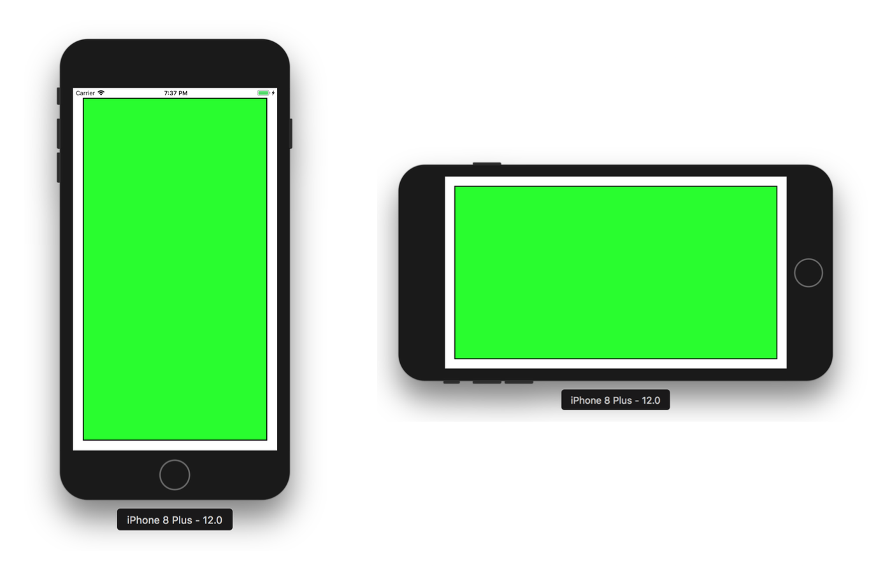
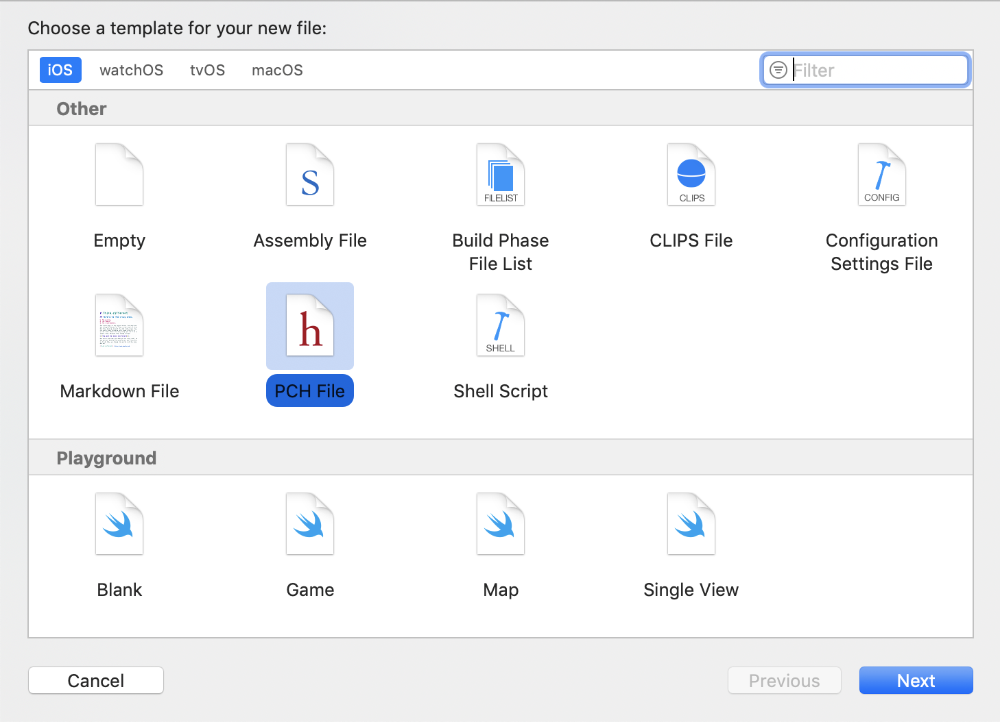
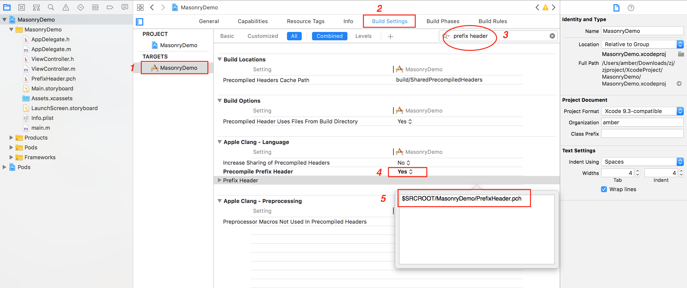
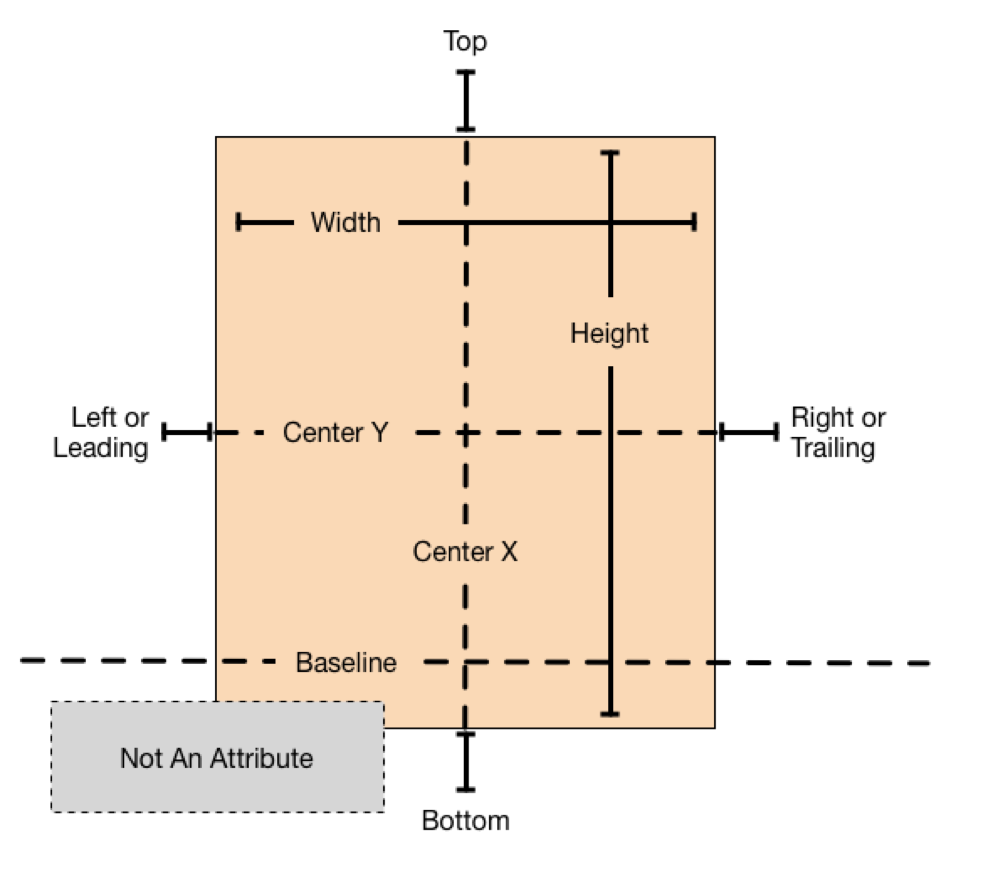
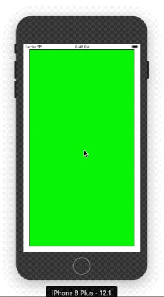
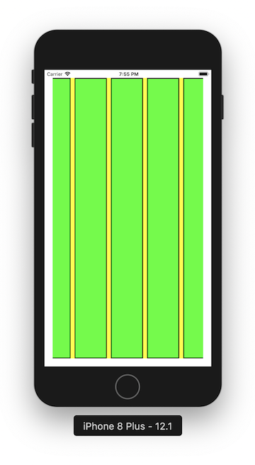

[Masonry](https://github.com/SnapKit/Masonry)是对AutoLayout封装而成的一个轻量级的布局框架。其语法优雅、代码简洁，可读性很高，而且同时支持iOS和Mac OS X。

这篇文章主要讲解Masonry的用法。

## 1 安装Masonry

这里我们使用CocoaPods来安装Masonry。

首先打开Podfile文件，添加下面的内容：

```
pod 'Masonry'
```

> 如果项目中还没有Podfile文件，可以在当前项目中手动创建一个，也可以通过终端定位到项目目录，使用`pod init`命令创建一个Podfile文件。

在命令行中输入`pod install`安装Masonry：

```
$ pod install
```

如果出现下面的提示内容，则表示Masonry安装成功：

```
Analyzing dependencies
Downloading dependencies
Installing Masonry (1.1.0)
Generating Pods project
Integrating client project

[!] Please close any current Xcode sessions and use `MasonryDemo.xcworkspace` for this project from now on.
Sending stats
Pod installation complete! There is 1 dependency from the Podfile and 1 total pod installed.
```

## 2 Masonry的使用

首先关闭之前创建的项目文件，打开后缀名为xcworkspace的项目。在需要使用Masonry的项目文件中导入Masonry的头文件。

这里我们创建一个greenView的子视图，并将它添加到self.view上，然后使用Masonry对它进行布局，让其距离父视图的上下左右边距均为20：

```
#import "ViewController.h"
#import "Masonry.h"

@interface ViewController ()
@property (nonatomic, strong) UIView *greenView;
@end

@implementation ViewController
- (void)viewDidLoad
{
    [super viewDidLoad];
    
    // 添加子视图
    [self.view addSubview:self.greenView];
    
    // 添加布局
    [self.greenView mas_makeConstraints:^(MASConstraintMaker *make) {
        make.left.equalTo(self.view).offset(20);
        make.right.equalTo(self.view).offset(-20);
        make.top.equalTo(self.view).offset(20);
        make.bottom.equalTo(self.view).offset(-20);
    }];
}

- (UIView *)greenView
{
    if (!_greenView) {
        _greenView = [[UIView alloc] init];
        _greenView.backgroundColor = [UIColor greenColor];
        _greenView.layer.borderColor = [UIColor blackColor].CGColor;
        _greenView.layer.borderWidth = 2.0;
    }
    return _greenView;
}
```

运行结果：



在上面的代码中，我们调用了`mas_makeConstraints:`方法给视图添加布局信息：

```
[self.greenView mas_makeConstraints:^(MASConstraintMaker *make) {
    make.top.equalTo(self.view).offset(20);
    make.left.equalTo(self.view).offset(20);
    make.bottom.equalTo(self.view).offset(-20);
    make.right.equalTo(self.view).offset(-20);
}];
```

> 上面的`left`、`right`、`top`、`bottom`均是Masonry支持的属性，分别表示左侧、右侧、顶部、底部；`equalTo`表示约束的关系；`offset`表示偏移值，另外还有`multipliedBy`表示倍数值。

上面的代码也可以写成：

```
[self.greenView mas_makeConstraints:^(MASConstraintMaker *make) {
    make.top.mas_equalTo(self.view.mas_top).offset(20);
    make.left.mas_equalTo(self.view.mas_left).offset(20);
    make.bottom.mas_equalTo(self.view.mas_bottom).offset(-20);
    make.right.mas_equalTo(self.view.mas_right).offset(-20);
}];
```

还可以写成：

```
[self.greenView mas_makeConstraints:^(MASConstraintMaker *make) {
    make.top.equalTo(@20);
    make.left.equalTo(@20);
    make.bottom.equalTo(@-20);
    make.right.equalTo(@-20);
}];
```

和：

```
[self.greenView mas_makeConstraints:^(MASConstraintMaker *make) {
    make.top.mas_equalTo(20);
    make.left.mas_equalTo(20);
    make.bottom.mas_equalTo(-20);
    make.right.mas_equalTo(-20);
}];
```

还可以简化为：

```
[self.greenView mas_makeConstraints:^(MASConstraintMaker *make) {
    make.edges.equalTo(self.view).with.insets(UIEdgeInsetsMake(20, 20, 20, 20));
}];
```

和：

```
[self.greenView mas_makeConstraints:^(MASConstraintMaker *make) {
    make.top.left.bottom.and.right.equalTo(self.view).with.insets(UIEdgeInsetsMake(20, 20, 20, 20));
}];
```

> 值得一提的是，这里的`and`和`with`其实没有执行任何操作，实际上是可以省略的，但是用在这种链式语法中就很巧妙，增加了语句的可读性，而且特别容易理解。

如果不想使用`mas_`前缀，可以在导入Masonry之前添加下面的宏：

```
#define MAS_SHORTHAND
```

例如：

```
#define MAS_SHORTHAND

#import "ViewController.h"
#import "Masonry.h"

...
[self.greenView makeConstraints:^(MASConstraintMaker *make) {
    make.edges.equalTo(self.view).with.insets(UIEdgeInsetsMake(20, 20, 20, 20));
}];
```

另外，也可以将`#define MAS_SHORTHAND`写在**PrefixHeader.pch**文件中。

###### 创建**PrefixHeader.pch**文件

打开**File\New\File...**，选择**iOS\Other\PCH File**，点击**Next**，修改要保存的文件名称（这里使用默认的），点击**Create**即可。



然后在**PrefixHeader.pch**文件中添加下面的代码：

```
#define MAS_SHORTHAND

#import "Masonry.h"
```

这样下次再需要使用Masonry的时候就不需要再导入了，并且也可以省略掉`mas_`前缀。

需要注意的是，**PrefixHeader.pch**文件需要配置一下才能生效。

###### 配置**PrefixHeader.pch**文件

选中项目，然后**TARGETS\Build Settings**，然后在搜索框中输入*prefix header*，然后定位到**Apple Clang - Language**这一栏，将**Precompile Prefix Header**的值改为**YES**，然后在**Prefix Header**右侧双击，在弹出的输入框中填写**PrefixHeader.pch**文件的路径即可。



>  这里可以使用`$(SRCROOT)/项目名称/xxx.pch`这样的格式来设置路径，其中`$(SRCROOT)`表示项目所在的目录。

## 3 Masonry支持的属性

前面代码中我们用到的`left`、`right`、`top`、`bottom`属性，其实Masonry还有很多属性。

下面列出的是标准属性：

```
@property (nonatomic, strong, readonly) MASConstraint *left;
@property (nonatomic, strong, readonly) MASConstraint *top;
@property (nonatomic, strong, readonly) MASConstraint *right;
@property (nonatomic, strong, readonly) MASConstraint *bottom;
@property (nonatomic, strong, readonly) MASConstraint *leading;
@property (nonatomic, strong, readonly) MASConstraint *trailing;
@property (nonatomic, strong, readonly) MASConstraint *width;
@property (nonatomic, strong, readonly) MASConstraint *height;
@property (nonatomic, strong, readonly) MASConstraint *centerX;
@property (nonatomic, strong, readonly) MASConstraint *centerY;
@property (nonatomic, strong, readonly) MASConstraint *baseline;
```



除此之外，Masonry还支持margin和safeArea相关的属性：

```
@property (nonatomic, strong, readonly) MASViewAttribute *leftMargin;
@property (nonatomic, strong, readonly) MASViewAttribute *rightMargin;
@property (nonatomic, strong, readonly) MASViewAttribute *topMargin;
@property (nonatomic, strong, readonly) MASViewAttribute *bottomMargin;
@property (nonatomic, strong, readonly) MASViewAttribute *leadingMargin;
@property (nonatomic, strong, readonly) MASViewAttribute *trailingMargin;
@property (nonatomic, strong, readonly) MASViewAttribute *centerXWithinMargins;
@property (nonatomic, strong, readonly) MASViewAttribute *centerYWithinMargins;

@property (nonatomic, strong, readonly) MASViewAttribute *safeAreaLayoutGuideTop;
@property (nonatomic, strong, readonly) MASViewAttribute *safeAreaLayoutGuideBottom;
@property (nonatomic, strong, readonly) MASViewAttribute *safeAreaLayoutGuideLeft;
@property (nonatomic, strong, readonly) MASViewAttribute *safeAreaLayoutGuideRight;
```

另外，Masonry还提供了一些方便的方法，可以同时创建多种约束，它们被称为MASCompositeConstraints（复合约束）：

```
@property (nonatomic, strong, readonly) MASConstraint *edges;
@property (nonatomic, strong, readonly) MASConstraint *size;
@property (nonatomic, strong, readonly) MASConstraint *center;
```

- `edges`

  ```
  make.edges.equalTo(self.view);
  make.edges.mas_equalTo(UIEdgeInsetsMake(20, 20, 20, 20));
  make.edges.equalTo(self.view).insets(UIEdgeInsetsMake(20, 20, 20, 20));
  ```

- `size`

  ```
  make.size.greaterThanOrEqualTo(view1);
  make.size.mas_equalTo(CGSizeMake(300, 200));
  
  make.size.equalTo(self.view).sizeOffset(CGSizeMake(100, -50));	
  // 表示：view.width = view.superView.width + 100, view.height = view.superView.height - 50
  ```

- `center`

  ```
  make.center.equalTo(self.view);
  make.center.equalTo(@(CGPointMake(100, 200)));
  make.center.mas_equalTo(CGPointMake(100, 200));
  
  make.center.equalTo(self.view).centerOffset(CGPointMake(-5, 10));	
  // 表示： view.centerX = view.superView.centerX - 5, view.centerY = view.superView.centerY + 10
  ```

## 4 Masonry中约束的关系

- `equalTo` 
- `lessThanOrEqualTo`
- `greaterThanOrEqualTo`

如果希望greenView的左侧大于或者等于self.view的左侧，我们可以在代码中可以这样写：

```
[self.greenView makeConstraints:^(MASConstraintMaker *make) {
    make.left.greaterThanOrEqualTo(self.view);
}];
```

如果希望greenView的宽度大于等于200，小于等于400，我们可以在代码中这样写：

```
[self.greenView makeConstraints:^(MASConstraintMaker *make) {
    // width >= 200 && width <= 400
    make.width.greaterThanOrEqualTo(@200);
    make.width.lessThanOrEqualTo(@400);
}];
```

## 5 Masonry中约束的优先级

- `priority`可以指定一个确切的优先级值，范围在0 ~ 1000，值越大优先级越高。
- `priorityHigh`相当于`UILayoutPriorityDefaultHigh`，优先级值为750。
- `priorityMedium`介于高优先级和低优先级之间，优先级值在250 ~ 750之间。
- `priorityLow`相当于`UILayoutPriorityDefaultLow`，优先级值为250。

优先级可以写在约束链的末尾，例如：

```
make.top.equalTo(self.view).with.priority(800);
make.bottom.equalTo(self.view).priorityMedium();
make.left.equalTo(self.view).priorityLow();
make.right.equalTo(self.view).priorityHigh();
```

## 6 创建约束

自动布局允许将宽度和高度设置为常量值，例如：

```
[self.greenView makeConstraints:^(MASConstraintMaker *make) {
    make.width.equalTo(@300);
    make.height.equalTo(@200);
}];
```

但是，自动布局不允许将对齐属性（如`left`、`right`、`centerY`等）设置为常量值。如果为这些属性传递了一个NSNumber类型的值，Masonry会将这些变为相对于视图的父视图的约束，即：

```
[self.greenView makeConstraints:^(MASConstraintMaker *make) {
    make.left.equalTo(@10);
}];
```

相当于：

```
[self.greenView makeConstraints:^(MASConstraintMaker *make) {
	make.left.equalTo(self.view.mas_left).offset(10);
}];
```

表示：

```
view.left = view.superView.left + 10;
```

除了使用NSNumber类型创建约束以外，还可以使用结构等，示例如下：

```
make.size.equalTo(@(CGSizeMake(300, 200)));
make.size.mas_equalTo(CGSizeMake(300, 200));
make.edges.mas_equalTo(UIEdgeInsetsMake(20, 20, 20, 20));

make.left.mas_equalTo(self.view).mas_offset(UIEdgeInsetsMake(20, 20, 20, 20));  
```

> 上面最后一行代码的效果等同于：
>
> ```
> make.left.mas_equalTo(self.view).mas_offset(20);
> ```

另外，还可以使用数组来传递不同类型的值创建约束，例如：

```
make.height.equalTo(@[view1.mas_height, view2.mas_height]);
make.height.equalTo(@[view1, view2]);
make.left.equalTo(@[view1.right, @100, view2]);
```

## 7 使用Masonry更新约束

有时候我们需要更改现有的约束以设置动画，或者删除、替换约束，在Mansory中，我们可以使用下面的方法来更新约束。

#### 7.1 将约束的表达式结果保存为属性或变量，通过使用该约束变量或属性来添加或者删除约束。

例如，我们可以声明一个`MASConstraint`类型的属性：

```
@property (nonatomic, strong) MASConstraint *topConstraint;
```

然后定义该属性：

```
[self.greenView mas_makeConstraints:^(MASConstraintMaker *make) {
    self.topConstraint = make.top.equalTo(self.view).with.offset(20);
}];
```

后面如果需要重新该约束值，可以这样写：

```
self.topConstraint.mas_equalTo(20);
```

另外，还可以根据需要调用下面的方法：

```
[self.topConstraint install];	// 创建NSLayoutConstraint并将其添加到适当的视图上。
[self.topConstraint uninstall];	// 删除之前安装的NSLayoutConstraint
[self.topConstraint activate];	// 如果操作系统支持NSLayoutConstraint，可以调用该方法来激活约束。否则需要调用install方法。
[self.topConstraint deactivate];	// 取消激活（使无效）之前安装/激活的NSLayoutConstraint。
```

以之前的greenView为例，我们在self.view上添加一个点击手势，每次点击的时候更新greenView的edges约束：

```
@property (nonatomic, strong) MASConstraint *edgesConstraint;

- (void)viewDidLoad
{
    ...
    
    // 添加子视图
    [self.view addSubview:self.greenView];
    
    // 给self.view添加点击手势
    UITapGestureRecognizer *tap = [[UITapGestureRecognizer alloc] initWithTarget:self action:@selector(tap:)];
    [self.view addGestureRecognizer:tap];
    
    // 给greenView添加布局
    [self.greenView mas_makeConstraints:^(MASConstraintMaker *make) {
        self.edgesConstraint = make.edges.equalTo(self.view).with.insets(UIEdgeInsetsMake(20, 20, 20, 20));
    }];
}

- (void)tap:(UITapGestureRecognizer *)tap
{
    int i = arc4random_uniform(10);
    
    // 更新greenView的布局
    self.edgesConstraint.mas_equalTo(UIEdgeInsetsMake(20 * i, 20 * i, 20 * i, 20 * i));
}
```

效果如下：



> 另外，还可以通过将约束存储在数组中来引用多个约束。

#### 7.2 使用`mas_updateConstraints`方法更新约束。

如果我们只需要更新约束的常量值，我们可以使用`mas_updateConstraints`方法来代替`mas_makeConstraints`方法。`mas_updateConstraints`对于更新一组约束很有用。

比如我们可以使用下面的代码替换`tap:`方法中的内容，实现之前的效果：

```
- (void)tap:(UITapGestureRecognizer *)tap
{
    int i = arc4random_uniform(10);
    
    // 使用mas_updateConstraints更新约束
    [self.greenView mas_updateConstraints:^(MASConstraintMaker *make) {
        make.edges.equalTo(self.view).with.insets(UIEdgeInsetsMake(20 * i, 20 * i, 20 * i, 20 * i));
    }];
}
```

#### 7.3 使用`mas_remakeConstraints`方法更新约束。

`mas_remakeConstraints`类似于`mas_updateConstraints`，但它不是更新常量值，而是在再次安装之前删除所有约束。 这样我们就可以提供不同的约束，而无需保留对要删除约束的引用。

```
- (void)tap:(UITapGestureRecognizer *)tap
{
    int i = arc4random_uniform(10);
    
    // 使用remakeConstraints更新约束
    [self.greenView mas_remakeConstraints:^(MASConstraintMaker *make) {
        make.edges.equalTo(self.view).with.insets(UIEdgeInsetsMake(20 * i, 20 * i, 20 * i, 20 * i));
    }];
}
```

#### 7.4 总结

- `mas_makeConstraints`只负责新增约束，每次调用会创建新的约束，如果对已存在的约束再次创建，会提示冲突（此时会存在对同一属性的两条约束）。
- `mas_updateConstraints`用于更新之前创建的约束，如果对已存在的约束进行更新，没有任何问题（此时只存在对同一属性的最新一条约束）。
- `mas_remakeConstraints`会清除之前的所有约束，仅保留最新的约束。

## 8 使用Masonry定位发生冲突的约束

使用Masonry可以为视图和约束创建有意义的名称，这样当设置的约束发生冲突时，我们可以定位到具体的元素。

例如：如果我们使用下面的代码为greenView添加布局：

```
[self.greenView mas_makeConstraints:^(MASConstraintMaker *make) {
    make.edges.equalTo(self.view).with.insets(UIEdgeInsetsMake(20, 20, 20, 20));
    make.height.lessThanOrEqualTo(@(200));
}];
```

运行的时候控制台会提示约束冲突：

```
[LayoutConstraints] Unable to simultaneously satisfy constraints.
...... 
(
    "<MASLayoutConstraint:0x600000f01ce0 UIView:0x7fbdace024b0.top == UIView:0x7fbdace0b630.top + 20>",
    "<MASLayoutConstraint:0x600000f01da0 UIView:0x7fbdace024b0.bottom == UIView:0x7fbdace0b630.bottom - 20>",
    "<MASLayoutConstraint:0x600000f01e60 UIView:0x7fbdace024b0.height <= 200>",
    "<NSLayoutConstraint:0x600000818e10 UIView:0x7fbdace0b630.height == 736>"
)

Will attempt to recover by breaking constraint 
<MASLayoutConstraint:0x600000f01e60 UIView:0x7fbdace024b0.height <= 200>
......
```

面对这样的输出，我们很难找到造成约束冲突的问题。

Masonry为NSLayoutConstraint添加了一个分类，重写了`- (NSString *)description`方法的默认实现。这样我们就可以为视图和约束提供有意义的名称，并且还可以轻松选择由Masonry创建的约束。

更改上面的代码如下：

```
self.greenView.mas_key = @"greenView";
self.view.mas_key = @"self.view";
//    MASAttachKeys(self.greenView, self.view);   // 也可以使用这种写法自动关联一个key

// 添加布局
[self.greenView mas_makeConstraints:^(MASConstraintMaker *make) {
    make.edges.equalTo(self.view).with.insets(UIEdgeInsetsMake(20, 20, 20, 20)).key(@"edgesConstraint");
    make.height.lessThanOrEqualTo(@(200)).key(@"heightConstraint");
//        make.height.lessThanOrEqualTo(@(200)).key(@1234);    // key可以是任意值
}];
```

这次的运行结果：

```
[LayoutConstraints] Unable to simultaneously satisfy constraints.
	......
(
    "<MASLayoutConstraint:edgesConstraint[2] UIView:greenView.top == UIView:self.view.top + 20>",
    "<MASLayoutConstraint:edgesConstraint[3] UIView:greenView.bottom == UIView:self.view.bottom - 20>",
    "<MASLayoutConstraint:heightConstraint UIView:greenView.height <= 200>",
    "<NSLayoutConstraint:0x600002f9f6b0 UIView:self.view.height == 736>"
)

Will attempt to recover by breaking constraint 
<MASLayoutConstraint:heightConstraint UIView:greenView.height <= 200>
......
```

可以很明显看到greenView设置的高度约束冲突了。

## 9 使用Masonry布局scrollView

对UIScrollView使用自动布局的时候，经常会遇到很多问题，比如布局无效，不能滑动等。主要是因为UIScrollView除了有自己的frame之外，还有一个contentSize。如果对子视图进行布局时参考了scrollView，例如设置子视图的leading/trailing/top/bottom属性等于scrollView的leading/trailing/top/bottom，这实际上是子视图相对于scrollview的contentsize来确定的，而非bounds。而且由于scrollview的contentSize又是根据子视图的位置决定的，这样就形成了一个依赖循环。

为了打破这种循环依赖，为ScrollView中的子视图添加约束的时候需要注意：

- 子视图不能依赖任何scrollView有关的布局，即不能参考scrollView的位置。
- 子视图除了要确定自己的大小以外，还需要确定自己与contentSize四周的距离，以此来确定contentSize。

比如我们现在有一个scrollView，将greenView作为子视图添加到scrollView上，代码如下：

```
- (void)viewDidLoad
{
    [super viewDidLoad];
    
    [self.view addSubview:self.scrollView];
    [self.scrollView addSubview:self.greenView];
    
    // 布局scrollView
    [self.scrollView mas_makeConstraints:^(MASConstraintMaker *make) {
        make.edges.equalTo(self.view);
    }];
    
    // 布局greenView并确定scrollview的contentSize
    [self.greenView mas_makeConstraints:^(MASConstraintMaker *make) {
        // 1 确定contentSize的大小
        make.edges.equalTo(self.scrollView); 
        
        // 2 确定greenView的大小
        make.height.mas_equalTo(500);
        make.width.mas_equalTo(1000);
        // make.size.equalTo(self.scrollView).sizeOffset(CGSizeMake(500, -100));
    }];
}
```

> 上面代码中我们使用`make.edges.equalTo(self.scrollView);`来确定contentSize的大小，它表示greenView的上下左右距离contentSize的值为0，因此只要greenView的大小确定了，contentSize也就确定了。

如果要在scrollView上添加多个子视图，可以将多个子视图放入一个containerView中，这样布局子视图时只需要参考containerView就可以了。

比如现在有一个scrollView，它里面有多个子视图等间隔排列：



我们可以使用下面的代码来实现：

```
- (void)viewDidLoad
{
    [super viewDidLoad];
    
    [self.view addSubview:self.scrollView];
    [self.scrollView addSubview:self.containerView];

    [self.scrollView mas_makeConstraints:^(MASConstraintMaker *make) {
        make.edges.equalTo(self.view).inset(20);
    }];

    [self.containerView mas_makeConstraints:^(MASConstraintMaker *make) {
        make.edges.equalTo(self.scrollView);
        make.height.mas_equalTo(self.scrollView);
    }];
	
	// 添加子视图
    int count = 10;
    UIView *previousView = nil;

    for (int i = 1; i <= count; ++i) {
        UIView *subView = [UIView new];
        subView.backgroundColor = [UIColor greenColor];
        subView.layer.borderColor = [UIColor blackColor].CGColor;
        subView.layer.borderWidth = 2.0;
        [self.containerView addSubview:subView];
        // 布局子视图
        [subView mas_makeConstraints:^(MASConstraintMaker *make) {
            make.top.bottom.equalTo(self.containerView);
            make.width.mas_equalTo(80);
            if (previousView) {
                make.left.equalTo(previousView.mas_right).offset(10);
            }
            else {
                make.left.equalTo(self.containerView).offset(10);
            }
        }];
        previousView = subView;
    }
    
    // 确定containerView的右边界
    [self.containerView mas_makeConstraints:^(MASConstraintMaker *make) {
        make.right.equalTo(previousView);
    }];
}
```

## 10 注意事项

- 对视图使用自动布局之前，需要先将视图添加到父视图上。
- 使用Masonry时注意区分`mas_equalTo`和`equalTo`的区别：
  - `mas_equalTo`：
    - 是对equalTo的封装，支持NSNumber、CGSize、CGPoint、UIEdgeInsets；
    - mas_equalTo是一个Macro，比较的是值；
    - 一般对于数值元素使用mas_equalTo，例如`make.width.mas_equalTo(100);`。
  - `equalTo`：
    - 只支持基本类型；
    - equalTo比较的是view；
    - 对于对象或多个属性的处理使用equalTo，例如`make.left.and.right.equalTo(self.view);`。
- 对视图使用自动布局后，如果尝试获取它的frame很可能获取到的是0。对于这种情况，我们可以在获取视图frame之前手动调用`layoutIfNeeded`方法来更新布局。
- Masonry中的block不存在循环引用的问题，不必使用weakSelf。虽然block内引用了view，但block并没有被view所持有，因此不会发生循环引用。

## 11 参考资料

[Masonry](https://github.com/SnapKit/Masonry)

[Masonry介绍与使用实践(快速上手Autolayout)](http://adad184.com/2014/09/28/use-masonry-to-quick-solve-autolayout/)

[Masonry 简单使用](https://juejin.im/post/5a3246126fb9a0450b666984)

[iOS开发之Masonry框架-使用方法须知](https://www.jianshu.com/p/24570a8f9e61)

[ScrollView使用Masonry自动布局](https://www.jianshu.com/p/689bc02da6ea)

[史上最简单的UIScrollView+Autolayout出坑指南](https://bestswifter.com/uiscrollviewwithautolayout/)

[iOS开发笔记 | 由使用Masonry布局不能立即获取到frame想到的一些问题](<https://blog.csdn.net/qq_41597968/article/details/79759847>)

[Masonry布局控件frame为0的问题](<https://yangjie2.github.io/2018/07/06/Masonry%E5%B8%83%E5%B1%80%E6%8E%A7%E4%BB%B6frame%E4%B8%BA0%E7%9A%84%E9%97%AE%E9%A2%98/>)

