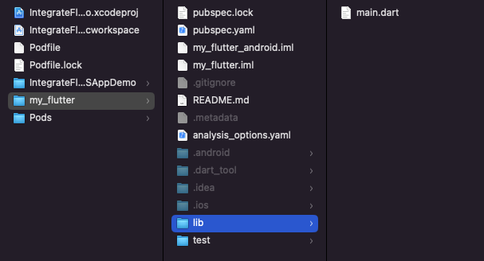
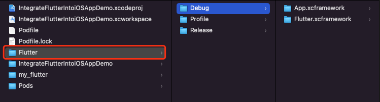
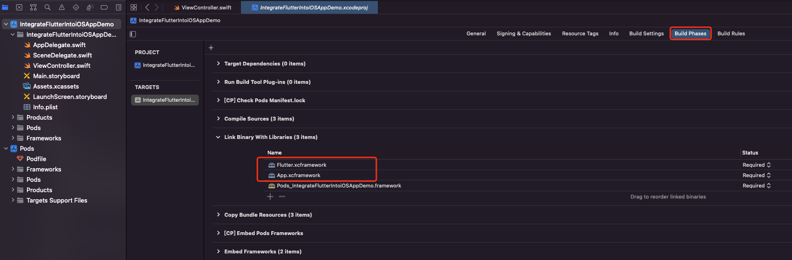
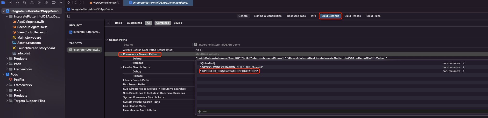
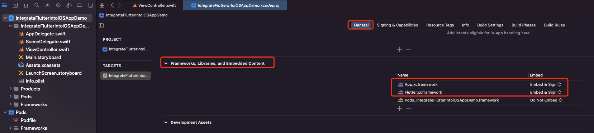
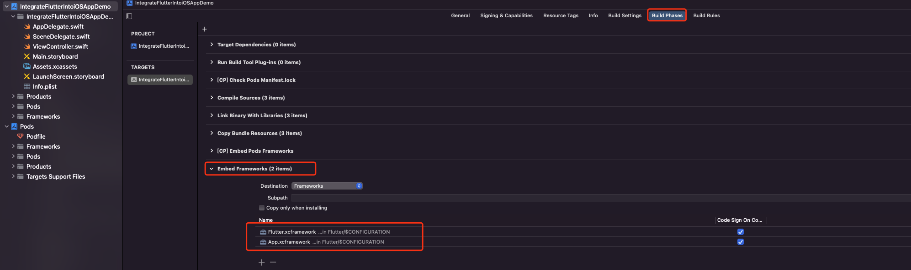
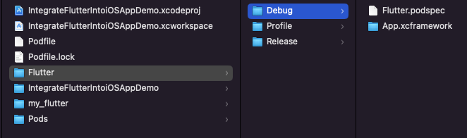
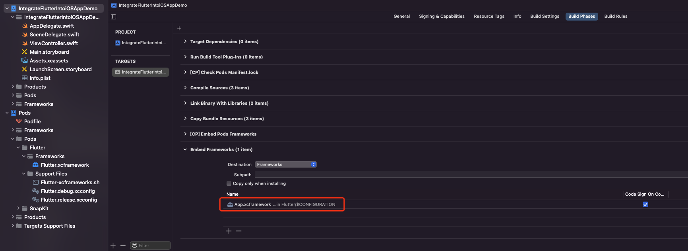
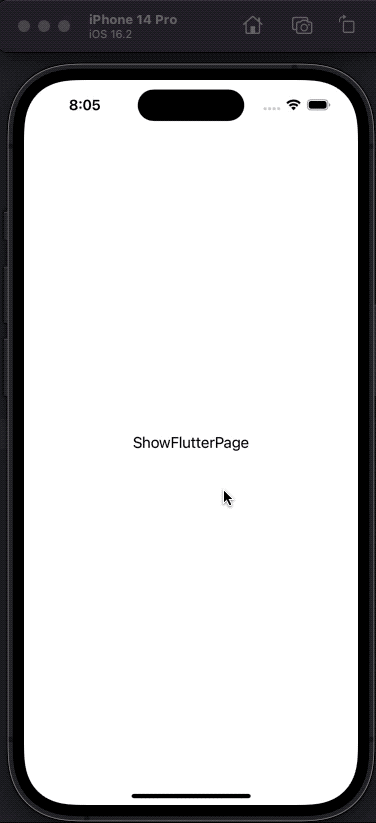
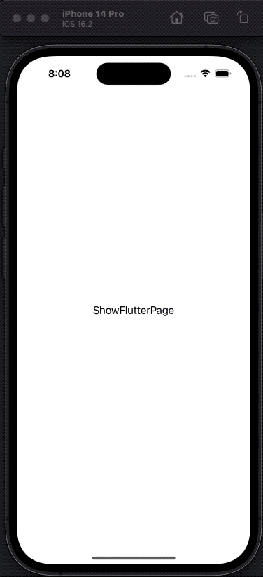

# iOS项目嵌入Flutter

在iOS原生项目中嵌入Flutter，主要是将Flutter module以Flutter SDK或者Flutter Framework等方式集成到项目中。

> Flutter支持iOS11及以上，所以在实践中需要确保运行环境支持。

下面以Demo为例详细介绍集成Flutter module的过程。

## 1 创建Flutter module
使用`flutter create --template module xxx`在当前项目目录下创建Flutter module：
```
~ cd /ProjectDirectory/IntegrateFlutterIntoiOSAppDemo
~ flutter create --template module my_flutter
Signing iOS app for device deployment using developer identity: "xxxx"
Creating project my_flutter...
Running "flutter pub get" in my_flutter...                       2,147ms
Signing iOS app for device deployment using developer identity: "xxxx"
Signing iOS app for device deployment using developer identity: "xxxx"
Wrote 12 files.

All done!
Your module code is in my_flutter/lib/main.dart.
```
完成之后会在项目目录下看到`my_flutter`文件夹。

创建的Flutter module目录结构如下，编写的Dart代码是放在 `lib/` 目录下：


## 2 在iOS项目中集成Flutter module

在现有iOS项目中集成Flutter module主要有三种方式：
- 使用CocoaPods和Flutter SDK集成
- 在Xcode中嵌入Flutter Framework
- 以CocoaPods的方式嵌入Flutter Framework
#### 2.1 使用CocoaPods和Flutter SDK集成
这种方式需要组内成员在本地安装Flutter SDK和CocoaPods。比较推荐使用这种方式，好处是，更新Flutter module中的内容无需执行额外的操作，即可在当前项目中生效。

在Podfile文件中添加下面内容：

```
flutter_application_path = 'my_flutter'
load File.join(flutter_application_path, '.ios', 'Flutter', 'podhelper.rb')
```
为每个需要集成Flutter的Target执行`install_all_flutter_pods(flutter_application_path)`：
```
target 'xxx' do
  install_all_flutter_pods(flutter_application_path)
end
```
在Podfile的`post_install`部分，执行`flutter_post_install(installer)`：
```
post_install do |installer|
  flutter_post_install(installer) if defined?(flutter_post_install)
end
```
下面是修改后的Podfile文件完整内容：
```
source 'https://github.com/CocoaPods/Specs.git'
platform :ios, '11.0'
# Flutter path
flutter_application_path = 'my_flutter'
load File.join(flutter_application_path, '.ios', 'Flutter', 'podhelper.rb')

target 'IntegrateFlutterIntoiOSAppDemo' do
  use_frameworks!
  pod 'SnapKit'
  
  # Flutter pods install
  install_all_flutter_pods(flutter_application_path)
end

post_install do |installer|
  # Flutter post install
  flutter_post_install(installer) if defined?(flutter_post_install)
end
```
执行`pod install`命令：
```
~ pod install
Analyzing dependencies
Downloading dependencies
Installing Flutter (1.0.0)
Installing FlutterPluginRegistrant (0.0.1)
Generating Pods project
Integrating client project
Pod installation complete! There are 3 dependencies from the Podfile and 3 total pods installed.
```
在Xcode中打开`.xcworkspace`项目，即可正常导入Flutter模块使用。
#### 2.2 在Xcode中嵌入Flutter Framework
如果不想使用CocoaPods作为应用依赖管理时，可以创建Framework，手动修改Xcode项目，将他们集成进去。需要注意的是，使用这种方式，每当在Flutter module中更改了代码，都必须重新运行`flutter build ios-framework`，才会在当前项目生效。

定位到Flutter module目录下，执行`flutter build ios-framework`在当前项目目录下创建frameworks：

```
~ cd my_flutter/
~ flutter build ios-framework --output=../Flutter/

💪 Building with sound null safety 💪

Building frameworks for com.example.myFlutter in debug mode...
 ├─Copying Flutter.xcframework...                                  323ms
 ├─Building App.xcframework...                                     32.5s
 └─Moving to ../Flutter/Debug                                       19ms
Building frameworks for com.example.myFlutter in profile mode...
 ├─Copying Flutter.xcframework...                                  427ms
 ├─Building App.xcframework...                                     54.5s
 └─Moving to ../Flutter/Profile                                     15ms
Building frameworks for com.example.myFlutter in release mode...
 ├─Copying Flutter.xcframework...                                  985ms
 ├─Building App.xcframework...                                     58.0s
 └─Moving to ../Flutter/Release                                     52ms
Frameworks written to
/xxx/IntegrateFlutterIntoiOSAppDemo/my_flutter/../Flutter.
```
完成之后会在项目目录下生成`Flutter`文件夹，在该`Flutter/`目录下可以看到生成的不同模式下的Framewroks：



将生成的Framework集成到项目中。
在项目Target的`Build Phases > Link Binary With Libraries`部分添加刚才生成的Framework：


上面添加Debug模式或者Release模式下的Framework都可以，根据自己的需要来添加就好。

不过正常情况下，还是希望在对应环境下嵌入相应的Framework，这样也便于开发者在模拟器调试，接下来就手动修改下Framework的路径，按环境来配置。
打开`project.pbxproj`文件，将刚才添加的frameworks的路径手动修改为`$CONFIGURATION`。比如之前如果是导入的Debug下的Framework，就将`path = Flutter/Debug/xxx.xcframework;`改为`path = Flutter/$CONFIGURATION/xxx.xcframework;`

```
3AEDAF0F29DAB0EF00239FAF /* App.xcframework */ = {isa = PBXFileReference; lastKnownFileType = wrapper.xcframework; name = App.xcframework; path = Flutter/$CONFIGURATION/App.xcframework; sourceTree = "<group>"; };
3AEDAF1129DAB0F600239FAF /* Flutter.xcframework */ = {isa = PBXFileReference; lastKnownFileType = wrapper.xcframework; name = Flutter.xcframework; path = Flutter/$CONFIGURATION/Flutter.xcframework; sourceTree = "<group>"; };
```
在Target的`Build Settings > Search Paths > Framework Search Paths`部分添加framework路径，同样这里按环境来配置。

```
$(PROJECT_DIR)/Flutter/$CONFIGURATION
```



> 注意：官方文档上这里的环境变量用的是`$(CONFIGURATION)`，不过这种写法在Xcode14.2有问题，需要改为`$CONFIGURATION`，如果你也遇到这个问题，可自行搜索环境变量的配置。
>
> >  官方文档提示：
> >
> > **Tip:** To use the simulator, you will need to embed the Debug version of the Flutter frameworks in your Debug build configuration. To do this you can use `$(PROJECT_DIR)/Flutter/$(CONFIGURATION)` in the **Framework Search Paths** (`FRAMEWORK_SEARCH_PATHS`) build setting. This embeds the Release frameworks in the Release configuration, and the Debug frameworks in the Debug Configuration.
> >
> > You must also open `MyApp.xcodeproj/project.pbxproj` (from Finder) and replace `path = Flutter/Release/example.xcframework;` with `path = "Flutter/$(CONFIGURATION)/example.xcframework";` for all added frameworks. (Note the added `"`.)

链接Framewrok之后，就可以在Target的`General > Frameworks, Libraries, and Embedded Content`部分，看到刚才嵌入的frameworks，然后手动将Embed改为`Embed & Sign`：



完成后会在`Build Phases > Embed Frameworks`部分看到刚才嵌入的frameworks：



接下来就可以正常导入Flutter模块进行编译了。

需要注意的是，使用这种方式，后续如果修改了`my_flutter/lib/main.dart`文件中的内容，需要重新执行`flutter build ios-framework`才会在现有项目生效。

#### 2.3 以CocoaPods的方式嵌入Flutter Framework
如果不想生成Flutter.xcframework这么大的文件，可以使用`--cocoapods`参数，将Flutter框架作为一个CocoaPods的podspec文件分发。这将会生成一个Flutter.podspec文件。但是App.xcframework和其他插件框架还是需要按照2.2的步骤来嵌入。
定位到Flutter module目录下，执行`flutter build ios-framework --cocoapods`在当前项目目录下创建Flutter.podspec文件和frameworks：

```
~ cd my_flutter/
~ flutter build ios-framework --cocoapods  --output=../Flutter/

💪 Building with sound null safety 💪

Building frameworks for com.example.myFlutter in debug mode...
 ├─Creating Flutter.podspec...                                       6ms
 ├─Building App.xcframework...                                     10.5s
 └─Moving to ../Flutter/Debug                                       22ms
Building frameworks for com.example.myFlutter in profile mode...
 ├─Creating Flutter.podspec...                                       1ms
 ├─Building App.xcframework...                                     19.6s
 └─Moving to ../Flutter/Profile                                     15ms
Building frameworks for com.example.myFlutter in release mode...
 ├─Creating Flutter.podspec...                                       1ms
 ├─Building App.xcframework...                                     21.4s
 └─Moving to ../Flutter/Release                                     46ms
Frameworks written to
/xxx/IntegrateFlutterIntoiOSAppDemo/my_flutter/../Flutter.
```
完成之后会在当前项目目录下看到`Flutter`文件夹，里面有生成的`Flutter.podspec`文件和`App.xcframework`：



将Flutter添加到Podfile文件中：

```
pod 'Flutter', :podspec => 'Flutter/Debug/Flutter.podspec'
```
Podfile完整内容如下：
```
source 'https://github.com/CocoaPods/Specs.git'
platform :ios, '11.0'

target 'IntegrateFlutterIntoiOSAppDemo' do
  use_frameworks!
  pod 'SnapKit'
  pod 'Flutter', :podspec => 'Flutter/Debug/Flutter.podspec'
end
```
> 注意，这里podspec的路径需要硬编码，如果是在Release模式下，需要改为'Flutter/Release/Flutter.podspec'，如果是在Debug模式下，需要改为'Flutter/Debug/Flutter.podspec'
执行`pod install`，会在项目中看到导入的`Flutter.xcframework`：


然后还需要将生成的`App.xcframework`按照2.2的方法链接和嵌入到当前项目中：



> 如果只有`Flutter.xcframework`，会在运行时报错`Failed to find assets path for "Frameworks/App.framework/flutter_assets"`。

之后就可以在项目中导入Flutter模块使用了。
同样需要注意的是：后续如果修改了`my_flutter/lib/main.dart`文件中的内容，需要重新执行`flutter build ios-framework --cocoapods`才会在现有项目生效（无需执行pod install）。

## 3 在iOS项目中展示Flutter页面

前面已经将Flutter模块嵌入到项目中，接下来尝试下在原生项目展示Flutter页面。

#### 3.1 直接调用FlutterViewController

在iOS项目中展示Flutter页面，可以直接调用FlutterViewController来展示，不过这样展示出来的稍有一些延迟。

```
import UIKit
import SnapKit
import Flutter

class ViewController: UIViewController {

    override func viewDidLoad() {
        super.viewDidLoad()
        setupUI()
    }
    
    private func setupUI() {
        view.backgroundColor = .white
        view.addSubview(flutterButton)
        flutterButton.snp.makeConstraints { make in
            make.center.equalToSuperview()
        }
    }
    
    private lazy var flutterButton: UIButton = {
        let view = UIButton()
        view.setTitle("ShowFlutterPage", for: .normal)
        view.setTitleColor(.black, for: .normal)
        view.addTarget(self, action: #selector(showFlutterPage), for: .touchUpInside)
        return view
    }()

    @objc private func showFlutterPage() {
        let flutterViewController = FlutterViewController(nibName: nil, bundle: nil)
        present(flutterViewController, animated: true)
    }
}
```
效果如下：



#### 3.2 预热FlutterEngine

通常建议预热一个FlutterEngine，FlutterEngine充当DartVM和Flutter运行时的主机。

预热FlutterEngine的好处是：

- 当展示FlutterViewController时，第一帧画面将会更快展现
- Flutter和Dart状态将比一个FlutterViewController存活更久
- 在展示UI前，应用和插件可以与Flutter和Dart逻辑交互。

预热FlutterEngine需要在`AppDelegate`文件中添加下面的内容：

```
import UIKit
import Flutter

@main
class AppDelegate: UIResponder, UIApplicationDelegate {
    var flutterEngine = FlutterEngine(name: "my flutter engine")
    func application(_ application: UIApplication, didFinishLaunchingWithOptions launchOptions: [UIApplication.LaunchOptionsKey: Any]?) -> Bool {
        flutterEngine.run()
        return true
    }
}
```
然后在ViewController中使用engine初始化FlutterViewController：
```
@objc private func showFlutterPage() {
    guard let delegate = UIApplication.shared.delegate as? AppDelegate else { return }
    let flutterEngine = delegate.flutterEngine
    let flutterViewController = FlutterViewController(engine: flutterEngine, nibName: nil, bundle: nil)
    present(flutterViewController, animated: true)
}
```
效果如下：



## 参考资料
https://docs.flutter.dev/development/add-to-app/ios/project-setup
https://flutter.cn/docs/development/add-to-app/ios/project-setup
https://juejin.cn/post/6844904130977218574


