二维码（Quick Response Code，简称QR Code）是由水平和垂直两个方向上的线条设计而成的一种二维条形码（barcode)。可以编码网址、电话号码、文本等内容，能够存储大量的数据信息。自iOS 7以来，二维码的生成和读取只需要使用Core Image框架和AVFoundation框架就能轻松实现。在这里，我们主要介绍二维码的读取。关于二维码的生成，可以查看[使用CIFilter生成二维码](https://github.com/darkjoin/Learning/wiki/使用CIFilter生成二维码)文章中的介绍。


## 1 二维码的读取

读取二维码也就是通过扫描二维码图像以获取其所包含的数据信息。需要知道的是，任何条形码（包括二维码）的扫描都是基于视频采集（video capture），因此需要使用AVFoundation框架。

扫描二维码的过程即从摄像头捕获二维码图像（input）到解析出字符串内容（output）的过程，主要是通过AVCaptureSession对象来实现的。该对象用于协调从输入到输出的数据流，在执行过程中，需要先将输入和输出添加到AVCaptureSession对象中，然后通过发送`startRunning`或`stopRunning`消息来启动或停止数据流，最后通过AVCaptureVideoPreviewLayer对象将捕获的视频显示在屏幕上。在这里，输入对象通常是AVCaptureDeviceInput对象，主要是通过AVCaptureDevice的实例来获得，而输出对象通常是AVCaptureMetaDataOutput对象，它是读取二维码的核心部分，与AVCaptureMetadataOutputObjectsDelegate协议结合使用，可以捕获在输入设备中找到的任何元数据，并将其转换为可读的格式。下面是具体步骤：

1. 导入AVFoundation框架。

   ```
   #import <AVFoundation/AVFoundation.h>
   ```

2. 创建一个AVCaptureSession对象。

   ```
   AVCaptureSession *captureSession = [[AVCaptureSession alloc] init];
   ```

3. 为AVCaptureSession对象添加输入和输出。

   ```
   // add input
   NSError *error;
   AVCaptureDevice *device = [AVCaptureDevice defaultDeviceWithMediaType:AVMediaTypeVideo];
   AVCaptureDeviceInput *deviceInput = [AVCaptureDeviceInput deviceInputWithDevice:device error:&error];
       
   [captureSession addInput:deviceInput];
       
   // add output
   AVCaptureMetadataOutput *metadataOutput = [[AVCaptureMetadataOutput alloc] init];
   [captureSession addOutput:metadataOutput];
   ```

4. 配置AVCaptureMetaDataOutput对象，主要是设置代理和要处理的元数据对象类型。

   ```
   dispatch_queue_t queue = dispatch_queue_create("MyQueue", NULL);
   [metadataOutput setMetadataObjectsDelegate:self queue:queue];
   [metadataOutput setMetadataObjectTypes:@[AVMetadataObjectTypeQRCode]];
   ```

   > 需要注意的是，一定要在输出对象被添加到captureSession之后才能设置要处理的元数据类型，否则会出现下面的错误：

   ```
   Terminating app due to uncaught exception 'NSInvalidArgumentException', reason: [AVCaptureMetadataOutput setMetadataObjectTypes:] Unsupported type found - use -availableMetadataObjectTypes'
   ```

5. 创建并设置AVCaptureVideoPreviewLayer对象来显示捕获到的视频。

   ```
   AVCaptureVideoPreviewLayer *previewLayer = [[AVCaptureVideoPreviewLayer alloc] initWithSession:captureSession];
   [previewLayer setVideoGravity:AVLayerVideoGravityResizeAspectFill];
   [previewLayer setFrame:self.view.bounds];
   [self.view.layer addSublayer:previewLayer];
   ```

6. 给AVCaptureSession对象发送`startRunning`消息以启动视频捕获。

   ```
   [captureSession startRunning];
   ```

7. 实现AVCaptureMetadataOutputObjectsDelegate的`captureOutput:didOutputMetadataObjects:fromConnection:`方法来处理捕获到的元数据，并将其读取出来。

   ```
   - (void)captureOutput:(AVCaptureOutput *)output didOutputMetadataObjects:(NSArray<__kindof AVMetadataObject *> *)metadataObjects fromConnection:(AVCaptureConnection *)connection
   {
       if (metadataObjects != nil && metadataObjects.count > 0) {
           AVMetadataMachineReadableCodeObject *metadataObject = metadataObjects.firstObject;
           if ([[metadataObject type] isEqualToString:AVMetadataObjectTypeQRCode]) {
               NSString *message = [metadataObject stringValue];
               [self.label performSelectorOnMainThread:@selector(setText:) withObject:message waitUntilDone:NO];
           }
       }
   }
   ```

   > 需要提醒的是，由于AVCaptureMetaDataOutput对象代理的设置，该代理方法会在`setMetadataObjectsDelegate:queue:`指定的队列上调用，如果需要更新用户界面，则必须在主线程中进行。

## 2 应用示例

下面，我们就做一个如下图所示的二维码阅读器：

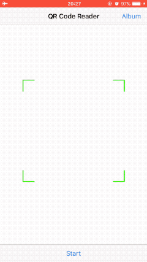

其中主要实现的功能有：

- 通过摄像头实时扫描并读取二维码。
- 解析从相册中选择的二维码图片。

由于二维码的扫描是基于实时的视频捕获，因此相关的操作无法在模拟器上进行测试，也不能在没有相机的设备上进行测试。如果想要查看该应用，需要连接自己的iPhone设备来运行。

#### 2.1 创建项目

打开**Xcode**，创建一个新的项目（**File\New\Project...**），选择**iOS**一栏下的**Application**中的**Single View Application**模版，然后点击**Next**，填写项目选项。在**Product Name**中填写**QRCodeReaderDemo**，选择**Objective-C**语言，点击**Nex**t，选择文件位置，并单击**Create**创建项目。

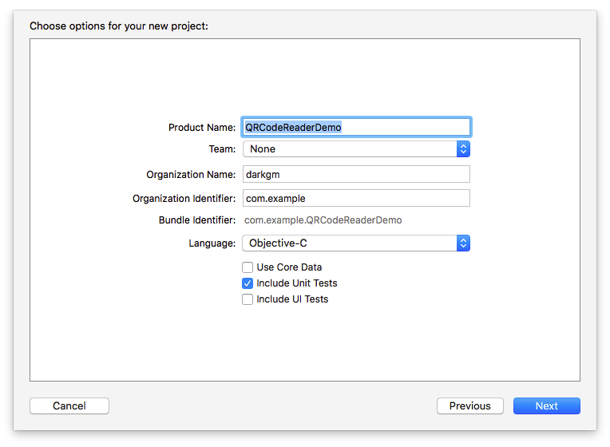

#### 2.2 构建界面

打开**Main.storyboard**文件，在当前控制器中嵌入导航控制器，并添加标题**QR Code Reader**：

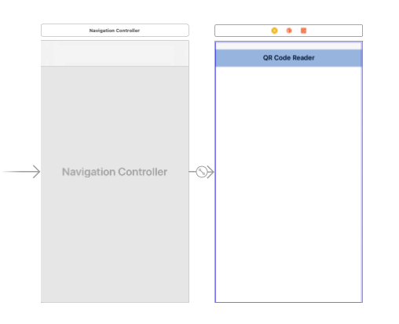

在视图控制器中添加ToolBar、Flexible Space Bar Button Item、Bar Button Item、View，布局如下：

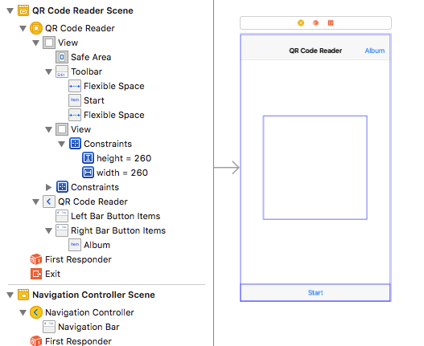

其中，各元素及作用：

- ToolBar：添加在控制器视图的最底部，其Bar Item标题为*Start*，具有双重作用，用于启动和停止扫描。
- Flexible Space Bar Button Item：分别添加在*Start*的左右两侧，用于固定*Start* 的位置使其居中显示。
- Bar Button Item：添加在导航栏的右侧，标题为*Album*，用于从相册选择二维码图片进行解析。
- View：添加在控制器视图的中间，用于稍后设置扫描框。在这里使用自动布局固定宽高均为260，并且水平和垂直方向都是居中。

创建一个名为**ScanView**的新文件（**File\New\File…**），它是UIView的子类。然后选中视图控制器中间添加的View，将该视图的类名更改为**ScanView**：

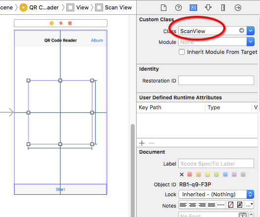

打开辅助编辑器，将storyboard中的元素连接到代码中：

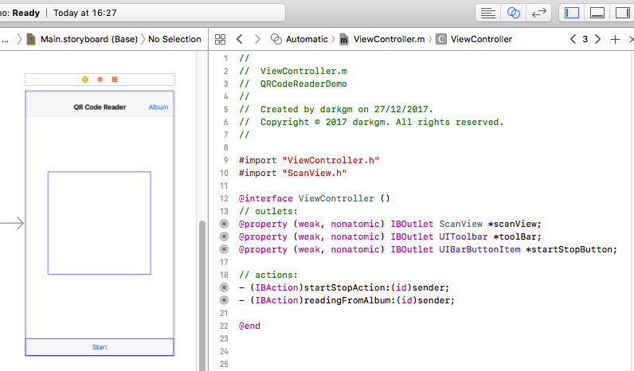

> 注意，需要在**ViewController.m**文件中导入**ScanView.h**文件。

#### 2.3 添加代码

##### 2.3.1 扫描二维码

首先在**ViewController.h**文件中导入AVFoundation框架：

```
#import <AVFoundation/AVFoundation.h>
```

切换到**ViewController.m**文件，添加`AVCaptureMetadataOutputObjectsDelegate`协议，并在接口部分添加下面的属性：

```
@interface ViewController ()<AVCaptureMetadataOutputObjectsDelegate>

// properties
@property (assign, nonatomic) BOOL isReading;
@property (strong, nonatomic) AVCaptureSession *captureSession;
@property (strong, nonatomic) AVCaptureVideoPreviewLayer *previewLayer;
```

在`viewDidLoad`方法中添加下面代码：

```
- (void)viewDidLoad
{
    [super viewDidLoad];
    
    self.isReading = NO;
    self.captureSession = nil;
}
```

然后在实现部分添加`startScanning`方法和`stopScanning`方法及相关代码：

```
- (void)startScanning
{
    self.captureSession = [[AVCaptureSession alloc] init];
    
    // add input
    NSError *error;
    AVCaptureDevice *device = [AVCaptureDevice defaultDeviceWithMediaType:AVMediaTypeVideo];
    AVCaptureDeviceInput *deviceInput = [[AVCaptureDeviceInput alloc] initWithDevice:device error:&error];
    if (!deviceInput) {
        NSLog(@"%@", [error localizedDescription]);
    }
    [self.captureSession addInput:deviceInput];
    
    // add output
    AVCaptureMetadataOutput *metadataOutput = [[AVCaptureMetadataOutput alloc] init];
    [self.captureSession addOutput:metadataOutput];
    
    // configure output
    dispatch_queue_t queue = dispatch_queue_create("MyQueue", NULL);
    [metadataOutput setMetadataObjectsDelegate:self queue:queue];
    [metadataOutput setMetadataObjectTypes:@[AVMetadataObjectTypeQRCode]];
    
    // configure previewLayer
    self.previewLayer = [[AVCaptureVideoPreviewLayer alloc] initWithSession:self.captureSession];
    [self.previewLayer setVideoGravity:AVLayerVideoGravityResizeAspectFill];
    [self.previewLayer setFrame:self.view.bounds];
    [self.view.layer addSublayer:self.previewLayer];
    
    // start scanning
    [self.captureSession startRunning];
}

- (void)stopScanning
{
    [self.captureSession stopRunning];
    self.captureSession = nil;
    
    [self.previewLayer removeFromSuperlayer];
}
```

找到`startStopAction:`并在该方法中调用上面的方法：

```
- (IBAction)startStopAction:(id)sender
{
    if (!self.isReading) {
        [self startScanning];
        [self.view bringSubviewToFront:self.toolBar];
        [self.startStopButton setTitle:@"Stop"];
    }
    else {
        [self stopScanning];
        [self.startStopButton setTitle:@"Start"];
    }
    
    self.isReading = !self.isReading;
}
```

至此，二维码扫描相关的代码已经完成，如果想要它能够正常运行的话，还需要在`Info.plist`文件中添加`NSCameraUsageDescription`键及相应描述以访问相机：

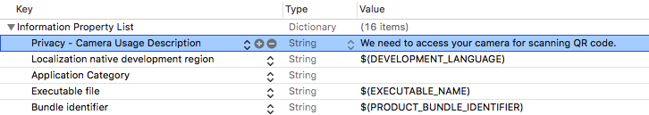

需要注意的是，现在只能扫描二维码但是还不能读取到二维码中的内容，不过我们可以连接设备，运行试下：

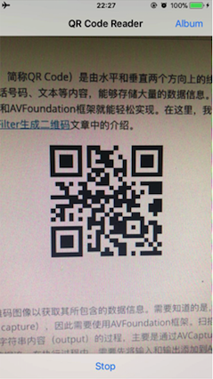

##### 2.3.2 读取二维码

读取二维码需要实现AVCaptureMetadataOutputObjectsDelegate协议的`captureOutput:didOutputMetadataObjects:fromConnection:`方法：

```
- (void)captureOutput:(AVCaptureOutput *)output didOutputMetadataObjects:(NSArray<__kindof AVMetadataObject *> *)metadataObjects fromConnection:(AVCaptureConnection *)connection
{
    if (metadataObjects != nil && metadataObjects.count > 0) {
        AVMetadataMachineReadableCodeObject *metadataObject = metadataObjects.firstObject;
        if ([[metadataObject type] isEqualToString:AVMetadataObjectTypeQRCode]) {
            NSString *message = [metadataObject stringValue];
            [self performSelectorOnMainThread:@selector(displayMessage:) withObject:message waitUntilDone:NO];
            
            [self performSelectorOnMainThread:@selector(stopScanning) withObject:nil waitUntilDone:NO];
            [self.startStopButton performSelectorOnMainThread:@selector(setTitle:) withObject:@"Start" waitUntilDone:NO];
            self.isReading = NO;
        }
    }
}

- (void)displayMessage:(NSString *)message
{
    UIViewController *vc = [[UIViewController alloc] init];
    
    UITextView *textView = [[UITextView alloc] initWithFrame:vc.view.bounds];
    [textView setText:message];
    [textView setFont:[UIFont preferredFontForTextStyle:UIFontTextStyleBody]];
    textView.editable = NO;
    
    [vc.view addSubview:textView];
    
    [self.navigationController showViewController:vc sender:nil];
}
```

在这里我们将扫码结果显示在一个新的视图中，如果你运行程序的话应该可以看到扫描的二维码内容了。

另外，为了使我们的应用更逼真，可以在扫描到二维码信息时让它播放声音。这首先需要在项目中添加一个音频文件：

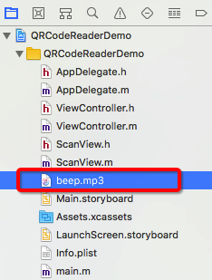

然后在接口部分添加一个AVAudioPlayer对象的属性：

```
@property (strong, nonatomic) AVAudioPlayer *audioPlayer;
```

在实现部分添加`loadSound`方法及代码，并在`viewDidLoad`中调用该方法：

```
- (void)loadSound
{
    NSString *soundFilePath = [[NSBundle mainBundle] pathForResource:@"beep" ofType:@"mp3"];
    NSURL *soundURL = [NSURL URLWithString:soundFilePath];
    NSError *error;
    
    self.audioPlayer = [[AVAudioPlayer alloc] initWithContentsOfURL:soundURL error:&error];
    
    if (error) {
        NSLog(@"Could not play sound file.");
        NSLog(@"%@", [error localizedDescription]);
    }
    else {
        [self.audioPlayer prepareToPlay];
    }
}

- (void)viewDidLoad
{
    ...    
    [self loadSound];
}
```

最后，在`captureOutput:didOutputMetadataObjects:fromConnection:`方法中添加下面的代码来播放声音：

```
- (void)captureOutput:(AVCaptureOutput *)output didOutputMetadataObjects:(NSArray<__kindof AVMetadataObject *> *)metadataObjects fromConnection:(AVCaptureConnection *)connection
{
    if (metadataObjects != nil && metadataObjects.count > 0) {
        AVMetadataMachineReadableCodeObject *metadataObject = metadataObjects.firstObject;
        if ([[metadataObject type] isEqualToString:AVMetadataObjectTypeQRCode]) {
            ...
            self.isReading = NO;
            
            // play sound
            if (self.audioPlayer) {
                [self.audioPlayer play];
            }
        }
    }

```

##### 2.3.3 设置扫描框

目前点击*Start*按钮，整个视图范围都可以扫描二维码。现在，我们需要设置一个扫描框，以限制只有扫描框区域内的二维码被读取。在这里，将扫描区域设置为storyboard中添加的视图，即scanView。

在实现部分找到`startReading`方法，添加下面的代码：

```
- (void)startScanning
{
    // configure previewLayer
    ...
    
    // set the scanning area
    [[NSNotificationCenter defaultCenter] addObserverForName:AVCaptureInputPortFormatDescriptionDidChangeNotification object:nil queue:[NSOperationQueue mainQueue] usingBlock:^(NSNotification * _Nonnull note) {
        metadataOutput.rectOfInterest = [self.previewLayer metadataOutputRectOfInterestForRect:self.scanView.frame];
    }];
    
    // start scanning
    ...
}
```

> 需要注意的是，`rectOfInterest`属性不能在设置 metadataOutput 时直接设置，而需要在`AVCaptureInputPortFormatDescriptionDidChangeNotification `通知里设置，否则 `metadataOutputRectOfInterestForRect: `方法会返回 (0, 0, 0, 0)。

为了让扫描框更真实的显示，我们需要自定义ScanView，为其绘制边框、四角以及扫描线。

首先打开**ScanView.m**文件，在实现部分重写`initWithCoder:`方法，为scanView设置透明的背景颜色：

```
- (instancetype)initWithCoder:(NSCoder *)aDecoder
{
    self = [super initWithCoder:aDecoder];
    
    if (self) {
        self.backgroundColor = [UIColor clearColor];
    }
    
    return self;
}
```

然后重写`drawRect:`方法，为scanView绘制边框和四角：

```
- (void)drawRect:(CGRect)rect
{
    CGContextRef context = UIGraphicsGetCurrentContext();
    
    // 绘制白色边框
    CGContextAddRect(context, self.bounds);
    CGContextSetStrokeColorWithColor(context, [UIColor whiteColor].CGColor);
    CGContextSetLineWidth(context, 2.0);
    CGContextStrokePath(context);
    
    // 绘制四角：
    CGContextSetStrokeColorWithColor(context, [UIColor greenColor].CGColor);
    CGContextSetLineWidth(context, 5.0);
    
    // 左上角：
    CGContextMoveToPoint(context, 0, 30);
    CGContextAddLineToPoint(context, 0, 0);
    CGContextAddLineToPoint(context, 30, 0);
    CGContextStrokePath(context);
    
    // 右上角：
    CGContextMoveToPoint(context, self.bounds.size.width - 30, 0);
    CGContextAddLineToPoint(context, self.bounds.size.width, 0);
    CGContextAddLineToPoint(context, self.bounds.size.width, 30);
    CGContextStrokePath(context);
    
    // 右下角：
    CGContextMoveToPoint(context, self.bounds.size.width, self.bounds.size.height - 30);
    CGContextAddLineToPoint(context, self.bounds.size.width, self.bounds.size.height);
    CGContextAddLineToPoint(context, self.bounds.size.width - 30, self.bounds.size.height);
    CGContextStrokePath(context);
    
    // 左下角：
    CGContextMoveToPoint(context, 30, self.bounds.size.height);
    CGContextAddLineToPoint(context, 0, self.bounds.size.height);
    CGContextAddLineToPoint(context, 0, self.bounds.size.height - 30);
    CGContextStrokePath(context);    
}
```

如果希望在扫描过程中看到刚才绘制的扫描框，还需要切换到**ViewController.m**文件，在`startStopAction:`方法中添加下面的代码来显示扫描框：

```
- (IBAction)startStopAction:(id)sender
{
    if (!self.isReading) {
        ...
        [self.view bringSubviewToFront:self.toolBar];	// display toolBar
        [self.view bringSubviewToFront:self.scanView];	// display scanView
        ...
    }
    ...
}
```

现在运行，你会看到下面的效果：

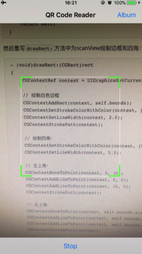

接下来我们继续添加扫描线。

首先在**ScanView.h**文件的接口部分声明一个NSTimer对象的属性：

```
@property (nonatomic, strong) NSTimer *timer;
```

然后切换到**ScanView.m**文件，在实现部分添加`loadScanLine`方法及代码，并在`initWithCoder:`方法中调用：

```
- (void)loadScanLine
{
    self.timer = [NSTimer scheduledTimerWithTimeInterval:3.0 repeats:YES block:^(NSTimer * _Nonnull timer) {
        UIView *lineView = [[UIView alloc] initWithFrame:CGRectMake(0, 0, self.bounds.size.width, 1.0)];
        lineView.backgroundColor = [UIColor greenColor];
        [self addSubview:lineView];
        
        [UIView animateWithDuration:3.0 animations:^{
            lineView.frame = CGRectMake(0, self.bounds.size.height, self.bounds.size.width, 2.0);
        } completion:^(BOOL finished) {
            [lineView removeFromSuperview];
        }];
    }];
}

- (instancetype)initWithCoder:(NSCoder *)aDecoder
{
    ...

    if (self) {
        ...
        [self loadScanLine];
    }

    ...
}
```

然后切换到**ViewController.m**文件，在`startStopAction:`方法中添加下面代码以启用和暂停计时器：

```
- (IBAction)startStopAction:(id)sender
{
    if (!self.isReading) {
        ...
        [self.view bringSubviewToFront:self.scanView];  // display scanView
        self.scanView.timer.fireDate = [NSDate distantPast];    //start timer
        ...
    }
    else {
        [self stopScanning];
        self.scanView.timer.fireDate = [NSDate distantFuture];  //stop timer
        ...
    }
    
    ...
}
```

最后，再在`viewWillAppear:`的重写方法中添加下面代码：

```
- (void)viewWillAppear:(BOOL)animated
{
    [super viewWillAppear:animated];
    
    self.scanView.timer.fireDate = [NSDate distantFuture];
}
```

可以运行看下：

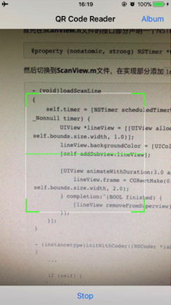

##### 2.3.4 从图片解析二维码

从iOS 8开始，可以使用Core Image框架中的CIDetector解析图片中的二维码。在这个应用中，我们通过点击*Album*按钮，从相册选取二维码来解析。

在写代码之前，需要在`Info.plist`文件中添加`NSPhotoLibraryAddUsageDescription`键及相应描述以访问相册：

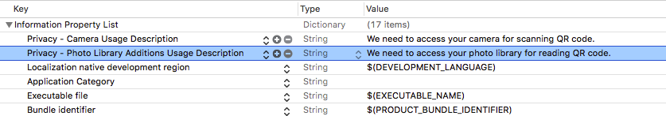

然后在**ViewController.m**文件中添加`UIImagePickerControllerDelegate`和`UINavigationControllerDelegate`协议：

```
@interface ViewController ()<AVCaptureMetadataOutputObjectsDelegate, UIImagePickerControllerDelegate, UINavigationControllerDelegate>
```

在实现部分找到`readingFromAlbum:`方法，添加下面代码以访问相册中的图片：

```
- (IBAction)readingFromAlbum:(id)sender
{
    UIImagePickerController *picker = [[UIImagePickerController alloc] init];
    picker.delegate = self;
    picker.sourceType = UIImagePickerControllerSourceTypePhotoLibrary;
    picker.allowsEditing = YES;
    
    [self presentViewController:picker animated:YES completion:nil];
}
```

然后实现UIImagePickerControllerDelegate的`imagePickerController:didFinishPickingMediaWithInfo:`方法以解析选取的二维码图片：

```
- (void)imagePickerController:(UIImagePickerController *)picker didFinishPickingMediaWithInfo:(NSDictionary<NSString *,id> *)info
{
    [picker dismissViewControllerAnimated:YES completion:nil];
    
    UIImage *selectedImage = [info objectForKey:UIImagePickerControllerEditedImage];
    CIImage *ciImage = [[CIImage alloc] initWithImage:selectedImage];
    
    CIDetector *detector = [CIDetector detectorOfType:CIDetectorTypeQRCode context:nil options:@{CIDetectorAccuracy:CIDetectorAccuracyLow}];
    NSArray *features = [detector featuresInImage:ciImage];
    
    if (features.count > 0) {
        CIQRCodeFeature *feature = features.firstObject;
        NSString *message = feature.messageString;
        
        // display message
        [self displayMessage:message];
        
        // play sound
        if (self.audioPlayer) {
            [self.audioPlayer play];
        }
    }
}
```

现在可以运行试下从相册选取二维码来读取：

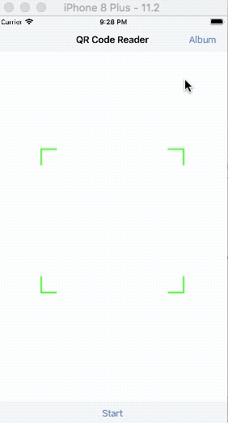

> 上图显示的是在模拟器中运行的结果。


至此，我们的二维码阅读器已经全部完成，如果需要完整代码，可以下载[QRCodeReaderDemo](https://github.com/darkjoin/CodeExamples)查看。

## 3 参考资料

[Still and Video Media Capture](https://developer.apple.com/library/content/documentation/AudioVideo/Conceptual/AVFoundationPG/Articles/04_MediaCapture.html#//apple_ref/doc/uid/TP40010188-CH5-SW14)

[Building a Barcode and QR Code Reader in Swift 4 and Xcode 9](https://www.appcoda.com/barcode-reader-swift/)

[How To Scan QR Code Using AVFoundation Framework](https://www.appcoda.com/qr-code-ios-programming-tutorial/)

[Barcode scanning in iOS using AVFoundation](https://ayeohyes.wordpress.com/2015/05/09/barcode-scanning-in-ios-using-avfoundation/)

[HOW TO SAVE/LOAD IMAGE/VIDEOS FROM CAMERA ROLL – XCODE IOS](http://beageek.biz/saveload-imagevideos-camera-roll-xcode-ios/)
