二维码（Quick Response Code，简称QR Code）是由水平和垂直两个方向上的线条设计而成的一种二维条形码（barcode)。可以编码网址、电话号码、文本等内容，能够存储大量的数据信息。自iOS 7以来，二维码的生成和读取只需要使用Core Image框架和AVFoundation框架就能轻松实现。在这里，我们主要介绍二维码的生成。关于二维码的读取，在[使用AVFoundation读取二维码](https://github.com/darkjoin/Learning/wiki/使用AVFoundation读取二维码)文章中有详细介绍。

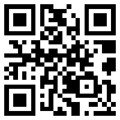

## 1 二维码的生成

生成一个二维码也就是根据提供的数据内容转换成一张二维码图像。从iOS 7开始，我们只需要使用CIFilter中的[CIQRCodeGenerator](https://developer.apple.com/library/content/documentation/GraphicsImaging/Reference/CoreImageFilterReference/index.html#//apple_ref/doc/filter/ci/CIQRCodeGenerator)就可以轻易实现。只不过这样生成的二维码图像是一个CIImage对象，如果要在图像视图中显示，需要将其转换为UIImage对象。具体步骤如下：

1. 使用名为*CIQRCodeGenerator*的过滤器创建一个CIFilter对象。

   ```
   CIFilter *filter = [CIFilter filterWithName:@"CIQRCodeGenerator"]
   ```

2. 为CIFilter对象设置*inputMessage* 和 *inputCorrectionLevel*参数。

   - *inputMessage*：是一个NSData对象，用于表示被编码的数据。对于字符串或者URL，需要使用NSISOLatin1StringEncoding字符串编码将其转换为NSData对象。要注意的是，NSISOLatin1StringEncoding编码对于中文或表情无法生成，需要的话可以使用NSUTF8StringEncoding 替换。
   - *inputCorrectionLevel*：是一个NSString对象，通常使用单个字母来指定纠错率，默认值是*M*。该参数控制输出图像中编码的附加数据量以提供纠错。其纠错率越高，输出的图像越大，同时也允许代码的更大区域被破坏或模糊。通常有*L*、*M*、*Q*、*H*这四种可能的纠正模式，分别代表了7%、15%、25%、30%的错误恢复能力。

3. 使用CIFilter对象的`outputImage`属性获取生成的二维码图像。

   ```
   CIImage *outputImage = filter.outputImage;
   ```

4. 对生成的二维码图像进行缩放。

   由于生成的二维码图像尺寸一般都比较小，为了避免模糊，通常需要对它进行缩放以适应图像视图的大小。其缩放比例一般为图像视图宽度（或高度）与二维码图像宽度（或高度）的比值。

   ```
   CGFloat scaleX = imageView.bounds.size.width / qrcodeImage.extent.size.width;
   CGFloat scaleY = imageView.bounds.size.height / qrcodeImage.extent.size.height;

   CIImage *transformedImage = [qrcodeImage imageByApplyingTransform:CGAffineTransformMakeScale(scaleX, scaleY)];
   ```

5. 将二维码图像转换为UIImage对象。

   ```
   imageView.image = [UIImage imageWithCIImage:transformedImage];
   ```

## 2 应用示例

下面，我们就做一个如下图所示的二维码生成器：

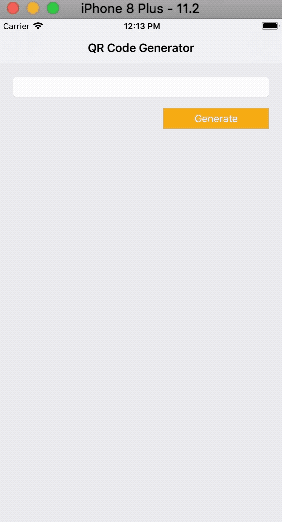

其中主要实现的功能有：

- 生成和删除二维码。
- 通过滑动条对二维码图像进行缩放。
- 将二维码保存到相册。

#### 2.1 创建项目

打开**Xcode**，创建一个新的项目（**File\New\Project..**.），选择**iOS**一栏下的**Application**中的**Single View Application**模版，然后点击**Next**，填写项目选项。在**Product Name**中填写**QRCodeGeneratorDemo**，选择**Objective-C**语言，点击**Nex**t，选择文件位置，并单击**Create**创建项目。

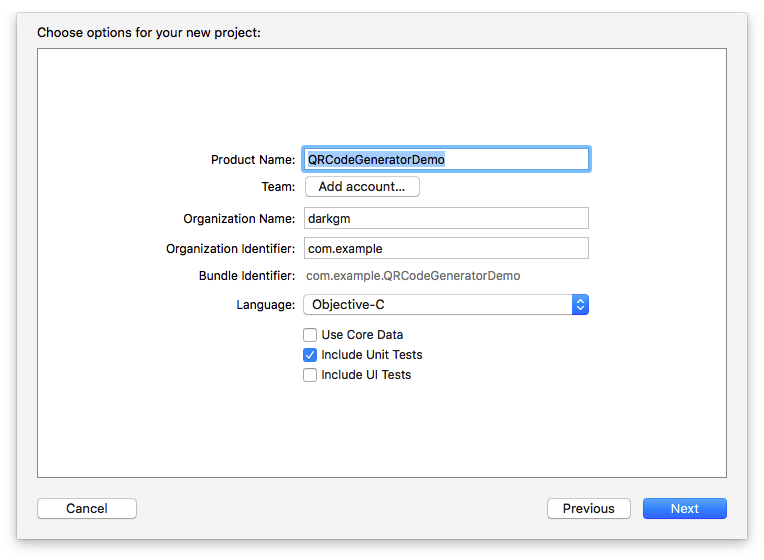

#### 2.2 构建界面

打开**Main.storyboard**文件，在当前控制器中嵌入导航控制器，并添加标题**QR Code Generator**：

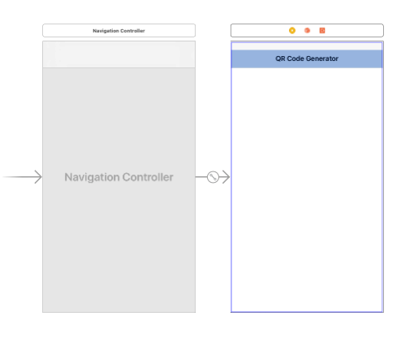

在视图控制器中添加文本框、按钮、图像视图等，布局如下：

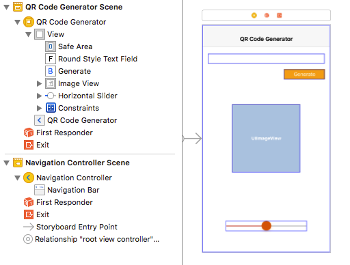

其中各元素及作用：

- Text Field：用于输入想要转换为二维码的数据内容，包括文本或URL字符串。
- Button：在这里具有双重作用，用于生成和清除二维码。
- Image View：用于显示生成的二维码图像。
- Slider：用来缩放生成的二维码图像。

打开辅助编辑器，将storyboard中的元素连接到代码中：

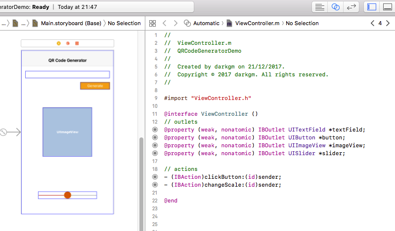

#### 2.3 添加代码

##### 2.3.1 生成二维码图像

由于使用CIFilter对象生成的二维码图像将是一个CIImage对象，所以需要先在**ViewController.m**文件的接口部分声明一个CIImage对象的属性：

```
@property (strong, nonatomic) CIImage *qrcodeImage;
```

然后在实现部分添加`generateQRCodeImage`方法及代码：

```
- (void)generateQRCodeImage
{
    NSData *data = [self.textField.text dataUsingEncoding:NSISOLatin1StringEncoding allowLossyConversion:NO];
    
    // 创建并设置CIFilter对象
    CIFilter *filter = [CIFilter filterWithName:@"CIQRCodeGenerator"];
    [filter setValue:data forKey:@"inputMessage"];
    [filter setValue:@"Q" forKey:@"inputCorrectionLevel"];
    
    // 获取生成的CIImage对象
    self.qrcodeImage = filter.outputImage;
    
    // 转换成UIImage对象，并显示在图像视图中
    self.imageView.image = [UIImage imageWithCIImage:self.qrcodeImage];
}
```

在`clickButton:`方法中调用该方法：

```
- (IBAction)clickButton:(id)sender
{
    [self generateQRCodeImage];
}
```

此时，运行程序，在文本框中输入内容，点击按钮就可以看到生成的二维码：

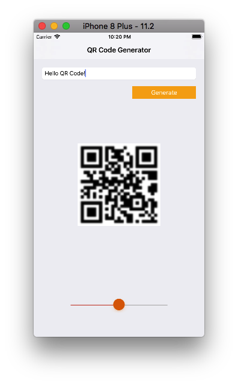

仔细的话你会发现这里的二维码比较模糊，这是由于生成的二维码尺寸较小，在imageView中显示时被拉伸导致的。下面我们就通过调整二维码的缩放来解决图像模糊的问题。

修改`generateQRCodeImage`方法中的代码如下：

```
- (void)generateQRCodeImage
{
    ...    
    // 获取生成的CIImage对象
    self.qrcodeImage = filter.outputImage;
    
    // 缩放CIImage对象
    CGFloat scaleX = self.imageView.bounds.size.width / self.qrcodeImage.extent.size.width;
    CGFloat scaleY = self.imageView.bounds.size.height / self.qrcodeImage.extent.size.height;
    CIImage *transformedImage = [self.qrcodeImage imageByApplyingTransform:CGAffineTransformMakeScale(scaleX, scaleY)];
    
    // 将调整后的CIImage对象转换成UIImage对象，并显示在图像视图中
    self.imageView.image = [UIImage imageWithCIImage:transformedImage];
}
```

再次运行，你会看到一张清晰的二维码：

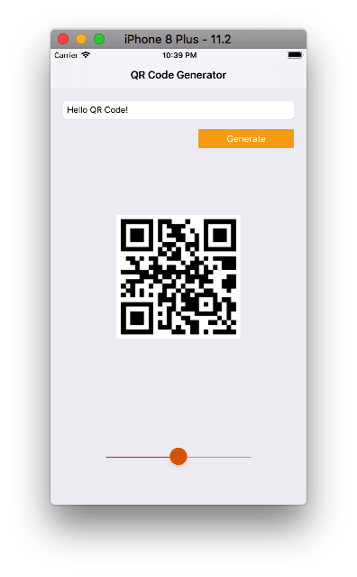

##### 2.3.2 删除二维码图像

在这个demo中，按钮具有双重作用：即生成二维码和删除二维码。因此需要在`clickButton:`方法中先判断二维码图像是否存在：

- 如果不存在，点击按钮生成一张二维码图像，按钮的标题变为"*Clear*"。
- 如果存在，点击按钮删除二维码图像，按钮的标题变为"*Generate*"。


修改`clickButton:`方法中的代码如下：

```
- (IBAction)clickButton:(id)sender
{
    if (self.qrcodeImage == nil) {
        [self generateQRCodeImage];
        [self.button setTitle:@"Clear" forState:UIControlStateNormal];
    }
    else {
        [self clearQRCodeImage];
        [self.button setTitle:@"Generate" forState:UIControlStateNormal];
    }
}
```

下面我们就添加`clearQRCodeImage`方法并实现它：

```
- (void)clearQRCodeImage
{
    self.imageView.image = nil;
    self.qrcodeImage = nil;
    self.textField.text = nil;
}
```

至此，二维码的生成和删除已基本完成，但为了有良好的体验，我们还需要考虑下面的情况：

- 在文本框未输入的情况下点击按钮是否生成二维码。
- 切换按钮时文本框的响应状态以及键盘出现与消失。
- 滑动条的显示和隐藏。

于是，在`clickButton:`方法中添加下面的代码：

```
- (IBAction)clickButton:(id)sender
{
    if (self.qrcodeImage == nil) {
        if ([self.textField.text isEqualToString:@""]) {
            return;
        }
        [self generateQRCodeImage];
        
        [self.textField resignFirstResponder];
        [self.button setTitle:@"Clear" forState:UIControlStateNormal];
    }
    else {
        [self clearQRCodeImage];
        
        [self.button setTitle:@"Generate" forState:UIControlStateNormal];
    }
    
    self.textField.enabled = !self.textField.enabled;
    self.slider.hidden = !self.slider.hidden;
}
```

最后，考虑到程序启动时滑动条不应该显示（滑动条只在生成二维码时出现），还需要在`viewDidLoad`方法中设置其`hidden`属性：

```
- (void)viewDidLoad
{
    [super viewDidLoad];
    
    self.slider.hidden = YES;
}
```

可以再次运行试下。

##### 2.3.3 缩放二维码图像

缩放显示的二维码主要是通过拖动滑动条缩放image View来完成的。在实现部分找到`changeScale:`方法，并添加代码下面的代码即可：

```
- (IBAction)changeScale:(id)sender
{
    self.imageView.transform = CGAffineTransformMakeScale((CGFloat)self.slider.value, (CGFloat)self.slider.value);
}
```

> 需要注意的是，`self.slider.value`是`float`类型，而`CGAffineTransformMakeScale`方法的参数是`CGFloat`类型，因此在上面的代码中进行了类型转换。

##### 2.3.4 保存二维码图像

将生成的二维码图片保存到相机胶卷相册主要是使用[UIImageWriteToSavedPhotosAlbum](https://developer.apple.com/documentation/uikit/1619125-uiimagewritetosavedphotosalbum?language=objc)函数来实现的。其完整声明如下：

```
void UIImageWriteToSavedPhotosAlbum(UIImage *image, id completionTarget, SEL completionSelector, void *contextInfo);
```

其中各参数及含义：

- `image`：表示要保存到相册的图像。

- `completionTarget`：可选的参数，表示图片保存后，调用完成选择器（completionSelector）的对象。

- `completionSelector`：可选的方法，表示图片保存后，completionTarget对象要调用的方法（即回调方法）。该方法应符合以下签名：

  ```
  - (void)image:(UIImage *)image
      didFinishSavingWithError:(NSError *)error
                   contextInfo:(void *)contextInfo;
  ```

- `contextInfo`：可选的参数，用于提供一个上下文信息以通过参数传递给completionSelector。

在这里我们的大致思路是：首先在imageView中添加单击手势，当用户点击二维码图像时会弹出一个提示框询问是否保存，如果用户点击保存按钮，那么就将二维码保存到相册中。下面是具体实现：

打开**Main.storyboard**文件，从对象库中找到点击手势（Tap Gesture Recognizer），将其添加到视图控制器的Image View上，完成之后会在控制器的顶部看到它：

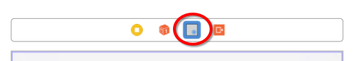

打开辅助编辑器，将其连接到代码中：

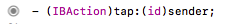

为了使image View能响应手势操作，需要在`viewDidLoad`中设置image View的`userInteractionEnabled`属性：

```
- (void)viewDidLoad
{
	...
    self.imageView.userInteractionEnabled = YES;
}
```

然后在实现部分找到`tap:`方法，并添加下面的代码：

```
- (IBAction)tap:(id)sender
{
    // 添加提示框
    UIAlertController *alertController = [UIAlertController alertControllerWithTitle:@"Save QRCode?" message:@"The QRCode will be saved in Camera Roll album." preferredStyle:UIAlertControllerStyleAlert];
    
    UIAlertAction *saveAction = [UIAlertAction actionWithTitle:@"Save" style:UIAlertActionStyleDefault handler:^(UIAlertAction * _Nonnull action) {
        // 保存二维码图像
        [self saveQRCodeImage];
    }];
    UIAlertAction *cancelAction = [UIAlertAction actionWithTitle:@"Cancel" style:UIAlertActionStyleCancel handler:nil];
    
    [alertController addAction:saveAction];
    [alertController addAction:cancelAction];
    
    [self presentViewController:alertController animated:YES completion:nil];
}
```

这时编译器会有红色警告提示`saveQRCodeImage`方法未声明。接下来我们就在实现部分添加该方法来实现二维码的保存：

```
- (void)saveQRCodeImage
{
    // 绘制图像
    UIGraphicsBeginImageContext(self.imageView.image.size);
    [self.imageView.image drawInRect:self.imageView.bounds];
    self.imageView.image = UIGraphicsGetImageFromCurrentImageContext();
    UIGraphicsEndImageContext();
    
    // 保存图像
    UIImageWriteToSavedPhotosAlbum(self.imageView.image, nil, nil, nil);
}
```

值得说明的是，这里的`self.imageView.image`是从CIImage对象转换来的，是保存不到相册的，需要先在图形上下文中绘制一下，生成一个新的图像，然后才能保存。

此时，运行程序，点击生成的二维码图像你会看到下面的效果：

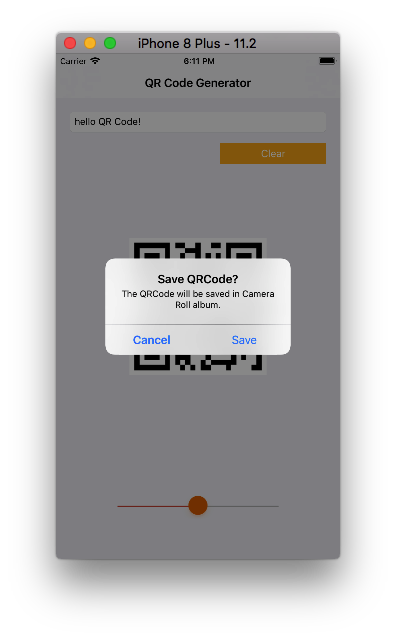

但是点击*Save*按钮时，程序会崩溃，在控制台会看到下面的消息：

```
This app has crashed because it attempted to access privacy-sensitive data without a usage description.  The app's Info.plist must contain an NSPhotoLibraryAddUsageDescription key with a string value explaining to the user how the app uses this data.
```

这是因为iOS要求应用程序开发者在允许访问相册之前要先获得用户的许可。为此，我们必须在`Info.plist`文件中添加名为`NSPhotoLibraryAddUsageDescription`的键，并为其添加相应的描述：

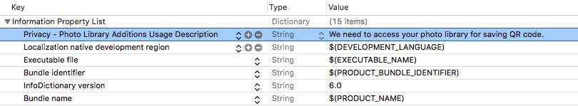

问题修复完成！再次运行，点击保存按钮，打开相册应用，你会看到刚才保存的二维码：

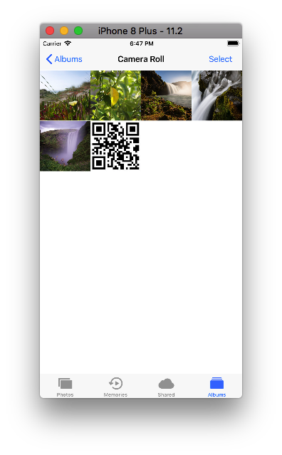

到目前为止，我们的工作已基本完成，但是为了更完美一些，最好是在点击保存按钮之后能够收到是否保存成功的反馈。所以需要在`saveQRCodeImage`方法中更改`UIImageWriteToSavedPhotosAlbum`函数的参数：

```
- (void)saveQRCodeImage
{
    ...
    
    // 保存图像
    UIImageWriteToSavedPhotosAlbum(self.imageView.image, self, @selector(image:didFinishSavingWithError:contextInfo:), nil);
}
```

然后添加`image:didFinishSavingWithError:contextInfo:`方法，并在该方法内创建alert View来显示二维码的保存状态：

```
- (void)image:(UIImage *)image didFinishSavingWithError:(NSError *)error contextInfo:(void *)contextInfo
{
    NSString *title;
    NSString *message;
    
    if (!error) {
        title = @"Success!";
        message = @"The QRCode image saved successfully.";
    }
    else {
        title = @"Failed!";
        message = @"The QRCode image saved unsuccessfully, please try again later.";
    }
    
    // 使用alert view显示二维码保存状态
    UIAlertController *alert = [UIAlertController alertControllerWithTitle:title message:message preferredStyle:UIAlertControllerStyleAlert];
    UIAlertAction *action = [UIAlertAction actionWithTitle:@"OK" style:UIAlertActionStyleDefault handler:nil];
    [alert addAction:action];
    
    [self presentViewController:alert animated:YES completion:nil];
}
```

运行程序，测试一下效果：

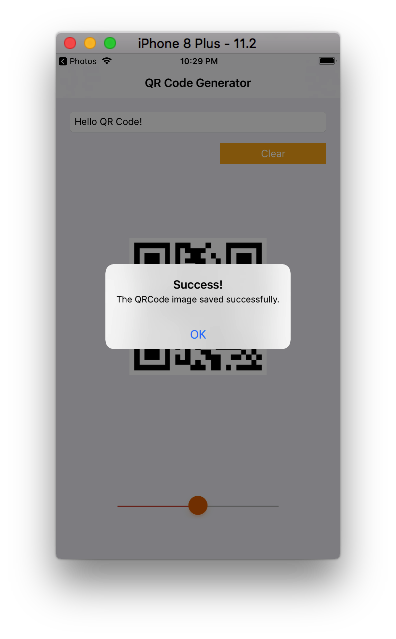

至此，我们的二维码生成器已经全部完成，如果需要完整代码，可以下载[QRCodeGeneratorDemo](https://github.com/darkjoin/CodeExamples)查看。

## 3 参考资料

[CIFilter - Core Image | Apple Developer Documentation](https://developer.apple.com/documentation/coreimage/cifilter)

[Building a QR Code Generator with Core Image Filters](https://www.appcoda.com/qr-code-generator-tutorial/)

[CIQRCodeGenerator](https://developer.apple.com/library/content/documentation/GraphicsImaging/Reference/CoreImageFilterReference/index.html#//apple_ref/doc/filter/ci/CIQRCodeGenerator)

[HOW TO SAVE/LOAD IMAGE/VIDEOS FROM CAMERA ROLL – XCODE IOS](http://beageek.biz/saveload-imagevideos-camera-roll-xcode-ios/)
