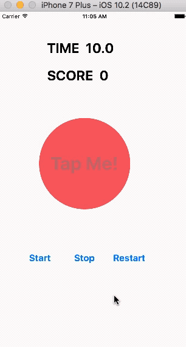
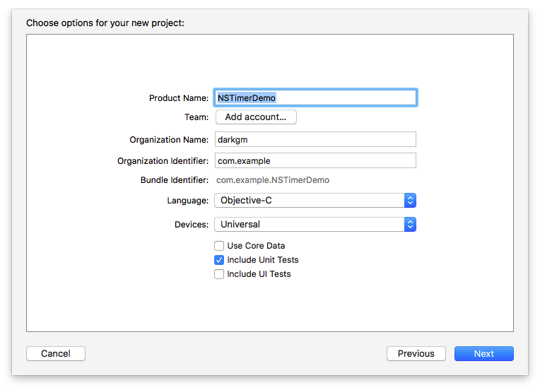
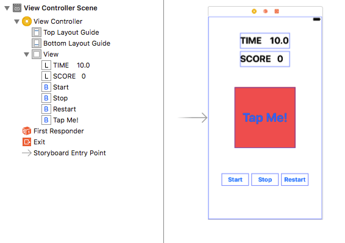
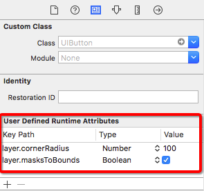
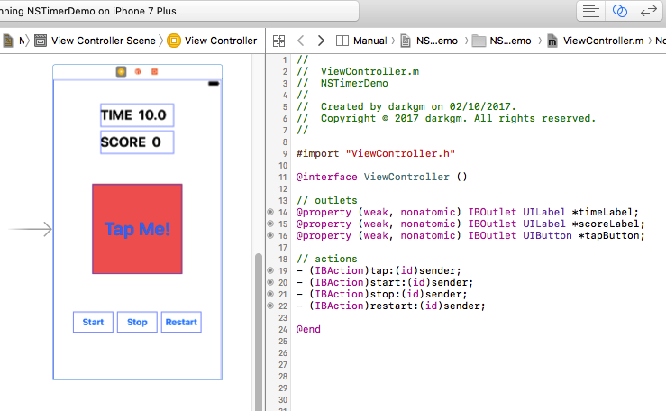

NSTimer继承自NSObject，用于创建定时器对象，以提供执行延迟动作或周期性动作的方法。通常情况下，创建的定时器会在一定的时间间隔后自动触发，向指定的对象发送指定的消息。如果创建的是非重复定时器，则会在触发一次之后自动失效，从而防止定时器再次触发。如果创建的是重复定时器，则会在设定的时间间隔后重复触发，想要其停止触发时，需要手动调用`invalidate`方法将其无效。在使用定时器的过程中需要注意以下几点：

- 创建的定时器必须添加到运行循环（run loop）中才能触发。
- 定时器与NSRunLoop对象一起工作，它的准确性有限。如果定时器的触发时间到了，而运行循环处于阻塞状态，此时定时器的触发时间就会推迟到下一个运行循环周期。
- 如果只是想在以后的某个时间发送消息，可以使用`performSelector:withObject:afterDelay:`方法替代使用定时器。

## 1 创建定时器
#### 1.1 Scheduled Timer
下面三种以`scheduled`开头的类方法创建的定时器会自动将默认循环模式（`NSDefaultRunLoopMode`）添加到当前的运行循环中，并在设定的时间间隔后自动触发。

##### 1.1.1 使用`scheduledTimerWithTimeInterval:target:selector:userInfo:repeats:`方法创建

该方法通过分别设置`selector`和`target`的方式告诉定时器触发时要执行的内容。其中各参数的含义如下：

- `timeInterval` 用于设置定时器触发的时间间隔，以秒为单位，如果小于或等于0.0，则按0.1毫秒处理。
- `target` 用于指定定时器触发时selector发送消息的对象，并且定时器在其有效期间内都会保持对该对象的强引用。
- `selector` 用于指定定时器触发时发送给target的消息。
- `userInfo` 用于提供用户信息的词典对象，可以将定时器触发时调用的方法中可能用到的其它内容放入该词典中。如果没有要提供的信息，可以将该参数设为`nil`。
- `repeats` 用于设置定时器是否重复触发。

代码示例：

```
- (void)startScheduledTimer
{
    [NSTimer scheduledTimerWithTimeInterval:0.1
                                     target:self
                                   selector:@selector(targetMethod:)
                                   userInfo:nil
                                    repeats:YES];
}

- (void)targetMethod:(NSTimer *)theTimer
{
	// do something
	...
}
```

##### 1.1.2 使用`scheduledTimerWithTimeInterval:repeats:block:`方法创建

该方法通过使用block的方式告诉定时器触发时要执行的内容。

```
- (void)startScheduledTimer
{
    [NSTimer scheduledTimerWithTimeInterval:0.1
                                    repeats:YES
                                      block:^(NSTimer * _Nonnull timer) {
                                          // do something
                                          ...
                                      }];
}
```

> 这里的block对象只有一个NSTimer类型的参数，并且没有返回值。另外，关于block的更多介绍，可以参考文章[iOS中的Block](https://github.com/darkjoin/Learning/wiki/iOS%E4%B8%AD%E7%9A%84Block)。

##### 1.1.3 使用`scheduledTimerWithTimeInterval:invocation:repeats:`方法创建

该方法通过使用NSInvocation对象告诉定时器触发时要执行的内容。

```
- (void)startScheduledTimer
{
    // 创建NSInvocation对象
    NSMethodSignature *methodSignature = [self methodSignatureForSelector:@selector(invocationMethod)];
    NSInvocation *invocation = [NSInvocation invocationWithMethodSignature:methodSignature];
    
    // 配置该invocation对象
    [invocation setTarget:self];
    [invocation setSelector:@selector(invocationMethod)];
    
    // 使用invocation对象创建定时器
    [NSTimer scheduledTimerWithTimeInterval:0.1 invocation:invocation repeats:YES];
}

- (void)invocationMethod
{
    // do something
    ...
}
```

#### 1.2 Unscheduled Timers
下面三种以`timer`开头的类方法创建的定时器，需要调用`addTimer:forMode:`方法手动将其添加到运行循环中，才能在设定的时间间隔后自动触发。

##### 1.2.1 使用`timerWithTimeInterval:target:selector:userInfo:repeats:`方法创建

```
- (void)startUnscheduledTimer
{
    NSTimer *timer = [NSTimer timerWithTimeInterval:0.1
                                             target:self
                                           selector:@selector(targetMethod:)
                                           userInfo:nil
                                            repeats:YES];
    
    NSRunLoop *runLoop = [NSRunLoop currentRunLoop];
    [runLoop addTimer:timer forMode:NSDefaultRunLoopMode];
}

- (void)targetMethod:(NSTimer *)theTimer
{
	// do something
	...
}
```

> 上面代码在`addTimer:forMode:`方法中，我们使用了默认的运行循环模式`NSDefaultRunLoopMode`，除此之外还有`NSRunLoopCommonModes`和`NSEventTrackingRunLoopMode`等，详细内容可以参考文档中关于[Run Loop Modes](https://developer.apple.com/documentation/foundation/nsrunloop/run_loop_modes?language=objc)的介绍。

##### 1.2.2 使用`timerWithTimeInterval:repeats:block:`方法创建

```
- (void)startUnscheduledTimer
{
    NSTimer *timer = [NSTimer timerWithTimeInterval:0.1
                                            repeats:YES
                                              block:^(NSTimer * _Nonnull timer) {
                                                  // do something
                                                  ...
                                              }];
    
    NSRunLoop *runLoop = [NSRunLoop currentRunLoop];
    [runLoop addTimer:timer forMode:NSDefaultRunLoopMode];
}
```

##### 1.2.3 使用`timerWithTimeInterval:invocation:repeats:`方法创建

```
- (void)startUnscheduledTimer
{
    NSMethodSignature *methodSignature = [self methodSignatureForSelector:@selector(invocationMethod)];
    NSInvocation *invocation = [NSInvocation invocationWithMethodSignature:methodSignature];
    
    [invocation setTarget:self];
    [invocation setSelector:@selector(invocationMethod)];
    
    NSTimer *timer = [NSTimer timerWithTimeInterval:0.1 invocation:invocation repeats:YES];
    
    NSRunLoop *runLoop = [NSRunLoop currentRunLoop];
    [runLoop addTimer:timer forMode:NSDefaultRunLoopMode];
}

- (void)invocationMethod
{
    // do something
    ...
}
```

#### 1.3 Self-Scheduled Timer
下面两种以`init`开头的实例方法创建的定时器具有指定的触发日期（FireDate），之后同样需要调用`addTimer:forMode:`方法手动将其添加到运行循环中，才能在设定的触发日期触发。

##### 1.3.1 使用`initWithFireDate:interval:target:selector:userInfo:repeats:`方法创建

```
- (void)startFireDateTimer
{
    // 创建NSDate对象
    NSDate *fireDate = [NSDate dateWithTimeIntervalSinceNow:2.0];
    
    // 创建定时器
    NSTimer *timer = [[NSTimer alloc] initWithFireDate:fireDate
                                              interval:0.1
                                                target:self
                                              selector:@selector(targetMethod:)
                                              userInfo:nil
                                               repeats:YES];
    
    // 将定时器添加到run loop
    NSRunLoop *runLoop = [NSRunLoop currentRunLoop];
    [runLoop addTimer:timer forMode:NSDefaultRunLoopMode];
}

- (void)targetMethod:(NSTimer *)theTimer
{
	// do something
	...
}
```

> 该方法中的参数`fireDate`表示定时器首次触发的时间。在上面的代码中，我们创建的定时器会在当前时间2秒后首次触发，之后每间隔0.1秒重复触发。

##### 1.3.2 使用`initWithFireDate:interval:repeats:block:`方法创建

```
- (void)startFireDateTimer
{
    NSDate *fireDate = [NSDate dateWithTimeIntervalSinceNow:2.0];
    NSTimer *timer = [[NSTimer alloc] initWithFireDate:fireDate
                                              interval:0.1
                                               repeats:YES
                                                 block:^(NSTimer * _Nonnull timer) {
                                                     // do something
                                                     ...
                                                 }];
    
    NSRunLoop *runLoop = [NSRunLoop currentRunLoop];
    [runLoop addTimer:timer forMode:NSDefaultRunLoopMode];
}
```

## 2 使用定时器
#### 2.1 触发定时器
通常情况下，创建的定时器会在指定的时间间隔后自动触发或者在设定的触发日期触发，但是在使用过程中如果希望立即触发定时器或者停用的定时器需要再次被触发，可以使用`fire`方法。需要注意的是，对于重复定时器，使用此方法立即触发之后会在指定的触发日期或者设定的间隔时间过后再次重复触发。但是对于非重复定时器，使用此方法立即触发之后定时器会自动失效，即使到了指定的触发时间也不再触发。

代码示例：

```
- (void)startFireDateTimer
{
    // 创建NSDate对象
    NSDate *fireDate = [NSDate dateWithTimeIntervalSinceNow:2.0];
    
    // 创建定时器
    NSTimer *timer = [[NSTimer alloc] initWithFireDate:fireDate
                                              interval:0.1
                                                target:self
                                              selector:@selector(targetMethod:)
                                              userInfo:nil
                                               repeats:YES];
    
    // 将定时器添加到run loop
    NSRunLoop *runLoop = [NSRunLoop currentRunLoop];
    [runLoop addTimer:timer forMode:NSDefaultRunLoopMode];
    
    // 触发定时器
    [timer fire];
}
```

> 上面的代码创建了一个指定触发日期的重复定时器，调用`[timer fire]`方法后，定时器会立即触发，然后会在当前时间2秒后再次触发，之后每间隔0.1秒重复触发。
> 
> 如果将代码中`initWithFireDate:interval:target:selector:userInfo:repeats:`方法的`repeats`参数改为`NO`，就创建了一个指定触发日期的非重复定时器，调用`[timer fire]`方法后，定时器会立即触发，然后自动失效，之后即使到达定时器设定的触发日期也不再触发。

#### 2.2 停止定时器
使用`invalidate`方法可以停止定时器再次触发，并使得定时器从其运行循环（run loop）中删除。如果在创建过程中配置了目标（target）和用户信息（userInfo），定时器也会删除其对这些对象的强引用。需要注意的是，删除定时器必须从创建定时器的线程发送`invalidate`消息。如果从另一个线程发送此消息，与定时器关联的输入源可能不会从其运行循环中删除，这可能会阻止线程正常退出。

```
- (void)stopTimer
{
    [self.timer invalidate];
    self.timer = nil;
}
```

## 3 应用示例
这里通过一个简单的示例介绍下NSTimer的应用。

在这个示例中我们使用定时器实现一个十秒钟的倒计时。当倒计时开始时可以通过点击按钮获取得分，在十秒内点击次数越多，得分越高。当倒计时结束时会弹出一个警告框，提示时间用完并显示当前分数。效果如下：



完整代码可以下载[NSTimerDemo](https://github.com/darkjoin/CodeExamples)查看，下面是详细介绍。

#### 3.1 创建项目
首先打开**Xcode**，创建一个新的项目（**File\New\Project...**），选择**iOS**一栏下**Application**中的**Single View Application**模版，然后点击**Next**，填写项目选项。在**Product Name**中填写**NSTimerDemo**，选择语言为**Objective-C**，点击**Next**，选择文件位置，并单击**Create**创建工程。



#### 3.2 构建界面
打开**Main.storyboard**文件，在当前控制器中添加两个label和四个button，布局及设置如下：



选中**Tap Me!** 按钮，将右上角切换到 **Identity Inspector**，找到 **User Defined Runtime Attributes** 一栏，在这里我们可以配置视图的属性。然后点击加号`+`，键入下面的内容：



> 此处添加的属性用于将按钮设置为圆角。在这个例子中，我们希望创建一个圆形的点击按钮，因此拖拽出来button被设置为正方形，上面属性中`layer.cornerRadius`的值被设置为该正方形边长的一半。
>
>另外需要注意的是，这里配置的属性（Runtime Attributes）要在运行时才能看到效果。

打开辅助编辑器，将storyboard中的元素连接到控制器中：



#### 3.3 添加代码
打开**ViewController.m**文件，在接口部分添加下面三个属性：

```
@property (strong, nonatomic) NSTimer *timer;
@property (assign, nonatomic) CGFloat time;
@property (assign, nonatomic) NSInteger score;
```

在实现部分为上面的三个属性实现懒加载方法，并在`viewDidLoad`方法中设置时间标签和分数标签的显示文本：

```
#pragma mark - Accessor Methods
- (NSTimer *)timer
{
    if (!_timer) {
        _timer = [NSTimer scheduledTimerWithTimeInterval:0.1 target:self selector:@selector(subtractTime) userInfo:nil repeats:YES];
    }
    
    return _timer;
}

- (CGFloat)time
{
    if (!_time) {
        _time = 10.0;
    }
    
    return _time;
}

- (NSInteger)score
{
    if (!_score) {
        _score = 0;
    }
    
    return _score;
}

# pragma mark - Lifecycles
- (void)viewDidLoad
{
    [super viewDidLoad];
    
    // 设置标签的文本内容
    self.timeLabel.text = [NSString stringWithFormat:@"TIME  %.1f", self.time];
    self.scoreLabel.text = [NSString stringWithFormat:@"SCORE  %li", (long)self.score];
    
    // 禁用点击按钮
    self.tapButton.enabled = NO;
}
```

上面代码使用了`scheduledTimerWithTimeInterval:target:selector:userInfo:repeats:`方法创建定时器，当其被触发时会发送`subtractTime`消息。在这个demo中，我们希望定时器触发时，时间标签从10秒开始倒计时，并在结束的时候弹出一个警告框，因此在`subtractTime`方法中添加如下代码：

```
- (void)subtractTime
{
    // 开始倒计时
    self.time = self.time - 0.1;
    self.timeLabel.text = [NSString stringWithFormat:@"TIME  %.1f", self.time];
    
    if (self.time < 0.1) {
        // 停止定时器
        [self.timer invalidate];
        self.timer = nil;
        
        // 创建警报器
        UIAlertController *alertController = [UIAlertController alertControllerWithTitle:@"Time is up!" message:[NSString stringWithFormat:@"Your socre %li points", (long)self.score] preferredStyle:UIAlertControllerStyleAlert];
        UIAlertAction *alertAction = [UIAlertAction actionWithTitle:@"Play Again" style:UIAlertActionStyleCancel handler:^(UIAlertAction * _Nonnull action) {
            // 重置标签文本
            self.time = 10.0;
            self.timeLabel.text = [NSString stringWithFormat:@"TIME  %.1f", self.time];
            
            self.score = 0;
            self.scoreLabel.text = [NSString stringWithFormat:@"SCORE  %li", (long)self.score];
            
            // 禁用点击按钮
            self.tapButton.enabled = NO;
        }];
        [alertController addAction:alertAction];
        
        // 显示警报视图
        [self presentViewController:alertController animated:YES completion:nil];
    }
}
```

下面直接在`start:`方法中启动定时器：

```
- (IBAction)start:(id)sender
{
    // 启动定时器
    [self.timer fire];
    
    // 启用点击按钮
    self.tapButton.enabled = YES;
}
```

在`stop:`方法中停止定时器：

```
- (IBAction)stop:(id)sender
{
    // 停止定时器
    [self.timer invalidate];
    self.timer = nil;
    
    // 禁用点击按钮
    self.tapButton.enabled = NO;
}
```

在`restart:`方法中再次启动定时器：

```
- (IBAction)restart:(id)sender
{
    // 重置标签文本内容
    self.time = 10.0;
    self.timeLabel.text = [NSString stringWithFormat:@"TIME  %.1f", self.time];
    
    self.score = 0;
    self.scoreLabel.text = [NSString stringWithFormat:@"SCORE  %li", (long)self.score];
    
    // 启动定时器
    [self.timer fire];
    
    // 启用点击按钮
    self.tapButton.enabled = YES;
}
```

最后，我们需要完成圆形按钮的点击事件：

```
- (IBAction)tap:(id)sender
{
    self.score++;
    self.scoreLabel.text = [NSString stringWithFormat:@"SCORE  %li", (long)self.score];
}
```

现在运行程序，就会看到下面的效果：


## 4 参考资料
1. [NSTimer - Foundation | Apple Developer Documentation](https://developer.apple.com/documentation/foundation/nstimer)

2. [Timer Programming Topics](https://developer.apple.com/library/content/documentation/Cocoa/Conceptual/Timers/Timers.html#//apple_ref/doc/uid/10000061-SW1)

3. [Using NSTimer](http://www.ios-blog.co.uk/tutorials/objective-c/objective-c-using-nstimer/)

4. [Using NSTimer Class in iOS](http://www.theappguruz.com/blog/using-nstimer-class-in-ios)

5. [Create falling objects in your iOS Application using NSTimer](http://www.ios-blog.co.uk/tutorials/objective-c/create-falling-objects-in-your-ios-application/)