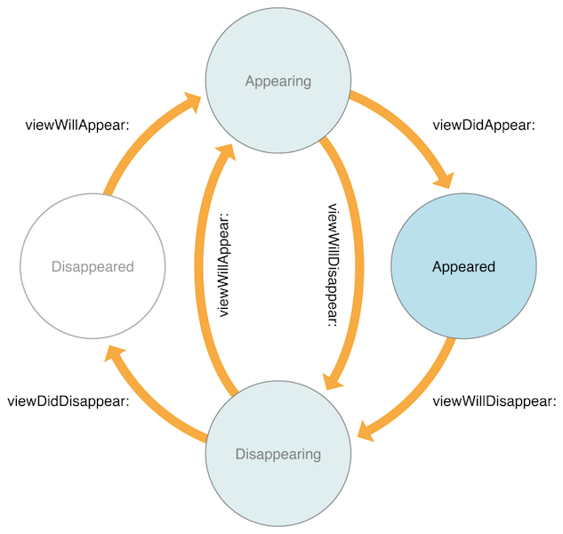
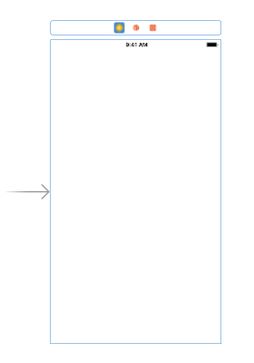
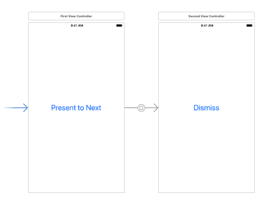
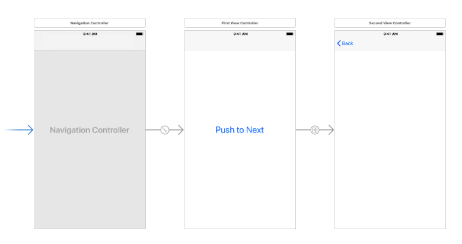

视图控制器的生命周期是指一个或多个视图控制器从创建到删除的整个过程。当视图控制器在不同状态之间转换时，系统会在适当的时候自动调用<code>viewDidLoad</code>、<code>viewWillAppear:</code>、<code>viewWillDisappear:</code>等一系列方法。当我们需要在生命周期的不同时期执行不同类型的动作时，通常会通过重写这些方法来执行相应的操作。在这里我们主要介绍这些与视图控制器生命周期相关的方法以及它们的执行顺序。

<h2>1 视图控制器生命周期相关的方法</h2>
<h4><a href='https://developer.apple.com/documentation/objectivec/nsobject/1402907-awakefromnib?language=objc'>awakeFromNib</a></h4>

严格来说该方法不属于视图控制器生命周期的范围,但是在viewController的初始化中仍然有一定的作用。

<ul>
<li>在视图加载之前发生，当对象（控制器或视图、按钮之类）从storyboard解档出来时调用，此时对象的所有的出口（outlets）和动作（actions）连接已经建立。</li>
<li>可以在该方法中执行一些无法放到<code>viewDidLoad</code>或<code>viewWillAppear:</code>方法中执行的初始化操作。比如，可以自定义控件的默认配置以匹配用户首选项或其他控件中的值，也可以使用它将各个控件恢复到应用程序的某些先前状态。</li>

</ul>
<h4><a href='https://developer.apple.com/documentation/uikit/uiviewcontroller/1621454-loadview?language=objc'>loadView</a></h4>
<ul>
<li>在视图开始加载时调用。</li>
<li>该方法主要用于创建控制器管理的视图，但是如果想对视图执行任何其他初始化操作，应该放在<code>viewDidLoad</code>方法中。</li>
<li>该方法不会被直接调用，只有当视图控制器去请求相应的<code>view</code>属性，并且获取不到视图对象（<code>self.view = nil</code>）时，才会调用此方法进行加载或者创建对应的视图。</li>
<li>通常情况下，视图在加载过程中，如果视图控制器具有关联的nib文件（控制器从storyboard实例化或者通过<code>initWithNibName:bundle:</code>方法指定了nib文件），该方法会直接从nib文件加载视图。如果视图控制器没有关联的nib文件，该方法会创建一个空白的UIView对象。</li>
<li>如果使用IB创建视图、初始化视图控制器，一般不需要重写该方法，系统会默认调用该方法创建对象（这也就是为什么视图控制器创建好了之后就存在一个view的原因）。如果使用手动创建视图，则需要重写该方法，并将视图层级结构的根视图分配给控制器的<code>view</code>属性（<code>self.view = theRootView</code>）。需要注意的是，我们手动创建的视图应该是唯一的实例对象，不应与任何其他视图控制器对象共享，因此在重写<code>loadView</code>方法中不应该调用<code>[super loadView]</code>。</li>

</ul>
<h4><a href='https://developer.apple.com/documentation/uikit/uiviewcontroller/1621495-viewdidload?language=objc'>viewDidLoad</a></h4>
<ul>
<li>在视图创建完成后、出现在屏幕之前调用，即视图控制器将其视图层次结构加载到内存后就会调用该方法，不管它是从nib文件加载的还是使用代码在<code>loadView</code>方法中加载的。</li>
<li>在一个生命周期内只会被调用一次。</li>
<li>可以使用该方法执行视图控制器相关的一次性初始化操作，但是不要在该方法中添加任何关于视图几何形状的初始化信息。这是因为当<code>viewDidLoad</code>被调用时，视图控制器还没有显示到界面中，视图的边界还没有确定下来，如果让它运行在一个不同的设备上，或者在不同的地方，或者被旋转之类，那么当它展示在屏幕上时，可能就不会出现在预定的位置。</li>

</ul>
<h4><a href='https://developer.apple.com/documentation/uikit/uiviewcontroller/1621510-viewwillappear?language=objc'>viewWillAppear:</a></h4>
<ul>
<li>在视图出现在屏幕上之前调用，用于通知视图控制器将其视图即将添加到视图层次结构中。</li>
<li>该方法表示视图将要出现，但是不保证视图将变得可见，视图也有可能被其他视图覆盖或隐藏等。</li>
<li>可以使用该方法来执行视图显示在屏幕上之前所需的任何操作。例如用来更改状态栏的方向或样式等，以便与正在呈现的视图的方向或样式进行协调。</li>
<li>可以在这里放置一些初始化的代码，比如需要执行某些基于数据的初始化操作，而这些数据可能会在视图控制器的视图离开屏幕时发生变化。也适合于对不可见时可能改变的内容进行同步，包括准备第一次出现前发生的变化等。但是不要在该方法中添加一次性初始化内容。因为当应用中有多个MVC时，它们会交替出现消失，导致该方法被多次调用，影响效率。</li>
<li>也可以在该方法中添加一些用于实现优化的代码或者耗费资源的操作。例如在<code>viewDidLoad</code>中进行网络调用时，如果MVC始终没有出现在屏幕上，那么<code>viewDidLoad</code>中的网络调用就浪费了时间，此时如果将网络调用的代码放在<code>viewWillAppear:</code>中执行可能会更好一些。</li>

</ul>
<h4><a href='https://developer.apple.com/documentation/uikit/uiviewcontroller/1621423-viewdidappear?language=objc'>viewDidAppear:</a></h4>
<ul>
<li>在视图出现在屏幕上之后被调用，用于通知视图控制器已经将其视图添加到应用程序的视图层次结构中了。</li>
<li>该方法表示视图已经出现在屏幕上，但是并不保证视图是可见的，视图可能被其他视图覆盖或隐藏。</li>
<li>可以使用该方法来执行视图显示在屏幕上之后所需的任何操作。比如获取数据或者显示动画等。</li>

</ul>
<h4><a href='https://developer.apple.com/documentation/uikit/uiviewcontroller/1621485-viewwilldisappear?language=objc'>viewWillDisappear:</a></h4>
<ul>
<li>在视图离开屏幕之前调用，用于通知视图控制器其视图即将从应用程序的视图层次结构中删除。</li>
<li>该方法表示视图即将从屏幕上离开，但是只有在实际删除视图之前才会调用。</li>
<li>通常不会在该方法中执行太多内容，主要用来提交更改、撤销视图第一响应者的状态或其他相关的清除操作。例如，如果有动画之类的，可以在这里停止动画和记住当前状态，以希望控制器不再占用内存资源，当再次回到屏幕上时会再次调用到<code>viewWillAppear:</code>，可以再同步回去以便恢复。除此之外，还可以使用该方法逆向更改在<code>viewDidAppear:</code>方法中视图首次呈现的状态栏方向或样式。</li>

</ul>
<h4><a href='https://developer.apple.com/documentation/uikit/uiviewcontroller/1621477-viewdiddisappear?language=objc'>viewDidDisappear:</a></h4>
<ul>
<li>在视图离开屏幕之后调用，用于通知视图控制器其视图已经从应用程序的视图层次结构中删除。</li>
<li>该方法表示视图已经从屏幕上消失，但是只有在视图真正从视图层次结构中删除时才会调用。</li>
<li>可以使用该方法执行关闭视图等相关操作。</li>

</ul>
<h4><a href='https://developer.apple.com/documentation/uikit/uiviewcontroller/1621437-viewwilllayoutsubviews?language=objc'>viewWillLayoutSubviews</a></h4>
<ul>
<li>在视图布局发生变化的时候调用，用于通知视图控制器它的视图即将布局其子视图。</li>
<li>当视图发生变化时，常常会导致视图布局发生变化，此时视图会调整其子视图的位置。比如进行旋转设备等操作，会多次调用到该方法。</li>
<li>重写该方法可以在视图显示其子视图之前进行更改。</li>
<li>可以在这里添加几何相关的代码。</li>

</ul>
<h4><a href='https://developer.apple.com/documentation/uikit/uiviewcontroller/1621398-viewdidlayoutsubviews?language=objc'>viewDidLayoutSubviews</a></h4>
<ul>
<li>在视图布局发生变化的时候调用，用于通知视图控制器它的视图刚刚布局完其子视图。</li>
<li>当视图控制器的视图边界发生变化时，视图调整其子视图的位置，然后系统调用该方法。但是由于每个子视图负责调整自己的布局，调用该方法并不表示子视图的各个布局已被调整 。</li>
<li>可以在这里执行布局相关的操作。例如，将手机从竖屏变为横屏，自动布局会尝试将所有元素移动至合适的位置，尽管并不总能实现，但它会尝试。在此之前，系统会调用<code>viewWillLayoutSubviews</code>，而在完成尝试之后才会调用到<code>viewDidLayoutSubviews</code>。由于自动布局的限制，有些元素可能没有清楚地表明要移动到哪里，此时可以重写该方法手动调整一些需要布局的元素，以便在视图显示其子视图后进行更改。</li>

</ul>
<h4><a href='https://developer.apple.com/documentation/uikit/uiviewcontroller/1621409-didreceivememorywarning?language=objc'>didReceiveMemoryWarning</a></h4>
<ul>
<li>当应用程序收到内存警告时，会将该消息发送到视图控制器。但是应用程序不会直接调用该方法，只有当系统确定可用内存空间很低时才会调用。</li>
<li>通常在该方法中执行一些释放内存的操作。需要说明的是，内存不足并不代表你的应用占了很大的内存空间，也许只是手机上运行的所有应用一起占了很大的内存，需要释放一些空间，它可能向很多应用都发送了这个消息。对于是否生成这个警告，完全由系统决定。当收到警告后，唯一的责任就是试着释放内存，即堆中的内容，也就是将强指针设置为<code>nil</code>。在这里举一个处理内存警告的例子，比如要展示一幅图像或播放一段声音通常都需要很多内存，但是如果视图控制器正在屏幕上显示，就不能释放那张图像，即使收到了<code>didReceiveMemoryWarning</code>消息，其实也没有太多可做的，但是如果有一张可选图像之类的，并且现在不在屏幕上，只要可以重新创建它，我们就可以先将它设为<code>nil</code>，不管是从文件系统中重新创建还是网络调用重新下载一幅，只要图像不是立刻需要就可以。尤其是不在屏幕上时，也可以响应这个警告。</li>

</ul>
<h2>2 视图控制器生命周期的执行顺序</h2>

大部分视图控制器都是从storyboard中创建的，当然也可以使用代码创建。如果是从stroyboard中出来的，就会调用到<code>initWithCoder:</code>和<code>awakeFromNib</code>，不然就是调用<code>initWithNibName:bundle:</code>和<code>init</code>。在这里，我们简单地通过显示单个或多个视图控制器来说明生命周期相关方法的调用顺序，相关代码可以在<a href='https://github.com/darkjoin/CodeExamples'>ViewControllerLifecycleDemo</a>中查看。

下面表格显示的是使用纯代码创建控制器时的调用顺序：

<figure><table>
<thead>
<tr><th>创建单个视图控制器</th><th colspan="2">以present方式呈现控制器</th><dt>&nbsp;</dt><th colspan="3">以push方式呈现控制器</th><dt>&nbsp;</dt><dt>&nbsp;</dt></tr></thead>
<tbody><tr><td></td><td colspan="2"></td><dt>&nbsp;</dt><td colspan="3"></td><dt>&nbsp;</dt><dt>&nbsp;</dt></tr><tr><td>显示第一个视图控制器</td><td>点击 <em>Present to Next</em> 按钮进入下一个视图控制器</td><td>点击 <em>dismiss</em> 按钮返回上一个视图控制器</td><td>点击 <em>Push to Next</em> 按钮进入下一个视图控制器（使用动画过渡）</td><td>点击 <em>Push to Next</em> 按钮进入下一个视图控制器（不使用动画过渡）</td><td>点击 <em>Back</em> 按钮返回上一个视图控制器</td></tr><tr><td><code>[FirstViewController init]</code></td><td><code>[SecondViewController init]</code></td><td><code>[SecondViewController viewWillDisappear:]</code></td><td><code>[SecondViewController init]</code></td><td><code>[SecondViewController init]</code></td><td><code>[SecondViewController viewWillDisappear:]</code></td></tr><tr><td><code>[FirstViewController initWithNibName:bundle:]</code></td><td><code>[SecondViewController initWithNibName:bundle:]</code></td><td><code>[FirstViewController viewWillAppear:]</code></td><td><code>[SecondViewController initWithNibName:bundle:]</code></td><td><code>[SecondViewController initWithNibName:bundle:]</code></td><td><code>[FirstViewController viewWillAppear:]</code></td></tr><tr><td><code>[FirstViewController init]</code></td><td><code>[SecondViewController init]</code></td><td><strong><code>[FirstViewController viewDidAppear:]</code></strong></td><td><code>[SecondViewController init]</code></td><td><code>[SecondViewController init]</code></td><td><strong><code>[SecondViewController viewDidDisappear:]</code></strong></td></tr><tr><td><code>[FirstViewController loadView]</code></td><td><code>[SecondViewController loadView]</code></td><td><strong><code>[SecondViewController viewDidDisappear:]</code></strong></td><td><code>[SecondViewController loadView]</code></td><td><code>[SecondViewController loadView]</code></td><td><strong><code>[FirstViewController viewDidAppear:]</code></strong></td></tr><tr><td><code>[FirstViewController viewDidLoad]</code></td><td><code>[SecondViewController viewDidLoad]</code></td><td>&nbsp;</td><td><code>[SecondViewController viewDidLoad]</code></td><td><code>[SecondViewController viewDidLoad]</code></td><td>&nbsp;</td></tr><tr><td><code>[FirstViewController viewWillAppear:]</code></td><td><code>[FirstViewController viewWillDisappear:]</code></td><td>&nbsp;</td><td><code>[FirstViewController viewWillDisappear:]</code></td><td><code>[FirstViewController viewWillDisappear:]</code></td><td>&nbsp;</td></tr><tr><td><code>[FirstViewController viewWillLayoutSubviews]</code></td><td><code>[SecondViewController viewWillAppear:]</code></td><td>&nbsp;</td><td><code>[SecondViewController viewWillAppear:]</code></td><td><code>[SecondViewController viewWillAppear:]</code></td><td>&nbsp;</td></tr><tr><td><code>[FirstViewController viewDidLayoutSubviews]</code></td><td><code>[SecondViewController viewWillLayoutSubviews]</code></td><td>&nbsp;</td><td><code>[SecondViewController viewWillLayoutSubviews]</code></td><td><strong><code>[FirstViewController viewDidDisappear:]</code></strong></td><td>&nbsp;</td></tr><tr><td><code>[FirstViewController viewDidAppear:]</code></td><td><code>[SecondViewController viewDidLayoutSubviews]</code></td><td>&nbsp;</td><td><code>[SecondViewController viewDidLayoutSubviews]</code></td><td><strong><code>[SecondViewController viewDidAppera:]</code></strong></td><td>&nbsp;</td></tr><tr><td>&nbsp;</td><td><strong><code>[SecondViewController viewDidAppera:]</code></strong></td><td>&nbsp;</td><td><strong><code>[FirstViewController viewDidDisappear:]</code></strong></td><td><code>[SecondViewController viewWillLayoutSubviews]</code></td><td>&nbsp;</td></tr><tr><td>&nbsp;</td><td><strong><code>[FirstViewController viewDidDisappear:]</code></strong></td><td>&nbsp;</td><td><strong><code>[SecondViewController viewDidAppera:]</code></strong></td><td><code>[SecondViewController viewDidLayoutSubviews]</code></td><td>&nbsp;</td></tr></tbody>
</table></figure>

&nbsp;

<blockquote>
表格中，点击 <em>Push to Next</em> 按钮进入下一个视图控制器：

<ul>
<li>使用动画过渡，对应<code>pushViewController:animated:</code>方法中<code>animated</code>参数为<code>YES</code>。</li>
<li>不使用动画过渡，对应<code>pushViewController:animated:</code>方法中<code>animated</code>参数为<code>NO</code>。</li>

</ul>
</blockquote>

&nbsp;

<h2>参考资料</h2>

<a href='https://developer.apple.com/documentation/uikit/uiviewcontroller?language=objc'>UIViewController</a>

<a href='https://developer.apple.com/library/content/featuredarticles/ViewControllerPGforiPhoneOS/DefiningYourSubclass.html#//apple_ref/doc/uid/TP40007457-CH7-SW1'>View Controller Programming Guide for iOS/Defining Your Subclass</a>

<a href='https://developer.apple.com/library/content/referencelibrary/GettingStarted/DevelopiOSAppsSwift/WorkWithViewControllers.html'>Understand the View Controller Lifecycle</a>

<a href='https://bradbambara.wordpress.com/2014/07/31/object-life-cycle-uiviewcontroller/'>OBJECT LIFE CYCLE: UIVIEWCONTROLLER</a>

<a href='http://iosdevelopertutorial4u.blogspot.com/2015/11/uiviewcontroller-lifecycle.html'>UIViewController Lifecycle</a>

<a href='http://www.10tiao.com/html/568/201507/208757175/1.html'>UIViewController(视图控制器)的生命周期</a>

<a href='https://bestswifter.com/uiviewlifetime/'>UIView的生命周期总结</a>

<a href='http://www.jianshu.com/p/fcfbd4919b0b'>iOS - ViewController生命周期</a>

&nbsp;
