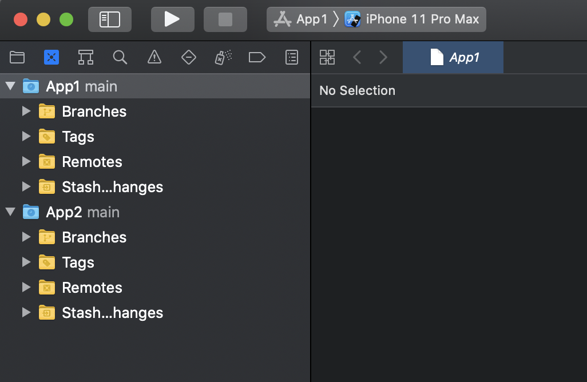
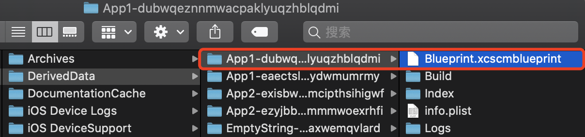
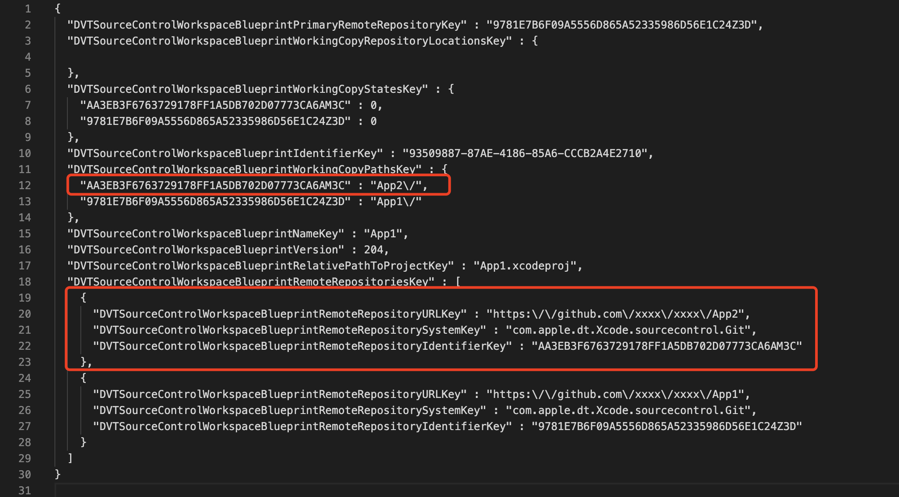
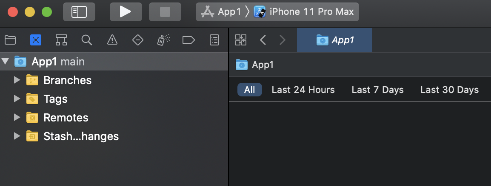

有时在项目中添加了其他项目中的文件或者将其他项目拖动到当前项目，可能会导致在Xcode中源代码控制导航器（source control navigator）下看到多个项目：

正常来说source control navigator只展示当前项目的版本控制，如果想要在这里删掉其他无关项目，解决办法是：

在`~/Library/Developer/Xcode/DerivedData`目录下找到当前项目，然后打开Blueprint.xcscmblueprint文件，删除掉项目无关的内容并保存，之后关闭当前项目重新打开应该就可以了。

以上面的App1为例：

找到`～/Library/Developer/Xcode/DerivedData/App1-dubwqeznnmwacpaklyuqzhblqdmi`目录下的Blueprint.xcscmblueprint文件：

打开Blueprint.xcscmblueprint文件，删除App2相关的内容并保存：

关闭项目重新打开即可：

最后，如果觉得上面的步骤麻烦，可以直接删除DerivedData😄

关于Blueprint.xcscmblueprint文件的更多知识可以参考[Blueprint](https://developer.apple.com/library/archive/documentation/Xcode/Conceptual/XcodeServerAPIReference/Blueprint.html)文档。

## 参考资料

[How to remove an unused source control master in Xcode?](https://stackoverflow.com/questions/48453636/how-to-remove-an-unused-source-control-master-in-xcode)

[Xcode Source Control showing multiple Working Copies](https://stackoverflow.com/questions/27516220/xcode-source-control-showing-multiple-working-copies)

[xcode remove repository from project](https://stackoverflow.com/questions/18855849/xcode-remove-repository-from-project)

